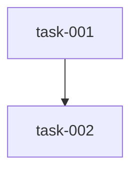

# Implementation Plan (TASKS.md)

## Dependency Graph

## task-001: local_llm.py hardening: fix max_tokens default + _cache_offset + prompt_cache threading
Three changes to datum/local_llm.py: (1) fix DEFAULTS["max_tokens"] from 131072 to 8192; (2) add _cache_offset(cache) helper that returns cache[0].offset or 0; (3) thread prompt_cache through multi_turn_phase() for delta-only prefill on turns 1+.

- **Acceptance Criteria**:
  - DEFAULTS["max_tokens"] == 8192, DEFAULTS["context_window"] == 131072
  - check_context_budget returns fits=True for 100-token prompt + 8192 output vs 131072 window
  - _cache_offset([]) returns 0
  - _cache_offset([obj_with_offset_500]) returns 500
  - multi_turn_phase creates one prompt_cache before the turn loop
  - Turns 1+ receive delta tokens only; fallback to full prompt if offset >= len(tokens)
- **Files**: datum/local_llm.py
- **RED Note**: check_context_budget("hello world", 8192) fails before fix (returns fits=False). _cache_offset not importable. multi_turn_phase does not call make_prompt_cache.
- **Estimated LOC**: 75

## task-002: Tests: test_local_llm_hardening.py — 5 tests for budget check and cache offset
Write tests/test_local_llm_hardening.py covering: budget check fix, prompt-too-large failure, cache_offset empty, cache_offset populated, multi_turn uses prompt_cache.

- **Acceptance Criteria**:
  - test_budget_check_fix passes
  - test_budget_check_fails_when_prompt_too_large passes
  - test_cache_offset_empty passes
  - test_cache_offset_populated passes
  - test_multi_turn_uses_prompt_cache passes
- **Files**: tests/test_local_llm_hardening.py
- **Depends on**: task-001
- **RED Note**: All 5 tests fail before task-001 is implemented.
- **Estimated LOC**: 80
