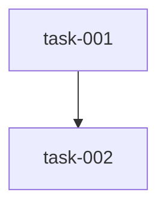

# Implementation Plan (TASKS.md)

## Dependency Graph

## task-001: First Task
- **Acceptance Criteria**:
  - AC1
- **Files**: src/a.py
- **RED Note**: Fails without a.py

## task-002: Second Task
- **Acceptance Criteria**:
  - AC2
- **Files**: src/b.py
- **Depends on**: task-001
- **RED Note**: Fails without b.py
