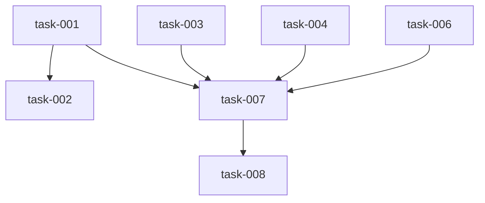

# Implementation Plan (TASKS.md)

## Dependency Graph

## task-001: Write-tool lane scripts + manifest entries (R4 partial)
Implement the three write-tool scripts (write_to_file, replace_file_content, multi_replace_file_content) as lane-tool scripts in this repo. These are declared in WRITE_TOOLS but have no backing .py scripts or manifest entries. Each script reads JSON args from stdin, performs the file operation, and returns a JSON result. Add corresponding manifest entries with write=["."] permission.

- **Acceptance Criteria**:
  - AC4.1: scripts/lane-tools/write_to_file.py exists, accepts {"path": str, "content": str}, writes the file, returns confirmation JSON
  - AC4.2: scripts/lane-tools/replace_file_content.py exists, accepts {"path": str, "old_text": str, "new_text": str}, performs exact replacement
  - AC4.3: scripts/lane-tools/multi_replace_file_content.py exists, accepts {"path": str, "replacements": [{"old_text": str, "new_text": str}]}, performs all replacements sequentially
  - AC4.4: All three have entries in scripts/lane-tools/manifest.toml with write=["."] permission and timeout_seconds set
- **Files**: scripts/lane-tools/write_to_file.py, scripts/lane-tools/replace_file_content.py, scripts/lane-tools/multi_replace_file_content.py, scripts/lane-tools/manifest.toml
- **RED Note**: Failing test: call _execute_tool with write_to_file tool_name and enable_write_tools=true — should fail because the script doesn't exist yet (unregistered_tool or FileNotFoundError). GREEN: script exists, reads args, writes file, returns success JSON. Also test sandbox rejection for paths outside allowed_write_dirs.
- **Estimated LOC**: 150

## task-002: Write-tool integration tests in datum repo (R4 complete)
Integration tests in this repo that exercise _execute_tool end-to-end with the three new write-tool scripts. Tests confirm the tool dispatch works, sandbox enforcement rejects out-of-bounds paths, and write operations produce correct file content. Uses a tmp directory (via pytest tmp_path) as the fixture.

- **Acceptance Criteria**:
  - AC4.5: _execute_tool({"tool_name": "write_to_file", ...}, {"enable_write_tools": true, "allowed_tools": [...]}) succeeds end-to-end
  - AC4.6: Sandbox enforcement: paths outside allowed_write_dirs are rejected with error message
  - Test covers all three write tools: write_to_file creates a new file, replace_file_content modifies it, multi_replace_file_content applies multiple edits
  - Test confirms write tools blocked when enable_write_tools=false
- **Files**: tests/test_write_tools.py
- **Depends on**: task-001
- **RED Note**: Failing test: write _execute_tool integration tests FIRST with assertions that write_to_file creates a file, replace_file_content modifies text, sandbox rejects escape attempts. Run pytest — tests fail because scripts didn't produce expected output (or weren't registered). Verify: deleting any write-tool script causes test failure.
- **Estimated LOC**: 120

## task-003: Bootstrap materialize.sh + scaffold templates (R1, R2)
Author the bootstrap script and template files in this repo that materialize ../datum-local when executed. The script creates the sibling repo with pyproject.toml (editable dep on ../datum), datum_local/__init__.py, README.md, .gitignore, runs uv sync, and git init. Idempotent — running twice does not corrupt an existing datum-local.

- **Acceptance Criteria**:
  - AC2.1: docs/epics/datum/epic-26/bootstrap/materialize.sh exists; running it from this repo's root creates ../datum-local/ with all scaffold files
  - AC2.2: The script is idempotent — running it twice does not corrupt an existing ../datum-local/
  - AC2.3: The script exits non-zero if ../datum (this repo) does not exist at the expected relative path
  - AC1.1: ../datum-local/pyproject.toml exists with editable path dep and requires-python >= 3.12
  - AC1.2: ../datum-local/datum_local/__init__.py exists and is importable
  - AC1.3: ../datum-local/README.md documents the editable-dependency rationale
  - AC1.4: uv sync in ../datum-local succeeds and import datum.state works from that venv
  - AC1.5: git init run, .gitignore covers .datum/, __pycache__/, .venv/
- **Files**: docs/epics/datum/epic-26/bootstrap/materialize.sh, docs/epics/datum/epic-26/bootstrap/templates/pyproject.toml, docs/epics/datum/epic-26/bootstrap/templates/init.py, docs/epics/datum/epic-26/bootstrap/templates/README.md, docs/epics/datum/epic-26/bootstrap/templates/gitignore
- **RED Note**: Failing test: run materialize.sh, assert ../datum-local/pyproject.toml exists with correct editable dep, assert uv sync exits 0, assert 'import datum.state' works from the venv. Script must be POSIX sh (no bashisms), idempotent, and exit non-zero if ../datum is missing.
- **Estimated LOC**: 120

## task-004: Config overlay template (R5)
Author the config.toml template for datum-local that enables the local LLM stack with write tools, budget caps, and model tier configuration. This is a template file in the bootstrap directory; materialize.sh copies it to ../datum-local/config.toml.

- **Acceptance Criteria**:
  - AC5.1: config.toml enables [multi_turn] with enable_tool_execution=true, enable_write_tools=true
  - AC5.2: allowed_tools includes all 7 read tools (full manifest set) plus the 3 write tools
  - AC5.3: Model tiers: main=Qwen3-30B-A3B-8bit, fast=Llama-3.1-8B-Instruct-4bit, oMLX endpoint=localhost:12200
  - AC5.4: Budget caps present: max_turns, timeout_s, max_tool_turns all set to finite values
  - AC5.5: No Claude/Anthropic model IDs appear anywhere in the config
- **Files**: docs/epics/datum/epic-26/bootstrap/templates/config.toml
- **RED Note**: Failing test: parse config.toml with tomllib, assert enable_write_tools=true, assert allowed_tools contains all 12 tools, assert no string matching 'claude' or 'anthropic' or 'sonnet' or 'opus' or 'haiku' appears, assert max_turns and timeout_s are finite integers.
- **Estimated LOC**: 50

## task-005: Contract-test suite template (R3)
Author the contract tests for datum-local that import datum surfaces and assert their signatures. These tests fail loudly on upstream drift. File is a template in the bootstrap directory; materialize.sh copies it to ../datum-local/tests/test_contracts.py.

- **Acceptance Criteria**:
  - AC3.1: Imports datum.state.load_state, datum.state.resolve_tier, datum.state.PHASES
  - AC3.2: Imports datum.gate and asserts it is callable as a module
  - AC3.3: Imports datum.local_llm.run_phase, multi_turn_phase, generate, structured, _execute_tool
  - AC3.4: Imports datum.pipeline_scheduler, datum.commit_queue
  - AC3.5: Imports datum.schemas.StepPlan, StepResult, ToolCall
  - AC3.6: Signature assertions use inspect.signature() to validate parameter names and count
  - AC3.7: uv run pytest tests/test_contracts.py passes green in datum-local
- **Files**: docs/epics/datum/epic-26/bootstrap/templates/test_contracts.py
- **RED Note**: Failing test: the contract tests themselves ARE the red test — they assert that datum's public API surface matches expected signatures. If any import fails or signature changes, the test fails. Verify by temporarily renaming a datum function — contract test must break.
- **Estimated LOC**: 90

## task-006: Fixture repo template (R6)
Create a tiny toy Python project as a test fixture for the M1 driver. The fixture has a minimal function with a known bug or missing feature that a RED-GREEN cycle can target. Committed as a template in the bootstrap directory; materialize.sh creates it as a git-initialized project at ../datum-local/fixtures/toy-project/.

- **Acceptance Criteria**:
  - AC6.1: fixtures/toy-project/ is a valid Python project with at least one source file and a tests/ directory
  - AC6.2: The project has a minimal function with a known missing feature (e.g. calculator missing multiply) for RED-GREEN targeting
  - AC6.3: uv run pytest in the fixture repo passes (baseline green before the driver modifies it)
  - AC6.4: The fixture is git-initialized with an initial commit by materialize.sh
- **Files**: docs/epics/datum/epic-26/bootstrap/templates/fixture/calculator.py, docs/epics/datum/epic-26/bootstrap/templates/fixture/test_calculator.py, docs/epics/datum/epic-26/bootstrap/templates/fixture/pyproject.toml
- **RED Note**: Failing test: run pytest in the fixture — all existing tests pass (baseline green). The fixture INTENTIONALLY lacks a multiply function — the M1 driver's job is to write the test for it (RED) then implement it (GREEN). Verify: the fixture's source file has no multiply, and no test covers it.
- **Estimated LOC**: 40

## task-007: M1 driver script template (R7)
Author the bare M1 driver script that runs multi_turn_phase with tool execution to perform RED-GREEN on the fixture repo. The driver operates in two phases: write a failing test (RED), run pytest to confirm failure; implement the fix (GREEN), run pytest to confirm pass. On success, commits both via commit_queue or git fallback. Template in bootstrap directory; materialize.sh copies to ../datum-local/scripts/m1_driver.py.

- **Acceptance Criteria**:
  - AC7.1: scripts/m1_driver.py exists as a standalone script
  - AC7.2: The driver calls datum.local_llm.multi_turn_phase with enable_tool_execution=true and enable_write_tools=true via mt_overrides
  - AC7.3: Two phases: (a) RED — write failing test, pytest confirms failure; (b) GREEN — implement fix, pytest confirms pass
  - AC7.4: On success, commits both the test and the fix to a branch in the fixture repo via datum.commit_queue or git fallback
  - AC7.7: Failure runs produce a structured JSON failure record (phase, attempts, reason, model used)
- **Files**: docs/epics/datum/epic-26/bootstrap/templates/m1_driver.py
- **Depends on**: task-001, task-003, task-004, task-006
- **RED Note**: Failing test: invoke m1_driver.py against the fixture repo — should produce a branch with a new test file and modified source file where pytest passes. The driver must handle: model not available (structured failure), write-tool sandbox (cwd-relative paths), pytest assertion in both RED and GREEN phases. AC7.5 (80% success rate) and AC7.6 (no Claude model IDs) validated by task-008.
- **Estimated LOC**: 180

## task-008: End-to-end integration test template (R8)
Automated test that exercises the full M1 flow, runnable locally. Invokes the M1 driver against a fresh copy of the fixture repo and asserts: fixture branch exists, test file written, source file modified, pytest passes in fixture, metrics log contains only local model IDs. Skippable when no local model is available.

- **Acceptance Criteria**:
  - AC8.1: tests/test_m1_e2e.py exists and is skippable when no local model is available (pytest.mark.skipif)
  - AC8.2: The test invokes the M1 driver against a fresh copy of the fixture repo
  - AC8.3: Asserts: fixture branch exists, test file written, source file modified, pytest passes in fixture, metrics log contains only local model IDs
  - AC8.4: The test completes in under 10 minutes (timeout enforced)
  - AC7.5: The driver completes RED-GREEN on the fixture in at least 4 of 5 consecutive runs (80% success rate validated here)
  - AC7.6: .datum/local-llm-metrics.jsonl from M1 runs contains no Claude/Anthropic model IDs
- **Files**: docs/epics/datum/epic-26/bootstrap/templates/test_m1_e2e.py
- **Depends on**: task-007
- **RED Note**: Failing test: test_m1_e2e.py runs the M1 driver against a fresh fixture copy. Assertions: branch created, test file exists at expected path, source file modified, pytest passes inside fixture, metrics JSONL contains zero Claude/Anthropic model references. skipif: no local model reachable at localhost:12200 and mlx_lm not importable. Timeout: 10 minutes enforced via pytest-timeout or signal.
- **Estimated LOC**: 100
