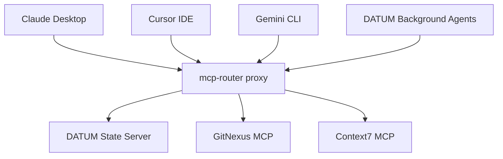

# DATUM MCP Architecture (The 1-to-Many Master Proxy)

DATUM relies on multiple Model Context Protocol (MCP) servers to function correctly:
- **DATUM State Server**: Manages the pipeline state and SSE updates (`datum://` protocol).
- **GitNexus**: Provides blast-radius and impact graph analysis.
- **Context7**: Provides real-time documentation retrieval for external libraries.

## The Friction Problem
Hardcoding all these distinct MCP servers into Claude Desktop, Cursor, Gemini, and DATUM's background orchestrator creates an unmaintainable nightmare. Whenever a new tool is introduced or an API token rotates, you'd have to edit 4 different JSON files manually.

## The Solution: MCP Router
DATUM solves this by enforcing a 1-to-Many Proxy topology using the Desktop `mcp-router` application.

### How it works:
1. **Zero JSON Editing**: You run `datum mcp sync`. This CLI command instantly purges all hardcoded tool configurations from Claude, Cursor, and Gemini.
2. **Unified Proxy**: It points all those clients to a single proxy: the `@mcp_router/cli` endpoint.
3. **Desktop Control**: You open the `mcp-router` desktop application to visually add, toggle, or configure GitNexus, Context7, and the DATUM State server in one place.

When an agent needs a tool, it talks to the router. The router delegates to the active servers. If a tool misbehaves, you just click the toggle switch in the UI, and the tool is instantly disabled across your entire fleet of agents.
