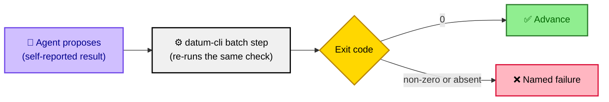
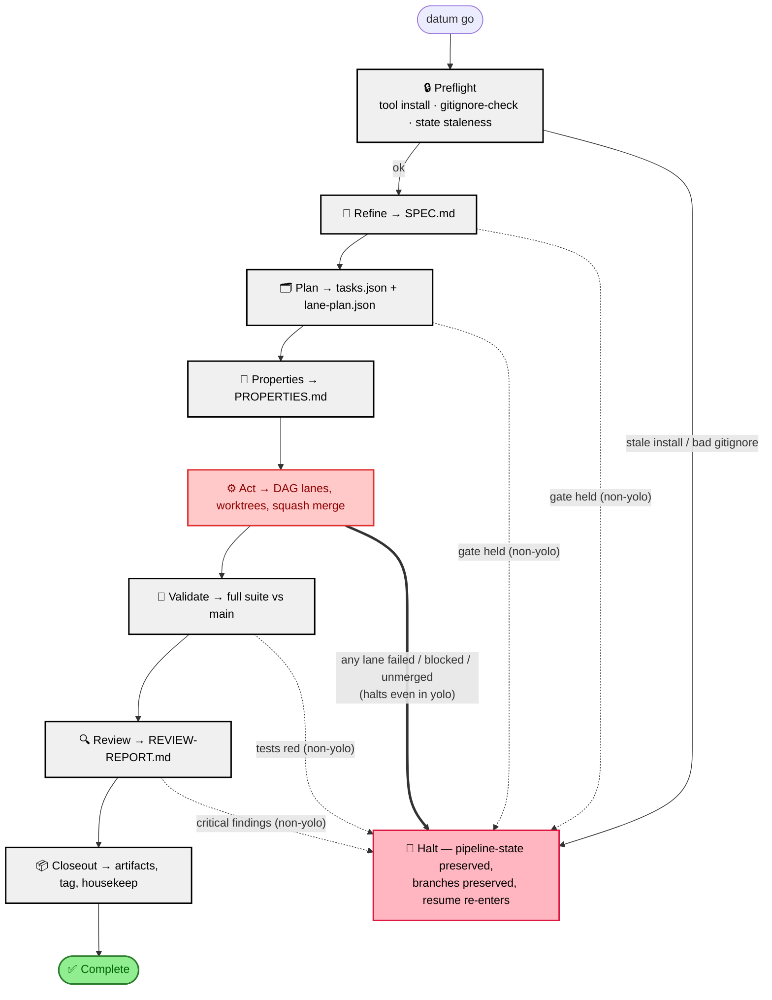
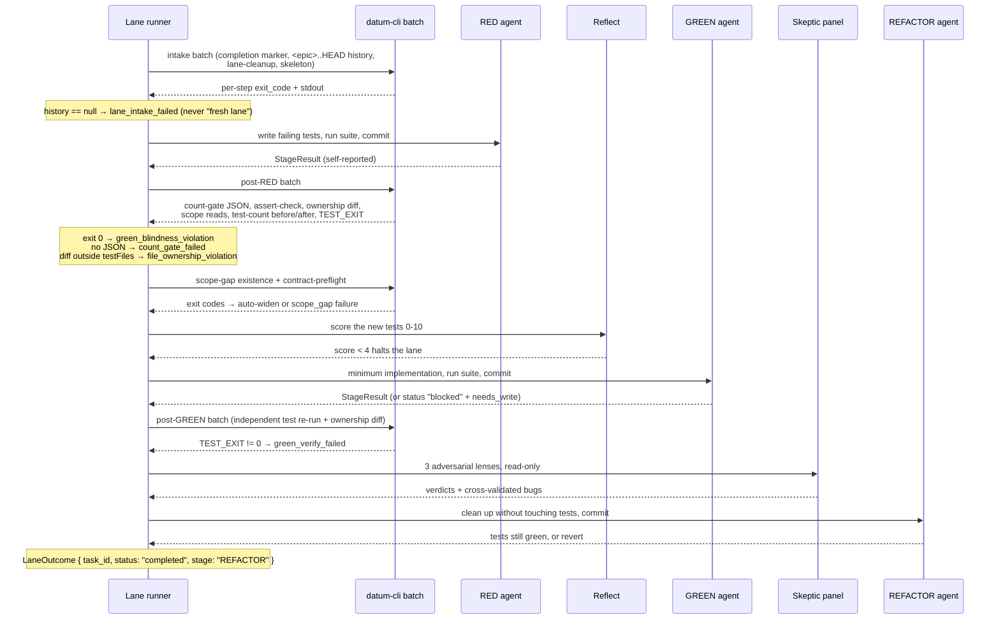
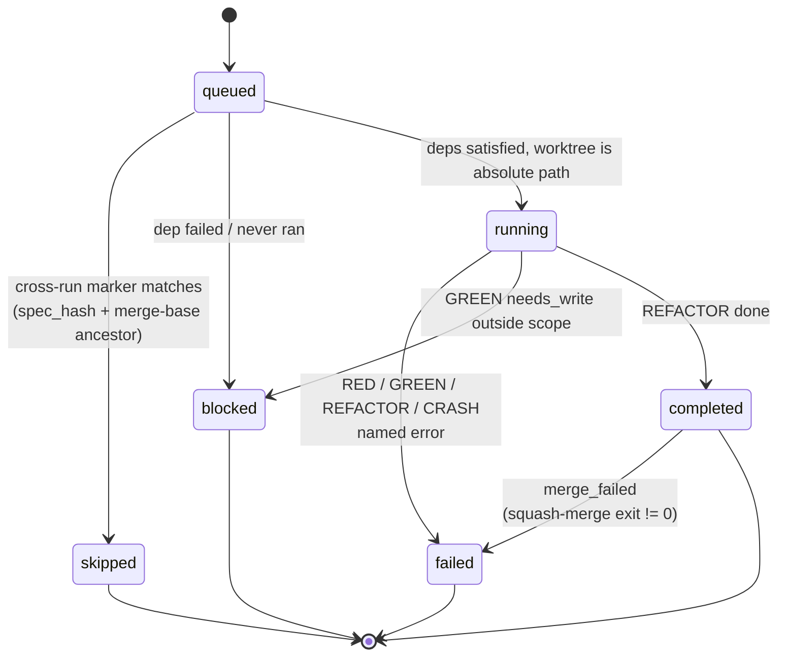

# datum — The Ideal Flow

This document describes the flow datum *wants*: a TDD delivery pipeline where an LLM may propose work but never certifies it, where every artifact handed forward has a named producer and a named consumer, and where nothing silently degrades to "fine". `datum go` (`skills/src/datum-go.ts`) runs seven phases — Refine, Plan, Properties, Act, Validate, Review, Closeout — each a child workflow script that dispatches LLM subagents for judgement and deterministic `datum ...` CLI commands (`datum/cli.py`, `datum/gate.py`) for every verdict. State lives in `.datum/pipeline-state.json` (written only after `datum pipeline-state-save` verifies the phase against git), epic-scoped lane markers (`datum lane-state`), and artifacts under `docs/epics/<branch>/`.

## Design principles

These are not aspirations; each is enforced somewhere in the code today.

1. **Every consumer has a producer.** No script reads a field that nothing writes, and no script writes a field nothing reads. A dead field is a bug, not dead weight.
2. **An LLM proposes; it never asserts pass/fail.** Every gate re-runs the check itself as a deterministic `datum-cli` batch step (`skills/src/shared/lane-steps.ts` step builders over `shared/batch.ts`) and trusts the real exit code over the agent's self-report. RED green-blindness, GREEN verification, Validate's final suite, the test-count gate, the squash-merge result and `pipeline-state-save` all work this way.
3. **No silent fallbacks.** A missing or empty result is a *named* failure — `lane_intake_failed`, `count_gate_failed`, `merge_failed`, `validate_run_failed` — never "treat as fresh", "treat as 0", or "treat as ok".
4. **A failed, blocked or unmerged lane halts the pipeline** before Validate/Review/Closeout, and Act is deliberately *not* recorded complete so a resume re-enters it.
5. **Bounded relays.** Never hand an LLM an unbounded file or log to echo back. Lane history is bounded to `<epic>..HEAD`; large reads get their own dedicated turn budget.
6. **Scoped commits.** Root-checkout commits stage only their own paths (operator WIP is not a violation); lane worktrees stay strict — the stage's diff must touch only its allowed files.
7. **Preflight demands.** A correct editable tool install, a robust `.gitignore` (`datum gitignore-check`), and a clean bootstrap (`datum init --json`) before any agent burns a token.

The shape principle 2 takes everywhere:

## 1. The pipeline

Note the asymmetry. Refine, Plan, Validate and Review hold only when `!yolo` — they are human-review holds. **Act halts unconditionally, yolo included**: shipping nothing is never an acceptable outcome to paper over. Properties has no halt at all (see Gap 5).

## 2. Phase by phase

### Preflight (before Refine)

| | |
|---|---|
| Inputs | repo root, `.datum/config.json`, `.datum/pipeline-state.json` |
| Steps | `scripts/preflight-tool-check.sh` (editable install still points at this repo); `datum gitignore-check [--fix]`; stale-state check (`isStaleState`, `shared/pipeline-state.ts`) |
| Gate | Both checks return JSON with `ok`; a false `ok` throws before any agent runs |
| Contract | `RepoConfig` (`shared/types.ts`), `AgentTypeConfig`, and a `PipelineState \| null` that is discarded when its `branch` is not the checked-out branch |

A stale editable install silently runs frozen code for the entire pipeline; a weak `.gitignore` lets scratch files land in `git add .` and collide at squash-merge time. Both are cheap to check and catastrophic to miss.

### Refine — TICKET.md → SPEC.md

| | |
|---|---|
| Inputs | `docs/epics/<branch>/TICKET.md` (+ optional `freeText` / `issueNumber` forwarded from `datum go`) |
| Steps | triage addenda → classify ambiguity → scan codebase → write SPEC.md + QUESTIONS.md → commit `refine: ...` |
| Gate | `datum gate refine` — SPEC has all required sections, no unresolved open questions, no banned vague terms, no unanswered QUESTIONS entries, plus the human-review hold unless `--approve` |
| Output contract | `{ branch, epicDir, ambiguity, gaps, gatePassed, gateMessage }` → `PhaseResult` (`datum-go.ts:61`) |

Handoff to Plan: `docs/epics/<branch>/SPEC.md` exists, is committed, and its acceptance criteria are checkable against a diff. A missing TICKET.md is a hard throw that names any input that was received and ignored — never a generic "run `datum init`".

### Plan — SPEC.md → tasks.json + lane-plan.json

| | |
|---|---|
| Inputs | SPEC.md, CURRENT_STATE.md, prior defects (`.datum/runs/*/closeout-data.json`), `.datum/ERRORS.md`, `config.context_files` |
| Steps | propose approaches → impact analysis → decompose (opus when blast radius is high) → `assertAcyclicTasks` → write `tasks.json` → `datum lane-plan` → **early gate** → *then* commit → pre-generate RED skeletons → triage → optional deepen |
| Gate | `datum gate plan --approve` runs *before* any commit (schema, `topological_order` matches lanes exactly and has no duplicates, every lane has `files` / `red_note` / `acceptance_criteria`, deps resolve, no zero-lane plan); the final `datum gate plan` re-checks with the human hold |
| Output contract | `LanePlan { lanes: Record<string, Lane>, topological_order: string[], total_lanes: number }` |

Ordering here *is* the contract: schema-invalid plans must never leave three commits behind. `Lane.kind` (`'structural' \| 'behavioral'`, from tasks.json `kind`) decides whether Act runs RED/GREEN at all — a structural lane goes straight to REFACTOR.

Handoff to Act:

| Artifact | Shape | Consumer |
|---|---|---|
| `docs/epics/<b>/lane-plan.json` (or `-final`) | `LanePlan` | `datum-go.ts` Act block, `datum-tdd-act-lane.ts` |
| `docs/epics/<b>/tasks.json` | task array validated against `task.schema.json` | `datum lane-plan`, `gate_prior_art` |
| `docs/epics/<b>/TASKS.md` | human-readable | Properties, `gate_plan` |
| `docs/epics/<b>/skeletons/preflight-<task>.json` | `ContractPreflight`-adjacent skeleton with `target_context`, `outputs[]` | lane intake batch |

### Properties — SPEC + TASKS → PROPERTIES.md

| | |
|---|---|
| Inputs | SPEC.md, TASKS.md |
| Steps | derive invariants across 11 categories, write + commit `properties: ...` |
| Gate | `datum gate properties` — all 11 categories present (SAFETY, LIVENESS, INVARIANT, BOUNDARY, IDEMPOTENT, ORDERING, ISOLATION, PERFORMANCE, SECURITY, OBSERVABILITY, COMPATIBILITY) and a task traceability table |
| Output contract | `{ branch, gatePassed }` — *ideally* consumed as a halt condition; see Gap 5 |

Handoff to Act: `PROPERTIES.md` as the invariant reference the skeptic panel and Review reason against.

### Act — lane-plan.json → merged epic branch

Inputs: `LanePlan`, `PipelineConfig`, epic-scoped lane markers. Steps: bootstrap (`datum init --json`) → resolve plan path → read plan → build waves → pack into batches of ≤5 → per batch: setup worktrees, run lanes, squash-merge → docs sync → triage. Detailed in §3.

| Handoff | Type | Producer → Consumer |
|---|---|---|
| `SetupResult { worktreePaths }` | `shared/types.ts` | `datum-tdd-act-setup.ts` → `datum-tdd-act-lane.ts` |
| `LaneResult { results: Record<string, LaneOutcome> }` | `LaneOutcome { task_id, status, stage?, error?, needs_write? }` | lane runner → `datum-go.ts` |
| `MergeResult { merged, failed, mergedIds }` | derived from the merge *step's* exit code, never from the input `completedIds` | `datum-tdd-act-merge.ts` → `datum-go.ts` |
| `DocsResult { synced, files?, committed?, commit_sha?, failure_reason? }` | | `datum-tdd-act-docs.ts` → `datum-go.ts` |
| `TriageResult { filed }` | duplicate-skipped issues are not counted as filed | `datum-tdd-act-triage.ts` |
| `.datum/runs/<runId>/lane-state/<task>.json` | `{ task_id, status }` | merge batch → next run's lane intake |

Gate: `datum pipeline-state-save --phase act --run-id <id>` refuses unless a commit matching `^act\(<runId>(-b\d+)?\):` exists in git log (`datum/pipeline_state.py:37-52`). The orchestrator honours the refusal — a `"verified": false` response leaves on-disk state untouched.

### Validate — merged epic → green suite

| | |
|---|---|
| Inputs | epic branch, `config.test_command` |
| Steps | fetch + merge `origin/main` (or fail loudly under `--no-merge-main`) → LLM validate-check (lint, AC coverage, diagnostics) → **deterministic re-run** of the exact same test command as a batch step |
| Gate | `testExitCode(...) === 0` from the independent run, and only then `datum gate validate`. `testExit === null` is `validate_run_failed`, distinct from "tests are red" |
| Output contract | `{ testsPassed, testExitCode, lintClean, acGaps, gatePassed, mainSync }` |

The agent's `tests_pass` is diagnostics only. This is the final correctness gate of the whole pipeline; it reads one number, and that number comes from a process the workflow script started.

### Review — merged epic → REVIEW-REPORT.md

| | |
|---|---|
| Inputs | epic branch diff, SPEC.md, ACs |
| Steps | four domain agents in parallel (Security, Performance, Architecture, Correctness) → dedup by `file:line:description` → render + commit `review: REVIEW-REPORT.md` |
| Gate | *Ideally* `datum gate review` — REVIEW-REPORT.md present, `review-packets/unified.json` present and schema-valid, high/critical findings trigger a bounded remediation loop (3 iterations, then escalate). See Gaps 2 and 4 |
| Output contract | `{ totalFindings, criticalFindings, canMerge }` |

### Closeout — merged epic → durable record

| | |
|---|---|
| Inputs | `runId` from Act (never regenerated), epic branch |
| Steps | one deterministic collect batch — `closeout-collect-git`, `-tasks`, `-token-metrics`, `closeout-collate`, then `test -s closeout-data.json`. Each collector is its own step so its exit code and stderr are individually visible |
| Gate | `data-exists` must be `yes`; otherwise throw rather than hand a synthesis agent a missing file |
| Steps (cont.) | synthesize CURRENT_STATE / CHANGELOG / RETRO / follow-ups (validated against `FollowUpIssue` before filing) → tag `epic/<branch>/<runId>` → archive → `datum housekeep-epic <branch>` (judges "merged" against the epic branch, not HEAD) |
| Output contract | `{ branch, runId, artifacts, followUps }` |

## 3. Act in depth

Act is where the propose/verify split earns its keep. Each lane runs in its own git worktree cut from the epic branch, so a failing lane can never leave partial work on the epic.

### One lane

Every `Note over Runner` is a named failure the workflow script decides on its own. Nothing in that column is the agent's opinion.

### Lane status

The `completed → failed` demotion is the one that matters: a lane the runner finished but whose squash-merge did not land has shipped nothing, so it is demoted before the halt check runs. Without it, Validate/Review/Closeout would run against an epic that never received the work.

### Resume

Three independent mechanisms, in decreasing scope:

1. **Phase-level** — `.datum/pipeline-state.json` `completedPhases`, verified against git before it is written. `detectStartFrom` resumes at the phase after the last completed one. State belonging to a different branch is discarded, not trusted.
2. **Epic-level** — `datum lane-state` markers. A lane is skipped only if `status == completed` **and** its `spec_hash` matches the current plan entry **and** its merge commit is an ancestor of the epic tip. All three, or the lane runs again.
3. **Lane-level (#331)** — the intake batch reads `<epic>..HEAD` on the lane branch. RED + GREEN commits present → resume at REFACTOR. RED only → resume at GREEN, reconstructing the `StageResult` from git rather than re-dispatching RED. The bound on that log is load-bearing: an unbounded read was 90 KB in a real repo, the relay truncated it to nothing, and the runner re-dispatched RED onto a finished lane.

## 4. Failure and resume semantics

| Event | Halts | Preserved | Re-entry |
|---|---|---|---|
| Preflight failure | Yes, before any agent | Everything | Fix install/gitignore, re-run |
| Refine/Plan gate held | Non-yolo only | SPEC/QUESTIONS/plan artifacts committed | `datum go --start-from <next>` |
| Lane failed or blocked | Yes, **including yolo** | Lane branches (`<epic>--<task>`), worktrees reported, `pipeline-state` without `act` | `datum go` re-enters Act; merged lanes skip via markers |
| Squash-merge failed | Yes | Lane branches untouched, no lane-state markers written | Act re-runs, merge is re-attempted |
| Validate red | Non-yolo | Epic branch, `testExitCode` in the phase result | `--start-from validate` |
| Review critical | Non-yolo | REVIEW-REPORT.md committed | `--start-from validate` after fixes |

The rules underneath: **Act is not marked complete on halt**, so a resume always re-enters it. **Nothing destructive runs before Closeout** — lane branches and pipeline-state are only deleted by `datum housekeep-epic`, which itself judges "merged" against the epic branch. And **`pipeline-state-save` can refuse**: if git shows no evidence for the phase, on-disk state stays as it was and the orchestrator logs the refusal instead of overriding it.

## 5. Gaps vs the ideal

Concrete divergences in the current code. Each names the principle it violates.

1. **Skeptic verdicts are advisory** — `skills/src/datum-tdd-act-lane.ts:921-925` logs `brokenCount >= 2` and proceeds to REFACTOR anyway. Three adversarial agents run, produce `SkepticResult`, and nothing consumes the verdict. Violates (1) and (2).
2. **Review's `canMerge` is LLM-judged** — `skills/src/datum-review.ts:105` computes `canMerge: critical.length === 0` from severities the domain agents assigned themselves. `datum gate review` is never invoked from any workflow script. Violates (2).
3. **`gate_validate` has a consumer with no producer** — `datum/gate.py:925-930` reads `.datum/last-test-signal.json`, and when the file is absent skips the check and passes. Nothing in `skills/src/` or `datum/` writes that file. Violates (1) and (3).
4. **`gate_review` is unreachable and would fail if reached** — `datum/gate.py:949` reads `Path("REVIEW-REPORT.md")` at the repo root while `datum-review.ts:94` writes `docs/epics/<branch>/REVIEW-REPORT.md`, and it requires `review-packets/unified.json` (`gate.py:957`) which no producer in `skills/src/` ever writes. Violates (1).
5. **Properties has no halt** — `datum-properties.ts:76` returns `gatePassed`, and `datum-go.ts:318-323` never reads it: the phase is marked complete unconditionally. Violates (1) and (4).
6. **Closeout still swallows tag and archive failures** — `datum-closeout.ts:83-84` embeds `2>/dev/null || true` for `git tag` and `datum closeout-archive` in the synthesis prompt, surviving the collect-batch de-silencing in 62e0e81. Violates (3).
7. **`context_files` are relayed unbounded** — `datum-plan.ts:64-71` spawns one reader agent per configured file to echo its exact contents back, with no size bound and no truncation-detection. Violates (5).
8. **Phase gate verdicts arrive through an LLM relay** — Refine/Plan/Properties/Validate all run `datum gate <phase>` via `util-run-gate.md` and parse the agent's echoed JSON (`parseAgentJson(..., { passed: false })`) rather than reading the CLI's exit code from a batch step, the way Validate's test re-run now does. Violates (2).
9. **Ownership checks fail open** — `shared/lane-steps.ts:183`: `ownershipFromStdout` returns `{ ok: true }` when the step produced no output, deliberately mirroring the legacy null-agent behaviour. A step that never ran is indistinguishable from a clean diff. Violates (3).
10. **Three remaining LLM-judged gates** — reflect `score < 4` fails a lane on a model's opinion (`datum-tdd-act-lane.ts:734`), the refactor pre-check decides whether REFACTOR runs at all (`:950-958`), and docs sync is gated on `should_refactor` (`datum-tdd-act-docs.ts:34`). Each is defensible as a *proposal*; none is re-verified. Violates (2).
