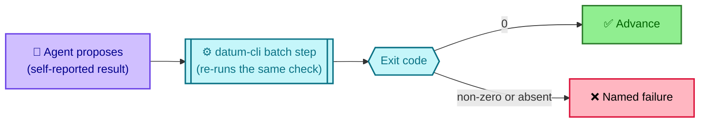
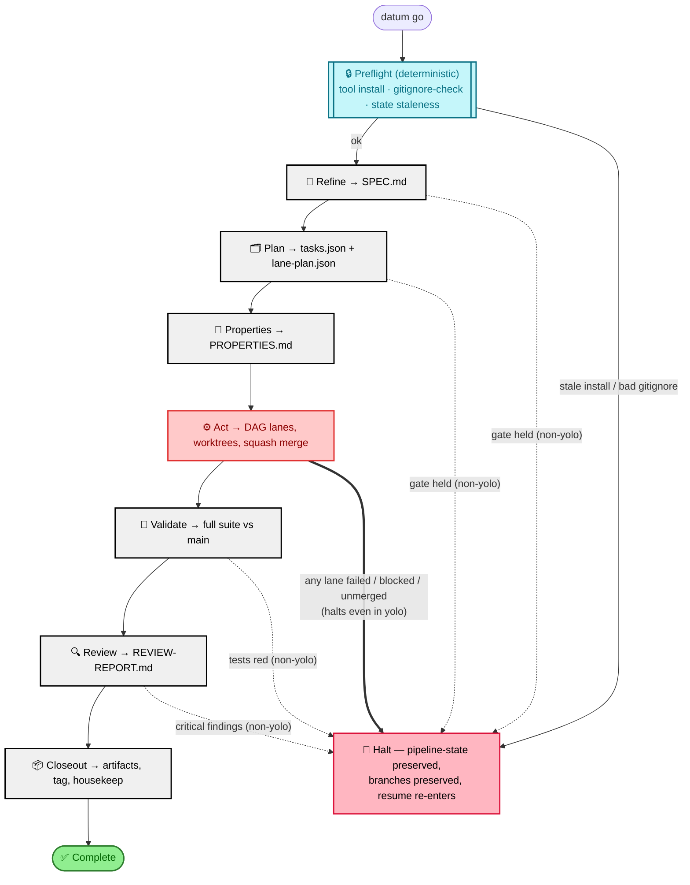
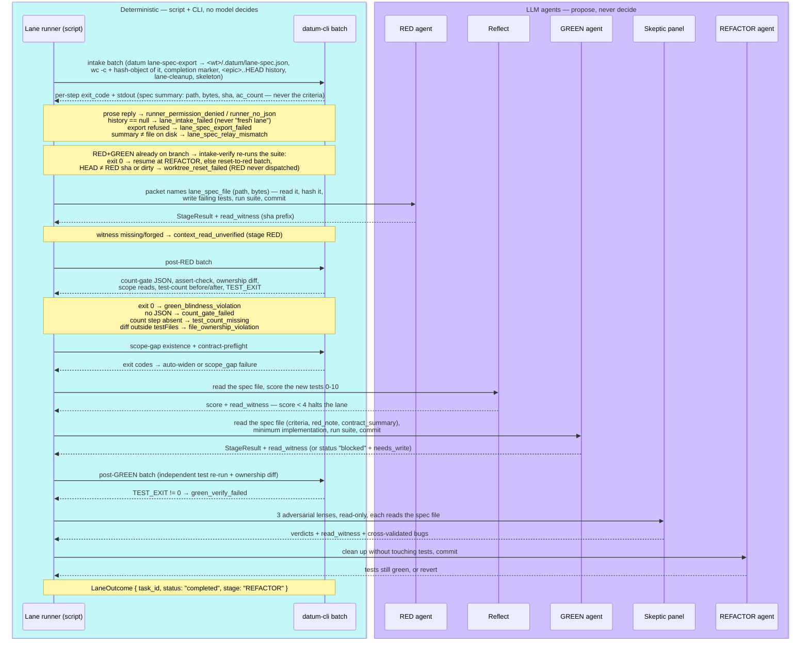
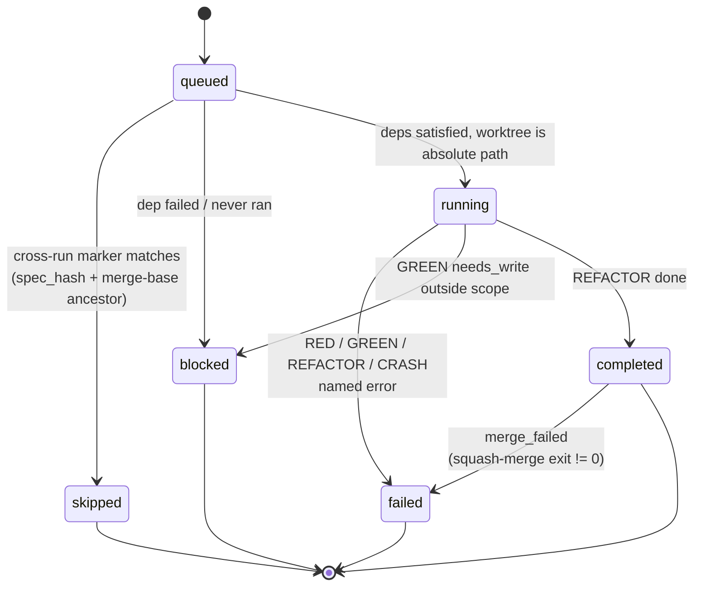

# datum — The Ideal Flow

This document describes the flow datum *wants*: a TDD delivery pipeline where an LLM may propose work but never certifies it, where every artifact handed forward has a named producer and a named consumer, and where nothing silently degrades to "fine". `datum go` (`skills/src/datum-go.ts`) runs seven phases — Refine, Plan, Properties, Act, Validate, Review, Closeout — each a child workflow script that dispatches LLM subagents for judgement and deterministic `datum ...` CLI commands (`datum/cli.py`, `datum/gate.py`) for every verdict. State lives in `.datum/pipeline-state.json` (written only after `datum pipeline-state-save` verifies the phase against git), epic-scoped lane markers (`datum lane-state`), and artifacts under `docs/epics/<branch>/`.

## Design principles

These are not aspirations; each is enforced somewhere in the code today.

1. **Every consumer has a producer.** No script reads a field that nothing writes, and no script writes a field nothing reads. A dead field is a bug, not dead weight.
2. **An LLM proposes; it never asserts pass/fail.** Every gate re-runs the check itself as a deterministic `datum-cli` batch step (`skills/src/shared/lane-steps.ts` step builders over `shared/batch.ts`) and trusts the real exit code over the agent's self-report. RED green-blindness, GREEN verification, Validate's final suite, the test-count gate, the squash-merge result and `pipeline-state-save` all work this way.
3. **No silent fallbacks.** A missing or empty result is a *named* failure — `lane_intake_failed`, `count_gate_failed`, `merge_failed`, `validate_run_failed` — never "treat as fresh", "treat as 0", or "treat as ok".
4. **A failed, blocked or unmerged lane halts the pipeline** before Validate/Review/Closeout, and Act is deliberately *not* recorded complete so a resume re-enters it.
5. **Bounded relays.** Never hand an LLM an unbounded file or log to echo back. Lane history is bounded to `<epic>..HEAD`. Epic docs go through the two-phase relay in `shared/context-relay.ts`: a probe batch reads sizes and blob hashes, an inline batch cats only what fits a 16 KB budget (byte-verified against the probe), and anything larger is handed to the consuming agent by path, byte count and hash with a mandatory Read-tool instruction. The budget exists because one batch is one tool result, and the harness spills results over ~25 KB to a file the runner can no longer echo — in dogfooding it fabricated the echo instead.
6. **Scoped commits.** Root-checkout commits stage only their own paths (operator WIP is not a violation); lane worktrees stay strict — the stage's diff must touch only its allowed files.
7. **Preflight demands.** A correct editable tool install, a robust `.gitignore` (`datum gitignore-check`), and a clean bootstrap (`datum init --json`) before any agent burns a token.

The shape principle 2 takes everywhere:

Legend for every diagram below: **purple rounded boxes are LLM agents** (a proposal, self-reported); **teal double-bordered or hexagonal nodes are deterministic** — a `datum` CLI, a bash batch, or the script itself reading an exit code, with no model in the loop. A teal step can run under a Haiku "runner" that only types the command, but nothing it says is trusted; only the exit code and the bytes on disk are.

## 1. The pipeline

Note the asymmetry. Refine, Plan, Validate and Review hold only when `!yolo` — they are human-review holds. **Act halts unconditionally, yolo included**: shipping nothing is never an acceptable outcome to paper over. Properties has no halt at all (see Gap 5).

## 2. Phase by phase

### Preflight (before Refine)

| | |
|---|---|
| Inputs | repo root, `.datum/config.json`, `.datum/pipeline-state.json` |
| Steps | `scripts/preflight-tool-check.sh` (editable install still points at this repo); `datum gitignore-check [--fix]`; stale-state check (`isStaleState`, `shared/pipeline-state.ts`) |
| Gate | Both checks return JSON with `ok`; a false `ok` throws before any agent runs |
| Contract | `RepoConfig` (`shared/types.ts`), `AgentTypeConfig`, and a `PipelineState \| null` that is discarded when its `branch` is not the checked-out branch |

A stale editable install silently runs frozen code for the entire pipeline; a weak `.gitignore` lets scratch files land in `git add .` and collide at squash-merge time. Both are cheap to check and catastrophic to miss.

### Refine — TICKET.md → SPEC.md

| | |
|---|---|
| Inputs | `docs/epics/<branch>/TICKET.md` (+ optional `freeText` / `issueNumber` forwarded from `datum go`) |
| Steps | triage addenda → classify ambiguity → scan codebase → write SPEC.md + QUESTIONS.md → commit `refine: ...` |
| Gate | `datum gate refine` — SPEC has all required sections, no unresolved open questions, no banned vague terms, no unanswered QUESTIONS entries, plus the human-review hold unless `--approve` |
| Output contract | `{ branch, epicDir, ambiguity, gaps, gatePassed, gateMessage }` → `PhaseResult` (`datum-go.ts:61`) |

Handoff to Plan: `docs/epics/<branch>/SPEC.md` exists, is committed, and its acceptance criteria are checkable against a diff. A missing TICKET.md is a hard throw that names any input that was received and ignored — never a generic "run `datum init`".

### Plan — SPEC.md → tasks.json + lane-plan.json

| | |
|---|---|
| Inputs | SPEC.md, CURRENT_STATE.md, prior defects (`.datum/runs/*/closeout-data.json`), `.datum/ERRORS.md`, `config.context_files` |
| Steps | propose approaches → impact analysis → decompose (opus when blast radius is high) → `assertAcyclicTasks` → write `tasks.json` → `datum lane-plan` → **early gate** → *then* commit → pre-generate RED skeletons → triage → optional deepen |
| Gate | `datum gate plan --approve` runs *before* any commit (schema, `topological_order` matches lanes exactly and has no duplicates, every lane has `files` / `red_note` / `acceptance_criteria`, deps resolve, no zero-lane plan); the final `datum gate plan` re-checks with the human hold |
| Output contract | `LanePlan { lanes: Record<string, Lane>, topological_order: string[], total_lanes: number }` |

Ordering here *is* the contract: schema-invalid plans must never leave three commits behind. `Lane.kind` (`'structural' \| 'behavioral'`, from tasks.json `kind`) decides whether Act runs RED/GREEN at all — a structural lane goes straight to REFACTOR.

Handoff to Act:

| Artifact | Shape | Consumer |
|---|---|---|
| `docs/epics/<b>/lane-plan.json` (or `-final`) | `LanePlan` | `datum-go.ts` Act block, `datum-tdd-act-lane.ts` |
| `docs/epics/<b>/tasks.json` | task array validated against `task.schema.json` | `datum lane-plan`, `gate_prior_art` |
| `docs/epics/<b>/TASKS.md` | human-readable | Properties, `gate_plan` |
| `docs/epics/<b>/skeletons/preflight-<task>.json` | `ContractPreflight`-adjacent skeleton with `target_context`, `outputs[]` | lane intake batch |

### Properties — SPEC + TASKS → PROPERTIES.md

| | |
|---|---|
| Inputs | SPEC.md, TASKS.md |
| Steps | derive invariants across 11 categories, write + commit `properties: ...` |
| Gate | `datum gate properties` — all 11 categories present (SAFETY, LIVENESS, INVARIANT, BOUNDARY, IDEMPOTENT, ORDERING, ISOLATION, PERFORMANCE, SECURITY, OBSERVABILITY, COMPATIBILITY) and a task traceability table |
| Output contract | `{ branch, gatePassed }` — *ideally* consumed as a halt condition; see Gap 5 |

Handoff to Act: `PROPERTIES.md` as the invariant reference the skeptic panel and Review reason against.

### Act — lane-plan.json → merged epic branch

Inputs: `LanePlan`, `PipelineConfig`, epic-scoped lane markers. Steps: bootstrap (`datum init --json`) → resolve plan path → read plan → build waves → pack into batches of ≤5 → per batch: setup worktrees, run lanes, squash-merge → docs sync → triage. Detailed in §3.

| Handoff | Type | Producer → Consumer |
|---|---|---|
| `SetupResult { worktreePaths }` | `shared/types.ts` | `datum-tdd-act-setup.ts` → `datum-tdd-act-lane.ts` |
| `LaneResult { results: Record<string, LaneOutcome> }` | `LaneOutcome { task_id, status, stage?, error?, needs_write? }` | lane runner → `datum-go.ts` |
| `MergeResult { merged, failed, mergedIds }` | derived from the merge *step's* exit code, never from the input `completedIds` | `datum-tdd-act-merge.ts` → `datum-go.ts` |
| `DocsResult { synced, files?, committed?, commit_sha?, failure_reason? }` | | `datum-tdd-act-docs.ts` → `datum-go.ts` |
| `TriageResult { filed }` | duplicate-skipped issues are not counted as filed | `datum-tdd-act-triage.ts` |
| `.datum/runs/<runId>/lane-state/<task>.json` | `{ task_id, status }` | merge batch → next run's lane intake |

Gate: `datum pipeline-state-save --phase act --run-id <id>` refuses unless a commit matching `^act\(<runId>(-b\d+)?\):` exists in git log (`datum/pipeline_state.py:37-52`). The orchestrator honours the refusal — a `"verified": false` response leaves on-disk state untouched.

### Validate — merged epic → green suite

| | |
|---|---|
| Inputs | epic branch, `config.test_command` |
| Steps | fetch + merge `origin/main` (or fail loudly under `--no-merge-main`) → LLM validate-check (lint, AC coverage, diagnostics) → **deterministic re-run** of the exact same test command as a batch step |
| Gate | `testExitCode(...) === 0` from the independent run, and only then `datum gate validate`. `testExit === null` is `validate_run_failed`, distinct from "tests are red" |
| Output contract | `{ testsPassed, testExitCode, lintClean, acGaps, gatePassed, mainSync }` |

The agent's `tests_pass` is diagnostics only. This is the final correctness gate of the whole pipeline; it reads one number, and that number comes from a process the workflow script started.

### Review — merged epic → REVIEW-REPORT.md

| | |
|---|---|
| Inputs | epic branch diff, SPEC.md, ACs |
| Steps | four domain agents in parallel (Security, Performance, Architecture, Correctness) → dedup by `file:line:description` → render + commit `review: REVIEW-REPORT.md` |
| Gate | *Ideally* `datum gate review` — REVIEW-REPORT.md present, `review-packets/unified.json` present and schema-valid, high/critical findings trigger a bounded remediation loop (3 iterations, then escalate). See Gaps 2 and 4 |
| Output contract | `{ totalFindings, criticalFindings, canMerge }` |

### Closeout — merged epic → durable record

| | |
|---|---|
| Inputs | `runId` from Act (never regenerated), epic branch |
| Steps | one deterministic collect batch — `closeout-collect-git`, `-tasks`, `-token-metrics`, `closeout-collate`, then `test -s closeout-data.json`. Each collector is its own step so its exit code and stderr are individually visible |
| Gate | `data-exists` must be `yes`; otherwise throw rather than hand a synthesis agent a missing file |
| Steps (cont.) | synthesize CURRENT_STATE / CHANGELOG / RETRO / follow-ups (validated against `FollowUpIssue` before filing) → tag `epic/<branch>/<runId>` → archive → `datum housekeep-epic <branch>` (judges "merged" against the epic branch, not HEAD) |
| Output contract | `{ branch, runId, artifacts, followUps }` |

## 3. Act in depth

Act is where the propose/verify split earns its keep. Each lane runs in its own git worktree cut from the epic branch, so a failing lane can never leave partial work on the epic.

### One lane

Every `Note over Runner` is a named failure the workflow script decides on its own. Nothing in that column is the agent's opinion.

### Lane status

The `completed → failed` demotion is the one that matters: a lane the runner finished but whose squash-merge did not land has shipped nothing, so it is demoted before the halt check runs. Without it, Validate/Review/Closeout would run against an epic that never received the work.

### Resume

Three independent mechanisms, in decreasing scope:

1. **Phase-level** — `.datum/pipeline-state.json` `completedPhases`, verified against git before it is written. `detectStartFrom` resumes at the phase after the last completed one. State belonging to a different branch is discarded, not trusted.
2. **Epic-level** — `datum lane-state` markers. A lane is skipped only if `status == completed` **and** its `spec_hash` matches the current plan entry **and** its merge commit is an ancestor of the epic tip. All three, or the lane runs again.
3. **Lane-level (#331)** — the intake batch reads `<epic>..HEAD` on the lane branch. RED + GREEN commits present → resume at REFACTOR. RED only → resume at GREEN, reconstructing the `StageResult` from git rather than re-dispatching RED. The bound on that log is load-bearing: an unbounded read was 90 KB in a real repo, the relay truncated it to nothing, and the runner re-dispatched RED onto a finished lane.

## 4. Failure and resume semantics

| Event | Halts | Preserved | Re-entry |
|---|---|---|---|
| Preflight failure | Yes, before any agent | Everything | Fix install/gitignore, re-run |
| Refine/Plan gate held | Non-yolo only | SPEC/QUESTIONS/plan artifacts committed | `datum go --start-from <next>` |
| Lane failed or blocked | Yes, **including yolo** | Lane branches (`<epic>--<task>`), worktrees reported, `pipeline-state` without `act` | `datum go` re-enters Act; merged lanes skip via markers |
| Squash-merge failed | Yes | Lane branches untouched, no lane-state markers written | Act re-runs, merge is re-attempted |
| Validate red | Non-yolo | Epic branch, `testExitCode` in the phase result | `--start-from validate` |
| Review critical | Non-yolo | REVIEW-REPORT.md committed | `--start-from validate` after fixes |

The rules underneath: **Act is not marked complete on halt**, so a resume always re-enters it. **Nothing destructive runs before Closeout** — lane branches and pipeline-state are only deleted by `datum housekeep-epic`, which itself judges "merged" against the epic branch. And **`pipeline-state-save` can refuse**: if git shows no evidence for the phase, on-disk state stays as it was and the orchestrator logs the refusal instead of overriding it.

## 5. Gaps vs the ideal

Concrete divergences in the current code, each naming the principle it violates. Items are kept once closed so the reasoning survives; the commit that closed each is named.

### Open

1. **Three remaining LLM-judged gates** — reflect `score < 4` fails a lane on a model's opinion, the refactor pre-check decides whether REFACTOR runs at all, and docs sync is gated on `should_refactor` (`datum-tdd-act-docs.ts`). Each is defensible as a *proposal*; none is re-verified. Violates (2). Accepted for now: the outcomes they gate (GREEN, REFACTOR, docs commit) are each independently verified afterwards.

### Closed

- **The placeholder scan read the whole owned file, strings included** — closed in 440aea1e/ff009375 (caliper eedom wf_0837ad8b-e5f task-005). `raise NotImplementedError` at line 240 of a test file was inside a `textwrap.dedent("""...""")` of Python source a pre-existing test feeds to the indexer, on a line the RED commit never touched; the lane halted as `placeholder_assertions` and triage filed it as agent behaviour. The scan now runs on a filtered copy: only lines the lane added since its merge-base survive, with line numbers kept, and the inside of any multi-line string is blanked; ast-grep already parsed strings correctly, the grep fallback eedom ran did not. Third instance of BUG I's lesson (a token matched inside a string) and the first of a new one: a gate on the lane's work must look only at the lane's diff, never at what the file already held.
- **The runner re-typed a batch script and dropped a quote** — closed in d71dfb8d/03f1d962 (caliper eedom wf_4f739141-c8c). The datum-cli runner transcribes the script into its Bash call, and the Haiku runner turned `printf '{"root": "%s"}'` into `"%s'}'`, an unmatched quote; setup halted on a script the workflow had written correctly, and nothing could tell a mistyped script from a failing one. `batchScript` now delivers the step runner through a quoted heredoc into a file, hashes it with `git hash-object` against the sha computed in TS, and sources it only on a match; a mismatch is one `__script` step naming `batch_script_corrupt: expected <sha>, got <sha>`, and `runBatch` re-sends the batch once to a fresh runner, the same shape as the refusal retry. Same principle as the relay closures below: bytes that cross an LLM turn are hash-checked, never trusted.
- **A batch assumed the runner's cwd was the repo root** — closed in 4377792d/1a0d0f26 (elonchesd wf_29721006-d27, run 20260905-100901). The closeout commit batch ran `git add docs/epics/datum/epic-1/RETRO.md` and got `pathspec did not match any files` although the artifacts agent had just written the file and it was on disk in the main checkout: the session's shell was sitting in a second worktree of master (`.temp/master-wt`, made to build a container image), so every relative `.datum/...` and `docs/epics/...` path resolved there, and the halt named the pathspec, not the directory. datum-go's boot batch already measured the root; it now records it (`setBatchRoot`), threads `repoRoot` through phaseArgs and every act child, and `batchScript` prepends a guarded `cd` ahead of the integrity wrapper: a vanished root is one named `__script` step, `batch_root_missing: <root>`, and nothing runs. The ordering tripwire covers the call like it covers the cache key. Same rule as the fingerprint: what the orchestrator measured once, every batch of the run is told, never re-guessed.
- **Plan left a consumer's committed routing.json modified; reflect ran out of turns reading its deferred inputs** — closed in 7152d7d9/bdee8ba0 and a464e08f (caliper eedom wf_4f739141-c8c). Plan stopped committing routing.json in 946c725a, but eedom had committed it under an earlier datum, so every plan run dirtied a tracked file; after the triage gate has read the fresh decision a tracked copy is restored to its committed content and `routing_json_tracked` names the untrack command (an untracked file is untouched; a step that did not run is `routing_restore_unchecked`). datum-reflect kept an 8-turn cap from before the lane spec became a deferred file; reading the spec, hashing it for the witness, reading every test file and surviving the harness's schema retry needs more, so the cap is 14. Reflect failing remains non-fatal (`reflect_no_result` proceeds to GREEN).
- **Closeout's token collector reported zero for a run it never measured** — closed in 6fdf8add. `closeout-collect-token-metrics` wrote `total_tokens: 0` whenever the per-run ledger was absent, so the CLOSEOUT report stated a cost it had not collected. It now writes `collected: false` with the reason and the synthesis names the absence. Principle 4: never claim a number that was not produced.
- **The closeout phase could never be recorded as complete** — closed in 291628cf (elonchesd epic-1 and epic-2). `verify_phase` matched `^closeout:` but the closeout batch commits `closeout(<run>): ...`, so pipeline state never gained the phase that had just finished and a relaunch would have redone it; the verifier accepts `<phase>:` or `<phase>(`. Found because elonchesd reported the exact commit subject and the exact pattern side by side: a precise report lands a fix at the source in one step, and the pipeline's own loop principle, "report the thing you saw, not what you concluded from it", applies to the humans and agents driving it too.
- **Review regenerated a report that already passed, and each regeneration sampled fresh "high" findings** — closed in ad8fd684/bbae0769 (elonchesd wf_54212856-1cb). Every blocker of iteration 2 was accepted by key and the gate answered needs_human; the yolo relaunch re-ran all four lenses, wrote a third report with six new highs (architecture the SPEC mandates, re-raises of decided places) and hard-stopped at the cap. Accepting was punished. Review now runs a structural early gate first and skips the lenses when the report passes (`review_already_complete`), which also stops the iteration counter from moving on an accepted state; the lens rubric reads REVIEW-RESPONSE.md, never re-raises a decided place, grades against this SPEC only, and requires a requirement, AC or measurable NFR citation for high. Same shape as the refine closure: a phase must recognise its own completed output before regenerating it.
- **The runner trimmed the last inline read's trailing newline and refine halted on a byte count** — closed in 0f93a83c/646ee9ab (caliper eedom wf_4f739141-c8c, 3695 of 3696 bytes, otherwise byte-identical). The probe records each file's blob sha, which proves the bytes where a count only measures them: a read exactly one byte short is restored when content plus a newline hashes to that sha, named in a warning, and rejected otherwise. Principle 5 refined: a byte count detects a relay loss; a hash decides whether the loss is recoverable.
- **A review lens answered in prose and halted the phase; a chained epic was reviewed against the wrong base** — closed in 9110236b/5776c924 (elonchesd wf_22ad6b36-dec). The lens calls now carry a schema, so the runtime validates and retries instead of a strict parse throwing once. `datum init --name` records the branch an epic was created from, `datum epic-base` resolves it (recorded parent, else origin/HEAD, else main or master), and review and closeout diff from it; #449 closed with it. The class behind the first half, sixty-nine parsed agent calls without a schema against seventeen with one, is #458.
- **A conflicting lane merge lost its git-level reason** — closed in d09ed0ee/a94ef07a (elonchesd wf_8769406f-b9c task-015; epic-2 Act completed 15/15 and the game plays in a browser). `merge_failed: squash-merge of task-015 did not land` said nothing about the conflicting file; the operator redid the merge by hand to learn it. The merge now captures the conflicted paths and git's output before the reset erases them, writes `.datum/runs/<run>/merge-conflict-<lane>.json`, and the demoted lane's error names the files, the reason and the report. The rebase-and-retry for a conflict in a lane-owned file is #456; the browser gate for DOM/canvas lanes, which would have caught four defects every unit-level check missed, is #457.
- **Any `throw new Error` in a TS test file read as an unfilled skeleton** — closed in 7a3c9e44/6806dd79 (elonchesd wf_a979f3d8-f0c task-013). The placeholder pattern was a token, so a guard clause beside real assertions failed a sound RED as `placeholder_assertions`. The check now matches the placeholder's shape, a test whose whole body is the skeleton throw, with a grep fallback on the skeleton's own message; a pattern entry carries its own fallback regex when its shape cannot be grepped. Same lesson as BUG I: match the thing, not a substring of it.
- **A lane could not amend a stale assertion in its own test file** — closed in eeb7f0d0/700a384f (elonchesd wf_bd10e486-775, the first run through Act with no datum halt). RED's rule "keep all existing tests intact" plus GREEN's `green_edited_tests` made a lane that extends a model deadlock on the previous epic's exact-shape assertion in a file the lane owns. RED now amends assertions the lane's ACs supersede, names each amendment, and never touches a test no AC contradicts; reflect reports a surviving contradiction as `stale_owned_test`. The twin case, a wrong fixture precondition GREEN diagnoses correctly but may not fix, is the bounded RED-repair route on #440.
- **First full completion on a consumer repo** — caliper #521 on eedom, 2026-09-05, run wf_32ecbc35-11b on 4aa3cb58: twenty `datum go` launches, Act 9/9 lanes merged, Validate green after six cross-lane fixes on the consumer side, Review passed on iteration 3 with four recorded decisions, Closeout wrote RETRO and CURRENT_STATE, retained five follow-ups, archived (4ba01d1). Nineteen named datum defects came out of those twenty runs (A through V above), every one a gap that only a second repository with a different shape could expose.
- **Second consumer, two epics to closeout** — elonchesd on elonChesd (a browser game served from a container), 2026-09-05: epic-1 (`datum/epic-1`, wf_29721006-d27) and epic-2 (`datum/playable-ui-shell`, wf_9b77d41e-3cd, Act 15/15 lanes merged, archived abe4635 and 4eec88d). A local-only repo with default branch `master`, TS tests under vitest and pnpm worktrees: the main-sync, base-branch, worktree-environment, review-iteration and pipeline-state-mirror closures above all came from it, none of which eedom's shape could have surfaced.
- **Closeout artifacts counted other epics' lanes, wrote a release-please CHANGELOG, and collided with a stale root TASKS.md** — closed in bb673842/0eb283aa (caliper BUGS T/U/V). Task metrics now count only the lanes in this epic's plan and list foreign markers as ignored; a CHANGELOG owned by release-please is skipped by name and the synthesis prompt quotes REVIEW-RESPONSE.md verbatim; a root artifact whose epic-scoped destination exists is kept in place as `KEPT_ROOT`, and an untracked root CURRENT_STATE.md is moved aside before synthesis, never overwritten. Retained follow-ups are not yet re-checked against later commits (#453).
- **Closeout died on a collector whose producer was retired** — closed in 0d736771/19812711 (caliper BUG S, eedom wf_8240c0f1-6e1, the first run to reach Closeout). `collect_tasks` read a `state.json` lane map nothing in Act writes any more (the mirror of the #394 dead-producer class); collate turned the missing optional output into a schema failure that also sank the collectors that had worked; the batch's base-sha step hard-coded `origin/main`; and the halt said "closeout-collect: ok" because every collector step is tolerant. Tasks now come from the lane plan plus every lane-state marker (epic-scoped and per run, so an Act spread over many run ids is counted whole); collate fails open with a named `collector_warnings` entry and lifts `lanes`; the base branch is resolved; the halt names each failed collector with its exit code and tail. Principle: a consumer without a producer is dead code that fails at the worst moment, and a tolerant step is still a failure to report.
- **A reworded re-finding got a new key and the recorded decision stopped applying** — closed in fb151ebe (caliper BUG R, eedom wf_40e67cca-a79). The content key hashes the finding's text, so a reviewer restating the same finding at the same file and line produced a new key and the operator's DEFER no longer matched; every reviewer re-run would have invalidated every recorded decision. The `review-accept` line already names `(<ID> <file>:<line>)`; the gate now parses that note and clears a row by lens, file and line when its key has no decision, saying "matched prior decision" in the pass message. The text key stays the identity; the place is the fallback, and ad69a8a6 extends it across lenses when the row and the recorded reason cite the same requirement id (R2.1, INV-003), the identity a reviewer actually re-derives a finding from. 3383ff29 (elonchesd epic-2 iteration 2: a perf finding re-raised by the architecture lens at the same line blocked) makes the place the identity regardless of lens and names the rule in the pass message, "(file+line)" or "(file+line+R12)", so an operator can tell a rule-based match from luck.
- **Plan committed run state under `.datum`; skeleton class names failed pep8-naming** — closed in 946c725a/38e5e643 (elonchesd wf_1b098b4d-33c) and 256a731e (caliper BUG Q, eedom wf_148432f2-fd0). `routing.json` was committed although datum's own gitignore-check ignores `.datum` run state and a consumer's global excludes ignored the whole directory; `datum gate triage` reads it from disk and nothing reads it from git, so it is now written and gated, never committed, and a test forbids any phase commit batch from adding a `.datum` path. `datum skeleton` named classes `TestTask_001_AC1`, which ruff's N801 rejects; now `TestTask001AC1`. Follow-ups filed: #451 (deterministic post-GREEN lint autofix), #452 (Validate reports tests, lint and AC coverage together).
- **A refused gate batch cost the whole refine output and the operator's answers** — closed in 2f67f118/4af00b05 (elonchesd wf_230050d5-e9e). The previous run's gate batch was classifier-refused, so refine was never recorded; the relaunch regenerated SPEC.md and QUESTIONS.md and discarded five answered questions. Refine now runs a structural early gate after Read and skips regeneration when it passes (`refine_already_complete`); when it re-runs, QUESTIONS.md is relayed to the writer with a carry-forward rule, and a bash check confirms every previously answered line survived before committing (`refine_answers_dropped`, or `refine_answers_unchecked` when the file was over the relay budget). Answered questions are operator decisions: a prompt rule proposes, the batch verifies.
- **Review accepts bound to renumbered ids; iterations counted gate calls; gate batch bypassed the runner** — closed in 4b6ddf2b/bb5bfaa7 (elonchesd epic-1 review iteration 2). Ids are reassigned every review run, so `ACCEPT PERF-001` matched a different finding the next time; every report row now carries a content key (lens, file, normalised description) and accepts bind to it, with a bare-id accept on a keyed report named as ignored. The iteration counter read a run id from the wrong key (every epic shared one file) and grew on every gate call, so an operator's own probes escalated the epic; an iteration is now a distinct blocked report, per epic, and clearing every blocker clears the escalation. The eight gate batches go through `runBatch` like every other batch. DEFER lines are accepted by the gate; the carry-forward into the target epic's TICKET is #450.
- **Review severity was a hard block with no recorded way past it; the gate claimed a remediation package it never produced** — closed in b4276535/b78b8c3f (elonchesd epic-1 review iteration 1: five of six "high" findings were per-frame scans over forty items). `datum review-accept <ID> --reason` records an operator accept in `REVIEW-RESPONSE.md`; the gate parses finding rows by id, ignores accepted ids, names the blocking ids and the accept command, and names the accepted ids when it passes. The "Remediation Package generated" line is gone: nothing produces one in a consumer repo (principle 4, never claim an artifact that was not written). The review lens carries a severity rubric: high means measurable at the spec's stated scale.
- **A second epic's init erased the first epic's pipeline state; `--name` on an epic branch re-adopted it** — closed in a16d8b25/bf0a10bf (elonchesd). `ensure_feature_branch` returned the current branch for every non-protected branch, title ignored, so `datum init --name X` on `datum/epic-1` answered `datum/epic-1` and datum-go's freeText path would have continued under the wrong epic; on a datum epic branch a different name now creates `datum/<slug>` from HEAD. Pipeline state is mirrored per epic under `.datum/epics/<slug>/pipeline-state.json`, restored on switch, seeded from the epic's own mirror by `pipeline-state-save`, and housekeep no longer deletes another epic's global state. The global file remains the "current epic" pointer; the full identity redesign is still open.
- **Context inline batch assumed the probe's shell state** — closed in 794f5e14/4e290148 (elonchesd wf_8913d90e-75f). The probe batch defined `__eb`; the inline read was a fresh batch that referenced `$__eb` without defining it, so `docs/epics/$__eb/TICKET.md` read as `docs/epics//TICKET.md` and refine halted with `context_relay_mismatch` on a file the probe had just measured. Plan and properties had the same latent gap. Every batch is a new shell; `contextInlineSteps` now defines `__eb` itself.
- **Main sync hard-wired `origin/main` and could not skip** — closed in be0cd7fc/46928901 (elonchesd wf_c17266bb-33a). A local-only repo (no remote, default branch `master`) could never pass Validate: the fetch failed by construction and the runner's refusal was neither retried nor named. The batch now records whether `origin` exists (a named `main sync skipped: no origin remote` that Validate accepts), resolves the base branch from `main_branch` in config, then `origin/HEAD`, then `origin/main`/`origin/master`, and runs through `runBatch` so a refusal is retried once and named. A remote whose fetch fails is still `main_sync_failed`.
- **A sound GREEN was discarded as `green_edited_tests`** — closed in 2dcc2a66/5b9f2c6a (caliper wf_b5e87f27-e4b BUG P). The lane runner registered every preflight skeleton output path as a test file, a second classifier that overrode `classifyFiles` and turned a doc and a deliverable fixture into "the lane's test files"; GREEN wrote them, the check fired, `reset --hard` threw the correct implementation away, and the retry deadlocked with the files in both write lists. Now only outputs `classifyFiles` calls tests are registered, the post-GREEN batch lists the RED commit's files and the check fires only for a test file RED actually wrote, and the GREEN commit is pinned to `<epic>--<lane>--discarded-green` before any reset. Principle: one classifier per fact; and never destroy a commit a gate rejected, pin it.
- **Cleanup never saw the lane worktrees; the setup error was thrown away** — closed in f99368f1/599cad8f/6a5d3573 (caliper wf_7686c0cf-f7e BUG O). Setup runs inside the batch's root worktree, so lanes nest under it; cleanup ran from the main checkout and scanned a run directory that never existed there, leaving empty lane branches alive and one lane registered with its files gone. The next setup died on that stale worktree, and the setup-wt step's `$(...) && printf` shape dropped the CLI's JSON diagnosis on exit 1 (the empty-string fallback used `??`, so the error read "CLI output was not JSON — " and nothing). Cleanup now unions the directory scan with git's own worktree list for the run and prunes; a stale worktree whose only changes are deletions is reclaimed; the step captures unconditionally and `laneWorktreePathsFromSteps` surfaces the CLI error verbatim as `setup_worktrees_failed`. The second half, 441c901b/79cb26af: cleanup only ran inside the merge child, so a throw in setup or the lane workflow skipped it; both orchestrators now run `cleanupSteps` for the in-flight batch from their act catch block (`cleanup_after_crash_failed` if even that fails). 5d81fc34: run directories git no longer registers are deleted outright after git has had its turn, so orphans stop accumulating. Principle 4 again: the JSON the CLI already printed is the diagnosis, never let the shell discard it.
- **Named launch ran a stale registry copy** — closed in 2c35494 (elonchesd wf_d95d30ed-366: `Workflow({name: "datum-go"})` executed the previous bundle right after a refresh; sub-workflows, loaded by `scriptPath` from `.datum/skills`, were current). The harness can hold the named copy for a session and nothing on our side invalidates it, so the launch is by `scriptPath`: `datum init`/`--refresh` print the exact line and SKILL.md instructs it. Consequence for the dogfooding record: every top-level datum-go fix between the act-phase halt and the digest first ran in wf_47c507cf-1e5.
- **`datum init --refresh` never pruned deleted bundles** — closed in 3660b6f (caliper: a stale `datum-route.js` survived the refresh and its `~/.claude/workflows` symlink dangled): `prune_stale_skills` runs inside `resolve_skills_dir`, `prune_dangling_workflow_links` runs after the workflow install and reports what it removed.
- **Lane worktrees had no test environment; a missing runner read as a red suite** — closed in b1634731/97117202/2c39c8c6 (elonchesd wf_eb0f9f9b-7b1). `git worktree add` checkouts carry no node_modules/.venv, so every verify exited 1 and every committed GREEN was `green_stale` at the next intake (an endless reset→GREEN loop). Setup gives each lane its own dependencies from pnpm's / uv's global cache (`pnpm install --frozen-lockfile --prefer-offline`, `uv sync --frozen`, when the lockfile and tool are present — 562aa473) and symlinks from the main checkout whatever that did not produce (`worktree_link_dirs`, default node_modules and .venv, resolved via the git common dir because the root worktree has none either); every independent test-verify names a missing runner/interpreter as `test_env_missing` before reading the exit code.
- **Unbounded scope reads spilled the post-RED batch** — closed in 4da0c82c/16c3a13e (caliper wf_a082eead-829 BUG N; triage mis-filed it as a count-gate tool bug, #441 closed). The post-RED batch cat'ed every lane test file next to the count gate; one large file pushed the result over the harness spill threshold and the runner returned nothing. Reads are `head -c` capped (16 KB budget split per file, 2 KB floor) with a size step, and a truncation is `scope_read_truncated` in the log. Same rule as principle 5: no batch may echo unbounded file content.
- **Python core review (worktree manager, gate, pipeline-state-save)** — closed in 311aa258/440096c1/faf288ea. A merge retried after a crash between a lane's temporary squash commit and the fold left that `tmp(datum)` commit on the epic branch (the fold base now starts below leftover tmp commits); the refine gate's Open Questions / section checks skipped H1 headings and the required-sections check matched prose; the review gate saw only four severity spellings; `pipeline-state-save` raised a traceback when git failed. Left as design/backlog: `resolve_epic_dir` trusting the cwd branch (already recorded in the dogfooding notes).
- **A RED from an earlier lane spec was reused on resume** — closed in b21e61fa/79a431c3 (caliper wf_7fb1a1b8-252 BUG M). Lane commits carry `Datum-Spec: <laneSpecHash>`; the intake history prints it (tab-separated) and `detectExistingLaneCommits` returns it; a RED whose spec differs from the digest's is `red_spec_stale`: reset to the epic branch (HEAD checked against the resolved ref), RED re-dispatched. Trailer-less commits from older runs are reused as before.
- **Phase-review sweep, orchestrators** — closed in 28c13daa/10494fe4/1dd023c7 (wf_9a69f891-462, act/go). `args.phases` is validated (`invalid_phase`); a mid-run new-epic bootstrap resets the inherited run id so a run without Act does not close out under the prior epic's id; the standalone Act wraps each batch (`act_batch_failed`, dependants blocked by the dep check) instead of aborting without summary or triage, and passes Plan's `skeletonDir`. The Act result reports `approvalLanes`/`needsApproval` apart from the dependency-blocked count (caliper).
- **A GREEN blocked on out-of-scope files read as a dependency block and lost its work** — closed in 41a5a1a9/fdab43f2/bb7ba4ad (caliper wf_2a6b91bb-bb4 BUG L). The lane commits GREEN's partial implementation files as `wip(<lane>): GREEN partial - blocked on <files>` (ignored by resume detection, so the next GREEN starts from them), the error is `green_blocked_needs_write: [<files>] — <reason>`, datum-go lists such lanes under LEAD APPROVAL NEEDED like datum-tdd-act already did, both orchestrators triage them even with zero failures, and triage classifies the prefix as a lane-plan defect.
- **Completion markers preceded the merge; root worktree setup was not idempotent; triage could crash Act** — closed in c6044278/c08e7e27/1788e445 (phase review wf_9a69f891-462, Act/merge/setup/go scripts). The per-run marker the intake batch reads as "completed" was written for every completed lane before the squash and regardless of its outcome, so a lane whose merge failed was skipped on the next run; markers now follow the merge and are gated on the merge JSON's `merged`/`already_merged` (`SKIPPED_NOT_MERGED` otherwise). `root-wt` removes a root worktree left by a prior partial setup of the same batch. The triage child workflow is wrapped (`triage_workflow_failed`) and its filed/consumer_findings/skipped counts are logged in both orchestrators.
- **A mangled skeptic witness voided a verified panel** — closed in eac354e3/deef5d9f (caliper wf_2f49073d-f07 BUG K3: a haiku lens returned the correct prefix as the KEY with value "true"). The witness prefix counts wherever it appears in `read_witness` (key or value, 7+ hex); a lens that still cannot be verified is `skeptic_lens_unverified` and dropped from the vote, and only a panel with no verified lens fails the lane (`context_read_unverified`, stage GREEN).
- **Phase-review sweep (Sonnet whole-file + refutation, wf_8a923794-99c / wf_9a69f891-462)** — closed in 9f992b9a/0458bcb7 and 9a32e33c/b6861c3d. Validate exported no `gateMessage`/`gateNeedsHuman`/`hardStop` although datum-go reads them on every validate halt (every hold printed "needs review"); Review compared the LLM's severity string verbatim, so "High"/"HIGH" never reached the critical/high merge gate — severity is normalised and an unknown value counts as high (`review_severity_unknown`), a reply without a findings array is `agent_output_unparseable`; Plan's parseable-but-empty approaches list fed "undefined" to decompose (`plan_no_approaches`); docs-check ran through bare `agent()` so a null read as "no stale references" (`docs_check_no_result`, and both consumers now warn on any docs `failure_reason`). The Haiku per-call-site checklist layer of the same workflow produced only refuted findings on its canary and was dropped. Filed, not fixed: Refine re-triages addenda on every re-entry (see-something issue).
- **Single-lens skeptic findings were dropped; the follow-up filer had no consumer** — closed in 1052590a/90c8982b/da1be7f0 (caliper#564). A critical/high finding one lens evidenced and the others did not corroborate is not a retry trigger (2-of-3 stands) but is now `skeptic_minority_finding: <lane> — <claim>` in the lane log, a FollowUpIssue under `.datum/runs/<run>/follow-ups/<lane>.json` (heredoc, hash-verified), a `follow_ups` count on the LaneOutcome for the Act summary, and filed at Closeout by `datum closeout-file-followups` (every evidenced severity is written per lane; the filer opens issues only at `--min-severity` high and reports the medium/low count retained in the manifest) — which existed but was never registered or run, and read `follow-ups.json` from the cwd instead of the run directory the synthesis agent writes to.
- **Witness rejected on prefix length; no-op commits blocked resumes** — closed in 276d90ec/092ec73f and a4f50e93 (caliper wf_c11a9109-d48 BUG K2; phase review wf_8a923794-99c). `verifyReadWitness` accepts a correct prefix of 7+ hex chars (git's short-sha floor; the prompt still asks for 12) and names a shorter correct one `witness prefix too short (N < 7)`. `git add` of a missing file already fails the commit batch, so nothing-to-commit means the artifact matches HEAD: Properties, Plan, Closeout and Refine's SPEC commit log "unchanged since the last run" instead of throwing "the agent did not write it"; Refine's ROADMAP append stays strict.
- **A refused batch was final; GREEN editing its own tests read as a foreign-file violation** — closed in 681021ae/e369725e/b96b0d02 (elonchesd wf_0593c210-f04). The host classifier allowed one of three identical reset batches under the same allow-rule, so `runBatch` re-sends a refused batch once to a fresh runner (`:retry` label, retry marker in the prompt) before the caller names `runner_permission_denied`; every lane-runner batch goes through it. A GREEN diff touching the lane's OWN test files is `green_edited_tests`: reset to the RED commit (HEAD-verified), one GREEN retry with the hint, suite and diff re-verified, failure by that name only on a repeat. GREEN prompts forbid editing tests and `--amend`.
- **Placeholder scan fired inside string literals; witness rejected on key shape** — closed in 4d9a182d..4c53f46c (caliper wf_181691ac-fbf, BUG I / BUG K). The `assert-check` grep fallback (no ast-grep) is anchored `^[[:space:]]*<escaped literal>`, so a fixture string in a test-detection test no longer fails a sound RED as `placeholder_assertions`. `verifyReadWitness` accepts any `read_witness` entry whose VALUE is a prefix of the file's blob sha (a haiku keyed by the full sha instead of the path); the instruction now states key = path, value = prefix. `resilientAgent` logs a null first attempt by name.
- **Closeout collate could never run; a refused reset-to-red still dispatched RED** — closed in 01ee0d4d and 831db0f8/babeb809/daa8baa8/bcb558fd. The CLI producer/consumer audit found `closeoutCollectSteps` invoking `datum closeout-collate` without its required `--epic-number`: argparse exited 2 on every run, `closeout-data.json` was never written and datum-closeout halted on "missing after collect"; the flag is optional now (branch pattern, else the UNKNOWN sentinel), which exposed that `CloseoutData` pinned `epic_number` to `>= 1` while the sentinel is -1 — the schema owns the sentinel and validates `>= 1 or UNKNOWN`. elonchesd wf_2b0230c2-f41: task-016's refused `git reset --hard` still parsed as a batch (tolerant step, non-zero), `resetToRedResult.missing` was false and RED ran on the un-reset worktree; the batch now reports HEAD and `worktreeResetToFromSteps` gates on HEAD == RED sha and a clean tree (`worktree_reset_failed`). Ownership violations no longer call a lane's own forbidden-at-this-stage file "owned by another lane"; "I cannot run / unable to execute" runner replies are refusals.
- **A dropped test-count-before step passed the post-RED count gate** — closed in 0ebb74eb (silent-fallback sweep of skills/src/shared): `sumCounts(null)` was 0, so a missing baseline read as `after - 0` new tests. `newTestCountFromSteps` requires both count steps and fails the lane as `test_count_missing: <step>`. The same sweep found every other `||`/`??`/`{}` default in shared/*.ts already guarded by an explicit missing/failed check.
- **The read witness could be copied from the prompt; the export summary was trusted; the runner's refusal was anonymous** — closed in f09c9c1/fc39136/831834e/ace40fb and 1185f17/aa0bd6f (review of the lane-spec slice, then elonchesd wf_2bf3cc14-899). The packet and `contextSlot()` printed the deferred file's full blob sha, so a stage agent could satisfy `read_witness` from its own prompt: `lane_spec_file` is `{path, bytes}` and the slot names path and bytes only (this also hardens the SPEC.md deferred read). The intake batch re-measures the exported file with `wc -c` and `git hash-object` (`lane_spec_relay_mismatch` on disagreement; the echoed path must equal `--out`). Witness failures record their stage instead of CRASH; `laneSpecExportCommand` guards its ids like `completionMarkerCommand`. When the host permission classifier refuses a batch (elonchesd: `git reset --hard`/`clean -fd` in a scratch worktree) the runner's prose reply is now `runner_permission_denied` with the excerpt (else `runner_no_json`), triage classifies it as an allow-rule matter, and SKILL.md tells operators to grant the rule up front — datum does not wrap the commands to evade the classifier.
- **The per-lane spec echo at intake was corrupted too (backticks became \\`)** — closed in 2fff95a/cddd455/e9285d3 (elonchesd wf_47c507cf-1e5, the first run on a current bundle: task-011/013/016 failed `lane_spec_relay_mismatch` at +44/+22 bytes, every extra byte an escaped backtick the Haiku runner added to the jq'd JSON). The intake batch now runs `datum lane-spec-export --plan --task --out <wt>/.datum/lane-spec.json --expect-hash <digest spec_hash>`, which writes the lane file itself, refuses on a hash mismatch (exit 1, nothing written) and prints only `{task_id, path, bytes, sha, ac_count}` (`lane_spec_export_failed` / `_unparseable`). The criteria text never enters the script: RED/GREEN packets carry `lane_spec_file {path, bytes, sha}` instead of `acceptance_criteria`/`red_note`, and red/red-retry/green/green-retry/reflect/skeptic prompts get the SPEC.md deferred-file contract (`contextSlot` + MANDATORY READ WITNESS); `witnessedAgent` (resilientAgent + `assertReadWitness`) fails the lane as `context_read_unverified` on a missing or forged witness, skeptic lenses included, and the count gate reads `ac_count` from the CLI. `contract_summary` is computed by the Python port inside the exported file; `extractContractSummary` is deleted with its last consumer. Real-bundle tests drive the forged-witness and hash-mismatch paths.
- **Chunked base64 lane-plan relay was generated, not copied** — closed in 6426375/a9beb47/6c93b50 (elonchesd wf_5791e11f-693: 15 021 chars of valid base64 that decoded to the real file only up to byte 2 741, then hallucinated; the byte check caught it but retries would be a lottery). The plan never travels through an LLM turn as a whole again: `datum lane-plan-digest` writes a compact digest (topology, files, per-lane `spec_hash` from the Python port), the act-start batch relays only that file byte-verified (`lane_plan_digest_mismatch` / `_too_large` / `_failed`), and each lane fetches its own full spec at intake with `jq`, wc -c and hash-object --stdin, cross-checked against the digest hash (`lane_spec_*`). `contextChunk*` and `verifyLanePlanShape` are deleted. A review of this slice found the digest step sending the CLI's JSON error to /dev/null (blank halt reason); fixed in 059cd06 with a real-bash test. Rule going forward: no LLM turn relays more than a few KB of exact bytes; content the script holds is written by heredoc and hash-checked; content the script needs is digested by a CLI and hash-checked; everything else is read by the consuming agent with a witness.
- **`datum-route` shipped to every consumer with no consumer** — closed in 60341d1: the router was materialised by `datum init` but never dispatched or documented, checked artifacts at repo-root paths the pipeline never writes, and relayed its signals through LLM runners. Deleted; `tests/test_skill_bundles_have_consumers.py` now requires every `skills/datum-*.js` to be dispatched by datum-go or documented in SKILL.md.
- **Adversarial review of the batch helpers (Sonnet, 2026-09-05)** — three findings, all closed in 8ba119c/0ce9341: a failed fold commit in `merge_lane_branches` left the squashed changes staged with HEAD reset and no JSON (now hard-reset to the start sha + `LaneMergeError` with `merged=[]`; every merge `RuntimeError` is JSON on exit 1); `completionMarkerCommand` and `stageSteps` interpolated ids raw (now validated as plain identifier / numeric / hex).
- **New-epic check ran `datum init` inside the judging agent** — closed in 10990d8: the agent returns `{newEpic, slug, reason}`; `newEpicBootstrapSteps`/`newEpicBootstrapFromSteps` (shared/boot.ts) run `datum init --name <slug> --json` as a batch and read `epicBranch` from its stdout; `new_epic_bootstrap_failed` halts instead of silently resuming the old epic.
- **Multi-lane squash merge refused on shared files; partial merges demoted every lane** — closed in b63e335/aee7235 (elonchesd wf_4f1e41dd-ab7 batch 3/5): lane 1's squash was left staged, so lane 2's `git merge --squash` refused whenever both touched the same file. Each lane's squash is now a temporary commit folded into one batch commit; a real conflict raises `LaneMergeError` with the landed lanes kept and committed, `datum worktrees merge` prints `{merged, failed_lane, sha}` on exit 1, markers follow the `merged` list, and datum-go/datum-tdd-act demote only the lane that did not land.
- **Heredoc writes verified empirically** — the exact `writeFileSteps` prompt was run by a Haiku datum-cli runner at 8 KB and 30 KB (tasks.json-like JSON with quotes, `$`, backticks, non-ASCII): both landed byte-exact (blob sha matched). Sizes beyond ~30 KB are unmeasured; `plan_write_mismatch` is the guard.
- **Closeout synthesis agent committed its own artifacts** — closed in e6c565a: the agent only writes; the script commits CURRENT_STATE.md, CHANGELOG.md and the epic RETRO.md through `commitFilesSteps` (`closeout_commit_failed`); follow-ups.json stays under the untracked `.datum/runs`. With this, no phase script asks an agent to `git commit` except `datum-awake` (a standalone skill outside the pipeline).
- **Review report and triage routing written by an LLM from script-held content** — closed in 41fe7c0/9a2a22d/a55797c: `shared/write-steps.ts` (`writeFileSteps` heredoc + `git hash-object` vs `writeFileBlobSha`, `<prefix>_write_mismatch`) writes REVIEW-REPORT.md and `.datum/routing.json`; both are committed through `commitFilesSteps`; `datum gate triage`, a producer with no caller, now runs after the routing commit.
- **Refine agents committed their own artifacts; GREEN contract check was an echo** — closed in df72b04/9b25133: the spec agent returns `{"written"}` gated by the TICKET read witness and `commitRefineFiles` commits SPEC/QUESTIONS (and ROADMAP.md when addenda were roadmapped) through `commitFilesSteps` (`refine_write_failed`, `refine_commit_failed`); the GREEN-side `datum contract-preflight` reuses `scopeContractSteps` instead of a "Run:" prompt whose summarised echo parsed as "skipped".
- **tasks.json written by an LLM from prompt text; deepen wiped its own findings** — closed in 7fb466c: `planBuildSteps` writes tasks.json through a quoted heredoc and `planBuildFromSteps` compares the on-disk blob sha with `tasksJsonBlobSha` (`plan_write_mismatch`); the plan/skeleton/deepen commits go through `commitPlanFiles` (`plan_commit_failed`); the skeleton batch is `skeletonBatchSteps`. Deepen appended `## Research Findings` to TASKS.md and then ran `datum lane-plan --md-output TASKS.md`, which regenerated the file and erased the findings — and `datum gate deepen`, the check for exactly that section, had no caller. No rebuild after deepen now; the gate runs.
- **Tracker and housekeep ran through "Run:" agents** — closed in 04427e6/7848b0d: `publishSteps`/`publishFromSteps`, `stageSteps`/`stageFromSteps` (the runner used to be told to invent `{"error"}`/`{"ok": false}` on failure) and `housekeepSteps`/`housekeepFromSteps` (reply was discarded). All three stay non-fatal but are named (`tracker_publish_failed`, `tracker_stage_failed`, `housekeep_failed`) and, for housekeep, exported on the closeout result.
- **Three lane-runner gates judged an LLM echo** — closed in fbc6f0e (legacy ownership check: `ownershipCheckSteps` + `ownershipFromStdout`, the same diff step and evaluator as the deterministic post-RED/post-GREEN batches; a typed-back `files_changed` list could drop a path), 1e8a2f9 (retry guard: `worktreeDirtySteps`/`worktreeDirtyFromSteps`, unknown state is `retry_guard_unverified` and aborts the retry like dirty does), and 9bb1f22 (dep merge: `depMergeSteps`/`depMergeFromSteps`, non-tolerant steps that abort their own failed merge; `dep_merge_failed` from the exit code, not a CONFLICT regex over an echo).
- **Phase completion recorded from an LLM echo** — closed in ed1901d: `markPhaseComplete` regex-tested a runner's typed-back text for `"verified": false`, so an empty or paraphrased reply recorded the phase in memory with nothing on disk. `pipelineStateSaveSteps`/`pipelineStateSaveFromSteps` read the exit code + printed state from a batch step; `pipeline_state_save_refused` / `pipeline_state_save_unverified` never record the phase.
- **Two deferred-file consumers had no witness** — closed in 45d4b50: decompose-tasks gets `contextWitnessWrapInstruction` (wrap the array as `{read_witness, tasks}` only when the SPEC or a context_file was deferred; `unwrapWitnessedArray` takes it back out, tasks.json unchanged) and properties' derive agent now writes PROPERTIES.md, returns a JSON receipt carrying the witness, and the script commits it via `commitFilesSteps` (`properties_commit_failed`). The classify and approaches agents were gated in 840becd.
- **Dead producers with no consumer** (#394) — closed in 9b6ffcb/1840733: `get_spm_test_command` was the one producer worth a consumer and now feeds per-lane `test_command` for Swift subpackages (`detect_spm_lane_override`); `datum gate red`, `datum verify-stage`, `commit_queue.py`, `dedupe.py`, the `tdd_driver` verify helpers, `resolve_tier`, `load_project_rules`, `caliper_available`, `backoff_ms`, and `check_no_source_leak` were deleted with their tests.
- **Skeptic verdicts advisory** — closed in 3b5b480: BROKEN triggers one verified GREEN retry, then `skeptic_broken` fails the lane.
- **Review's `canMerge` LLM-judged; `gate_review` unreachable** — closed in b5528aa: `datum gate review` resolves the report via `resolve_artifact`, drops the packets requirement, and datum-review/datum-go run `gateSteps('review')` and halt on it.
- **`gate_validate` consumer with no producer** — closed in 5f8a485: the Validate verify batch writes `.datum/last-test-signal.json` from the same shell as the test run and the gate requires it.
- **Properties has no halt** — closed in e4f2e2f: gate failures halt in yolo too, Properties included.
- **Closeout swallows tag/archive failures** — closed in 2038047/5d2ea00: `closeoutArchiveSteps` (tag, archive, `git mv` per artifact, commit only staged) with per-step exit codes.
- **`context_files` relayed unbounded** — closed in a7093d2 (64 KB cap, `wc -c` byte verification, `context_relay_mismatch`), extended to TICKET/SPEC/TASKS in 5ff0b36 and to datum-plan's own SPEC read in a4c50da; `util-read-context.md` is gone.
- **Phase gate verdicts via LLM relay** — closed in a6929b0/8b1dd82/65839ab/e4f2e2f: `shared/gate.ts` reads the CLI exit code from a batch step; `util-run-gate.md` removed.
- **Ownership checks fail open** — closed in 51adbf4/3b5b480: `ownership_check_failed` when the step produced nothing.
- **Boot via LLM relay** — closed in a3e9dab: `bootSteps()`/`bootFromSteps()` read both configs, pipeline state, local skills, repo root and branch as one batch; corrupt state is `pipeline_state_corrupt`, not `null`.
- **Triage re-guessed pipeline-known failures** — closed in 00c3892: `classifyLaneError` maps every named failure prefix to a category deterministically; dependency failures are never filed.
- **Agent-type switch read after first use** — closed in 8a23f0b: `stageOpts` throws `agent_types_unconfigured` before `configureAgentTypes`; `bootstrapOpts` is the explicit pre-config read; a static test checks the order in every script.
- **Main-sync and standalone config read via LLM** — closed in 337f3a8: `mainSyncSteps`/`mainSyncFromSteps` and `configReadSteps`/`configFromSteps`; `mainSyncPrompt` and `READ_CONFIG_PROMPT` are gone.
- **Resume replayed stale gates** — closed in dcda394: the inputs fingerprint (configs, epic docs, pipeline state) is stamped into every batch prompt.
- **Large-file relays fabricated by the runner** — closed in 84607b8: two-phase budgeted relay; files over 16 KB are read by the consuming agent.
- **Deferred reads unverified** — closed for the JSON-returning consumers in 840becd: `contextWitnessInstruction`/`assertReadWitness`, `context_read_unverified`.
- **Docs commit via a 3-turn agent; docs failure aborted the run** — closed in 800e9dd: `commitFilesSteps` with the exact message (trailers refused), `docs_workflow_failed` fails soft in both orchestrators.
- **GREEN turn-cap left a dirty worktree and an "unknown" failure** — closed in 887c6aa: `green_no_result`, `worktreeResetSteps` before the escalation retry, stage caps 80/60/60.
- **Closeout batch invoked commands that did not exist** — closed in ae4c6f2: `datum closeout-collect-*`, `closeout-collate`, `closeout-archive` registered, forwarding to the closeout modules.
- **Agent replies defaulted on parse failure** — closed in c13757f: `parseAgentJsonStrict` at every site whose default would have been acted on; thrown phase children fold into the halt path.
- **Two-commit RED failed as "no new tests"** — closed in a7abd94: the before-count reads from the epic merge-base.
- **Issue filer defaulted to datum's own tracker** — closed in c74f2c9: an unresolved GitHub repo is `github_repo_unresolved`; `plan-issues` skips and the tracker logs it.
- **Closeout scripts ignored git/gh exit codes** — closed in dc00821; the triage classifier learned every named lane failure with a completeness test in 3772a62.
- **Prose reply to a schema'd reflect/refactor-check crashed the lane** — closed in 2864a90: both route through `resilientAgent`; `reflect_no_result` proceeds without a score, `refactor_check_no_result` skips the optional stage; a test rejects schema calls outside `resilientAgent`/`parallel`.
- **Lane plan relayed by an LLM echo drifted and broke resume hashes; re-merging an already-merged lane crashed** — closed in b823892 (chunked base64 relay — itself superseded by the lane-plan digest in 6c93b50, see above) and `cc83935` (empty squash is "already merged").
- **A throw inside the inline Act phase bypassed the halt record** — closed in 41d0a79: the Act body is one try/catch, `act_phase_failed` halts at Act with state preserved.
- **Intake trusted a rejected GREEN commit; REFACTOR swallowed its reason** — closed in a8879a2: intake runs the suite before resuming at REFACTOR, `green_stale` resets to RED and re-runs GREEN, `refactor_failed: <reason>` surfaces.
- **Triage filed consumer-code findings into datum's tracker** — closed in 11e3b6f: `triageDestination` routes only infrastructure/workflow failures to datum; consumer findings are logged and counted.
- **A re-merge re-stamped completed markers; a conflicting squash left the checkout dirty** — closed in 55df693: `lane-state write` refuses to overwrite a completed marker without `--force`, `lane-state rehash` repairs from the on-disk plan (Python port of `laneSpecHash` pinned by shared vectors), `git reset --merge` before raising. The chunked relay was verified against the git blob sha (7ecf5af) until the digest replaced it (6c93b50).
- **Sandbox-hostile code in bundles** — closed in 6811546/51a9fbf: the Workflow vm exposes no `Buffer`/`TextEncoder`/`process`/`require` and throws on `Date.now()`/`Math.random()`/`new Date()`; `utf8ByteLength` replaces `Buffer.byteLength`, retry jitter is deterministic, and a tripwire test bans all of them in bundled sources.

## 6. Runtime contract for bundled scripts

`skills/*.js` run inside the Workflow tool's Node `vm` context, not in Node proper. From the authoring reference, and confirmed by dogfooding failures:

- No filesystem or Node API: no `Buffer`, `TextEncoder`, `process`, `require`. Pure helpers in `skills/src/shared/` only.
- `Date.now()`, `Math.random()` and argless `new Date()` throw (they would break resume). Timestamps come from a `datum-cli` step (`date`); randomness is spread by index.
- `args` arrives verbatim; a stringified object is a string. Every script parses `args` first and calls `configureAgentTypes` before its first `agent()`.
- `agent()` returns `null` when skipped or terminally failed; every consumer treats `null` as a named failure, never as "ok".

`skills/src/shared/utf8.test.ts` and `agent-types-ordering.test.ts` enforce the first three statically.
