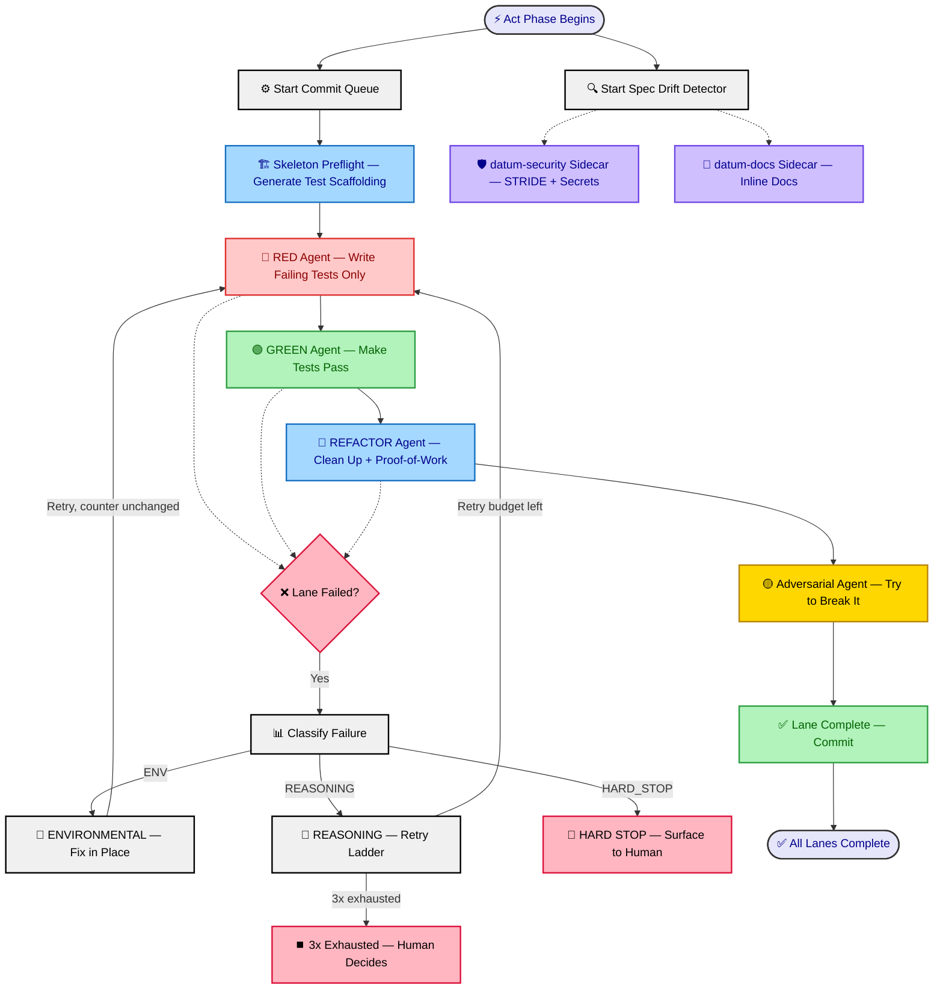

# DATUM Workflow

## Pipeline Overview

```mermaid
flowchart TD
    %% ── Node Declarations ──
    Start(["⚡ datum go"])
    BranchCheck{"🔐 On main/master?"}
    CreateBranch["🔀 Create datum/epic-N branch"]
    SelfCheck["🧪 Self-Check Contracts"]
    HaltCheck["❌ HARD STOP — Assets Drifted"]
    ReadState["💾 Read State + Detect Language"]

    DetectEntry{"📋 Detect Entry Point"}
    OfferInit["⚙️ Offer datum init"]

    Refine["📝 Refine — TICKET to SPEC + QUESTIONS.md"]
    RefineGate{"🔐 Refine Gate"}
    Classify{"📊 Classify — Patch/Feature/System"}

    Plan["📋 Plan — SPEC to TASKS (+ units for System)"]
    PlanGate{"🔐 Plan Gate + Overconfidence Check"}

    Triage{"📊 Triage — Deepen or Skip?"}
    Deepen["🔍 Deepen — Codebase Evidence Gathering"]

    Properties["🛡️ Properties — SAFETY, LIVENESS, INVARIANT"]
    Architect["🏗️ Architect Gate — ADR + C4"]

    Act["⚙️ Act — Red-Green-Refactor"]

    Validate["🧪 Validate — Full Test Suite"]
    Review["🔍 Review — Multi-Domain"]
    CreatePR["📤 Create PR"]

    MergeGate{"🔐 Merge — ALWAYS required"}
    PRComments["💬 PR Comments — Triage + Fix"]
    Merged["✅ PR Merged"]

    Closeout["📊 Closeout — Retro + Tag"]
    Done(["✅ Done"])

    %% ── Flow ──
    Start --> BranchCheck
    BranchCheck -->|Yes| CreateBranch --> SelfCheck
    BranchCheck -->|No| SelfCheck
    SelfCheck -->|Fail| HaltCheck
    SelfCheck -->|Pass| ReadState
    ReadState --> DetectEntry

    DetectEntry -->|"TICKET.md found"| Refine
    DetectEntry -->|"SPEC.md found"| Plan
    DetectEntry -->|"TASKS.md found"| Act
    DetectEntry -->|"PR URL"| PRComments
    DetectEntry -->|"Nothing"| OfferInit

    Refine --> RefineGate
    RefineGate -->|Pass| Classify --> Plan
    RefineGate -->|"Gaps found"| Refine

    Plan --> PlanGate
    PlanGate -->|Approved| Triage
    PlanGate -->|Rejected| Plan

    Triage -->|"Complex"| Deepen --> Properties
    Triage -->|"Trivial"| Properties

    Properties --> Architect --> Act

    Act --> Validate --> Review --> CreatePR --> MergeGate
    MergeGate -->|Approved| Merged
    MergeGate -->|"Comments"| PRComments
    PRComments --> MergeGate

    Merged --> Closeout --> Done

    %% ── Styles ──
    classDef startEnd fill:#E6E6FA,stroke:#333,stroke-width:2px,color:darkblue
    classDef gate fill:#FFD700,stroke:#B8860B,stroke-width:2px,color:black
    classDef phase fill:#90EE90,stroke:#2E7D2E,stroke-width:2px,color:darkgreen
    classDef error fill:#FFB6C1,stroke:#DC143C,stroke-width:2px,color:black
    classDef neutral fill:#F0F0F0,stroke:#000,stroke-width:2px,color:black

    class Start,Done startEnd
    class BranchCheck,DetectEntry,RefineGate,Classify,PlanGate,Triage,MergeGate gate
    class Refine,Plan,Deepen,Properties,Architect,Act,Validate,Review,CreatePR,PRComments,Closeout,Merged phase
    class HaltCheck error
    class SelfCheck,ReadState,CreateBranch,OfferInit neutral
```

## Act Phase Detail — Per-Lane Pipeline

## Phase Summary

| Phase | Input | Output | Gate |
|-------|-------|--------|------|
| **Branch Guard** | Current branch | Feature branch `datum/epic-N` (auto-incremented) | Hard — auto-creates branch |
| **Discovery** | CURRENT_STATE.md | Orientation context + `docs/LANDSCAPE.md` (optional) | — |
| **Refine** | `docs/epics/$BRANCH/TICKET.md` | `SPEC.md` (with Assumption Audit + Classification Metadata) + `QUESTIONS.md` | Skippable in yolo |
| **Classify** | SPEC.md Classification Metadata | Pipeline shape: Patch→Express, Feature→Standard, System→Extended | Auto (user override at Plan gate) |
| **Plan** | SPEC.md | `TASKS.md` + `tasks.json` + `lane-plan.json` (+ units for System-tier) | **Always required** + overconfidence gate |
| **Triage** | TASKS.md | `.datum/routing.json` (`deepen` or `properties`) | **Always required** — never skipped |
| **Deepen** | TASKS.md + codebase (GitNexus-first) | `## Research Findings` appended to TASKS.md | Skipped if Triage routes to `properties` |
| **Properties** | SPEC + TASKS (+ findings if deepened) | `docs/epics/$BRANCH/PROPERTIES.md` | Skippable in yolo (skipped for Patch tier) |
| **Architect** | Properties | ADRs + C4 diagrams | Blocks if significant decisions lack ADRs |
| **Act** | TASKS + PROPERTIES | Committed code per lane | Retry ladder per lane |
| **Validate** | All lanes complete | Test results | Skippable in yolo |
| **Review** | Test-passing code | Review packets | Max 3 satisfaction iterations |
| **PR + Merge** | Review-passing code | Merged PR | **Always required** |
| **PR Comments** | PR feedback | Addressed comments | Re-validates after fixes |
| **Closeout** | Merged PR | RETRO.md + git tag + solutions | Automatic |
