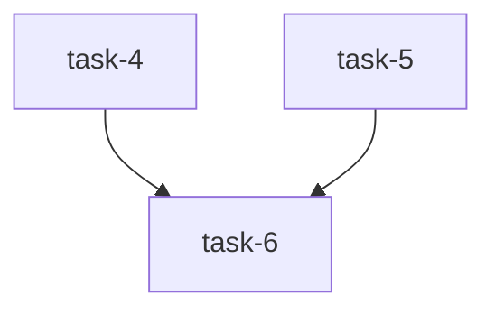

# Implementation Plan (TASKS.md)

## Dependency Graph

## task-1: make_function_name() replaces hyphens with underscores for valid Python identifiers
Fix make_function_name() in skeleton_creator.py to replace hyphens (produced by slugify()) with underscores before interpolating into the function-name string, so the result is always a valid Python identifier.

- **Acceptance Criteria**:
  - make_function_name('ac1', 'when mypy-output has error-lines', 'python') returns a string containing no hyphens and matching ^[a-zA-Z_][a-zA-Z0-9_]*$
  - make_function_name('ac1', 'simple text', 'python') still returns a valid identifier (no regression)
  - make_function_name('ac1', 'mixed--punctuation and spaces', 'python') returns a valid Python identifier with no hyphens
  - slugify() in datum/slug.py is NOT modified — it continues to produce hyphen-separated slugs
  - make_function_name('ac1', 'swift-test case', 'swift') also produces a valid Swift test function name with no hyphens
- **Files**: datum/skeleton_creator.py, tests/test_make_function_name.py
- **RED Note**: Write tests that call make_function_name() with AC text containing hyphens (e.g. 'when mypy-output has error-lines') and assert the result matches ^[a-zA-Z_][a-zA-Z0-9_]*$ and contains no hyphens. Currently make_function_name uses slugify() output directly which contains hyphens, so these tests will fail.
- **Estimated LOC**: 30

## task-2: build_lane_plan() converts file conflicts into dependency edges
Fix build_lane_plan() and its caller in main() so that file conflicts detected by build_file_ownership() are consumed (not discarded with _) and automatically converted into depends_on edges. First-claimant wins ownership; later claimants depend on the owner.

- **Acceptance Criteria**:
  - Given two tasks that both write 'datum/foo.py', build_lane_plan() produces a lane plan where exactly one of the two lanes depends on the other
  - The _ at line 356 of lane_plan.py is replaced with a named variable 'conflicts' and its value is passed to build_lane_plan()
  - build_lane_plan() accepts a new 'conflicts' parameter (dict[str, list[str]]) and uses it to add dependency edges
  - For any lane with non-empty file_conflict_with, that lane's depends_on includes all lanes that own the conflicting files
  - No lane is its own dependency — self-edges are excluded
  - build_file_ownership() return signature and behavior are unchanged
  - file_conflict_with field is retained in the schema for observability
- **Files**: datum/lane_plan.py, tests/test_lane_plan_conflicts.py
- **RED Note**: Write tests that create two tasks sharing a file (e.g. both write 'datum/foo.py'), call build_lane_plan() via the full main() flow or directly, and assert that the resulting lane plan has exactly one dependency edge between the two lanes. Currently build_file_ownership() conflicts are discarded with _ at line 356 and build_lane_plan() does not add conflict-based dependency edges, so the test will fail (depends_on will be empty).
- **Estimated LOC**: 50

## task-3: Skeleton creator appends to existing test files instead of overwriting
Fix the three Path.write_text() call sites in skeleton_creator.py (lines 467, 556, 579) to append content when the destination file already exists, preserving previous skeleton content. New content is separated by a blank line.

- **Acceptance Criteria**:
  - At each of the three write_text() call sites, if the destination file already exists, the new skeleton content is appended with a blank-line separator
  - Running build_skeleton() twice on the same dest path results in a file containing both sets of def test_* functions
  - If the destination file does not exist, the file is created with the skeleton content (unchanged behavior)
  - A blank-line separator is inserted between existing content and appended content
- **Files**: datum/skeleton_creator.py, tests/test_skeleton_append.py
- **RED Note**: Write a test that calls the skeleton-writing code path twice targeting the same destination file and asserts both sets of test function definitions are present. Currently Path.write_text() overwrites unconditionally, so the second call will destroy the first call's content, and the test will fail.
- **Estimated LOC**: 45

## task-4: Act phase logs paths and throws descriptive errors on missing lane plan
Fix the Act phase in datum-go.ts so that when lane-plan.json is not found, the error message includes both paths tried. When found, log the path, lane count, and wave count. When lanes are empty, log lane count 0 before throwing.

- **Acceptance Criteria**:
  - When lane-plan.json is not found, the thrown error message includes literal strings of both the primary path (docs/epics/{branch}/lane-plan.json) and the fallback path (.datum/lane-plan.json)
  - When lanePlan.lanes is empty or waves.length === 0, the Act phase logs the lane count (0) before throwing 'Lane plan has 0 tasks'
  - When lane-plan.json is found and has lanes, the Act phase logs: path where found, number of lanes detected, number of waves
  - The agent prompt for reading lane-plan.json instructs the agent to return which path was found (primary or fallback) as part of its response
  - No silent completion: every Act-phase execution either logs a non-zero lane count or throws
- **Files**: skills/src/datum-go.ts, tests/test_act_phase_logging.py
- **RED Note**: Write a test that validates the error message format when lane-plan.json is missing — it must contain both path strings. Also test that the log output includes path, lane count, and wave count when the plan is found. Since the current code throws a generic 'Failed to parse lane-plan.json' message without paths, the path-assertion test will fail. Note: for the TS workflow, the test validates the source code patterns (grep-based or snapshot) since direct execution requires the Claude Code runtime.
- **Estimated LOC**: 40

## task-5: Test-count gate grep matches indented class-based test methods
Fix the grep pattern in datum-tdd-act-lane.ts that counts new test functions so it matches both top-level 'def test_' and indented 'def test_' inside class bodies (e.g. unittest.TestCase methods).

- **Acceptance Criteria**:
  - The grep pattern at the diff-context check ('^+def test_') is replaced with a pattern that also matches '+    def test_' (indented, inside class bodies)
  - The file-level grep ('def test_') already matches indented definitions — verify it is not anchored to column 0
  - A Python file containing only 'class TestFoo(unittest.TestCase):\n    def test_bar(self): pass' produces a count of 1 (not 0) from the updated diff grep pattern
  - No regression: top-level 'def test_' functions still count correctly
  - Both the diff-context grep and the file-level grep are updated consistently
- **Files**: skills/src/datum-tdd-act-lane.ts, tests/test_grep_test_count.py
- **RED Note**: Write a test that creates a Python file with an indented test method inside a class, generates a diff in the format git diff outputs (with '+    def test_bar' lines), and runs the grep pattern against it. The current pattern '^+def test_' requires no leading whitespace, so indented class methods will produce count 0 — the test will fail.
- **Estimated LOC**: 35

## task-6: Rebuild generated JS from updated TypeScript sources
Run bash scripts/build-workflows.sh to regenerate skills/datum-go.js and skills/datum-tdd-act-lane.js from the updated TypeScript sources. This is a build step, not a code change — it depends on all TS source edits being complete.

- **Acceptance Criteria**:
  - bash scripts/build-workflows.sh exits 0
  - skills/datum-go.js contains the updated lane-plan logging and error messages from fix-act-phase-lane-plan-logging
  - skills/datum-tdd-act-lane.js contains the updated grep pattern from fix-test-count-grep-indented
  - Both generated JS files have the // @generated banner
- **Files**: skills/datum-go.js, skills/datum-tdd-act-lane.js
- **Depends on**: task-4, task-5
- **RED Note**: Verify the generated JS files do NOT yet contain the fixes (they reflect the old TS source). After rebuilding, verify they DO contain the updated patterns. The RED state is that the current generated JS has the old grep pattern and old error messages.
- **Estimated LOC**: 5

## Research Findings

### task-1: make_function_name() replaces hyphens with underscores
- **Pattern**: `datum/skeleton_creator.py:337` — `make_function_name` calls `slugify(ac_text)` at line 338, then interpolates the slug directly into f-strings (e.g. `f"test_{ac_id.lower()}_{slug}"`). No `.replace('-', '_')` call exists.
- **Convention**: `datum/skeleton_creator.py:350` already uses `.replace('-', '_')` in `make_struct_name`, confirming `.replace('-', '_')` is the established local pattern for identifier sanitization.
- **Convention**: `datum/slug.py:18` — `slugify()` uses `re.sub(r"[^a-z0-9]+", "-", ...)` producing hyphen-separated output by design. The fix must be in `make_function_name`, not `slugify`.
- **Pitfall**: The Go path at line 344 splits on `_`, so replacing hyphens with underscores before that split is required — otherwise Go test names will also be malformed.
- **Convention**: No existing tests for `make_function_name` exist in `tests/` — `tests/test_make_function_name.py` is a new file.
- **Convention**: Tests import directly from `datum.*` (no subprocess needed for pure functions). Pattern: `from datum.skeleton_creator import make_function_name`.

### task-2: build_lane_plan() converts file conflicts into dependency edges
- **Pattern**: `datum/lane_plan.py:356` — `ownership, _ = build_file_ownership(tasks)` discards conflicts. `build_lane_plan()` at line 277 uses `task.get("depends_on", [])` only; no conflict-based edge logic exists.
- **Pattern**: `datum/lane_plan.py:263-267` — `build_lane_plan` already builds a local `write_conflicts` dict per-lane; conflict detection is present but only used for the `file_conflict_with` field, not for adding dependency edges.
- **Convention**: `build_lane_plan()` signature is `(tasks, sorted_ids, ownership, units=None)` — add `conflicts: dict[str, list[str]] | None = None` as a new optional parameter to avoid breaking existing callers.
- **Pitfall**: Self-edge exclusion — when a conflict is detected, the owner task must not be added to its own `depends_on`. Check `owner != tid` before adding.
- **Pitfall**: `topological_sort()` at line 126 will raise `ValueError` on cycles — adding conflict edges could create cycles if two tasks share multiple files and already depend on each other. Test for this.
- **Convention**: No existing tests for `build_lane_plan` with conflict edges — `tests/test_lane_plan_conflicts.py` is a new file. Test pattern is direct function call (not subprocess).

### task-3: Skeleton creator appends to existing test files instead of overwriting
- **Pattern**: Three `dest.write_text(...)` call sites: lines 467, 556, 579. All follow the same pattern: `dest = Path(skeleton["path"]); dest.parent.mkdir(...); dest.write_text(skeleton.pop("content"))`.
- **Convention**: Python idiomatic append: `if dest.exists(): dest.write_text(dest.read_text() + "\n\n" + content) else: dest.write_text(content)`. Alternatively `dest.open("a")` but that skips blank-line separator logic.
- **Pitfall**: Line 286 (`path.write_text(content)`) in `build_impl_stubs` is a fourth write-text call for impl stubs — NOT one of the three AC targets. Do not modify it.
- **Pitfall**: `skeleton.pop("content")` mutates the dict — must capture the content value before popping, or pop after the conditional write.
- **Convention**: Tests use `tmp_path` fixture (pytest) for file I/O. Tests call `build_skeleton()` twice targeting the same `dest`. No existing append tests exist; `tests/test_skeleton_append.py` is new.

### task-4: Act phase logs paths and throws descriptive errors on missing lane plan
- **Pattern**: `skills/src/datum-go.ts:113-121` — current flow: build `lanePlanPath`, call `agent()` with a prompt mentioning fallback `.datum/lane-plan.json`, parse result, then throw generic `'Failed to parse lane-plan.json — agent returned unparseable output'` without either path in the message.
- **Pattern**: `skills/src/datum-go.ts:124-125` — empty-lanes guard throws `'Lane plan has 0 tasks — nothing to execute'` with no prior log of lane count.
- **Convention**: TypeScript test strategy: grep-based snapshot tests against the `.ts` source file since direct execution requires the Claude Code runtime. Pattern confirmed by task RED Note.
- **Pitfall**: The agent prompt already mentions `.datum/lane-plan.json` as fallback, but the error on parse failure doesn't include the paths. The fix must update the `throw` on line 121 to include both `lanePlanPath` and `.datum/lane-plan.json` literals.
- **Pitfall**: The AC requires the agent prompt instruct the agent to return which path was found — this means updating the prompt string at line 115 to ask for path provenance in the response.
- **Convention**: `log()` calls in datum-go.ts emit strings directly. Add `log()` before the throw on the 0-lanes path.

### task-5: Test-count gate grep matches indented class-based test methods
- **Pattern**: `skills/src/datum-tdd-act-lane.ts:174` — diff-context grep is `'^+def test_'` (caret anchors to start-of-line in the diff output, requiring zero leading whitespace after `+`).
- **Pattern**: `skills/src/datum-tdd-act-lane.ts:237` — file-level grep uses `"def test_\\\\|async def test_"` (no caret anchor), so it already matches indented definitions correctly.
- **Convention**: The fix is to replace `'^+def test_'` with a pattern that matches `+def test_` or `+    def test_` (any leading spaces after `+`). Use `'^+[[:space:]]*def test_'` or `'^+\\s*def test_'` — confirm which grep flavor the agent shell uses (POSIX BRE/ERE vs GNU grep).
- **Pitfall**: `grep -c` on a diff counts lines matching the pattern. The `+` at the start of a diff addition line must still be matched — do not accidentally make it optional.
- **Pitfall**: The test creates a fake git diff string (not a real git repo diff) and pipes it to `grep -c` — test uses Python `subprocess` to run grep with the pattern against the fake diff content.
- **Convention**: `tests/test_grep_test_count.py` is a new file. Pattern: use Python `subprocess.run(['grep', '-c', pattern], input=diff_text, ...)` to test the grep pattern in isolation.

### task-6: Rebuild generated JS from updated TypeScript sources
- **Pattern**: `scripts/build-workflows.sh` — runs `npx tsc` type-check then `npx esbuild` bundle per `.ts` entry point in `skills/src/`. Output goes to `skills/datum-go.js` and `skills/datum-tdd-act-lane.js`.
- **Convention**: Generated files have `// @generated — DO NOT EDIT. Source: skills/src/<basename>.ts` as first line. Verified via `head -1 "$outfile" | grep -q '@generated'`.
- **Pitfall**: Build script uses `sed -i '' ...` (macOS BSD sed). Requires running on macOS. The `npx tsc` step will fail if TS has type errors — ensure task-4 and task-5 TS edits are type-correct before running the build.
- **Pitfall**: The build script also processes ALL `datum-*.ts` files, not just the two changed ones — if any other TS file has an error, the build fails. Run `npx tsc --noEmit` first to check all files.
- **Convention**: RED verification is source-content grep: confirm old patterns still present in JS before fixing, then confirm new patterns present after rebuild.
