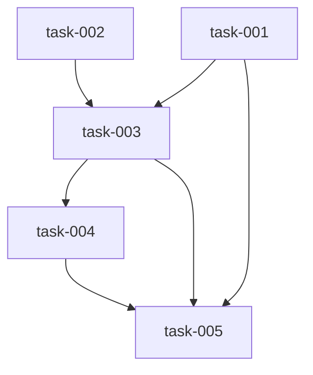

# Implementation Plan (TASKS.md)

## Dependency Graph

## task-001: Add deterministic `datum lane-state read|write` CLI subcommand
Add a `lane_state` Typer sub-app to datum/cli.py (following the worktrees_app pattern at cli.py:1468-1512) exposing `read --epic <branch> --task <id>` and `write --epic <branch> --task <id> --status <status> [--merge-commit <sha>] [--spec-hash <hash>] [--run-id <runId>]`. Reads/writes epic-scoped markers at .datum/epics/<slug>/lane-state/<task>.json with a legacy .datum/runs/<runId>/lane-state/<task>.json fallback for read, atomic write via temp+rename, and rejects unslugifiable/path-traversal --epic values before touching the filesystem.

- **Acceptance Criteria**:
  - `datum lane-state write --epic datum/epic-287 --task task-002 --status completed --merge-commit abc123 --spec-hash h1 --run-id run1` creates .datum/epics/datum-epic-287/lane-state/task-002.json with fields task_id, status, merge_commit, spec_hash, run_id, completed_at
  - `datum lane-state read --epic datum/epic-287 --task task-002` exits 0 and prints the exact JSON written above (schema-matching) when the marker exists
  - `datum lane-state read --epic datum/epic-287 --task task-999` (no marker) exits 0 and prints {"status": "not_found"} without raising
  - writing the same marker twice with identical inputs (same --merge-commit/--spec-hash/--run-id, no completed_at override) produces byte-identical file contents
  - `datum lane-state write --epic '../../etc' --task x --status completed` exits non-zero with a clear error and creates no directory outside .datum/epics/
  - epic branch slugification matches 'datum/epic-287' -> 'datum-epic-287' (slashes to hyphens, filesystem-safe)
- **Files**: datum/cli.py, tests/test_lane_state_cli.py
- **RED Note**: Write a pytest test using typer.testing.CliRunner. Invoke `lane-state write --epic datum/epic-287 --task task-002 --status completed --merge-commit abc123 --spec-hash h1 --run-id run1` against a tmp_path-based .datum root, assert the file exists with correct JSON fields, assert `lane-state read` for the same task returns matching JSON, assert `lane-state read` for a nonexistent task prints {"status": "not_found"} with exit code 0, assert writing twice produces identical bytes, and assert `--epic '../../etc'` exits non-zero and creates no directory outside .datum/epics/.
- **Estimated LOC**: 140

## task-002: Add packWaves partitioner and computeBlockedLanes helper to shared/utils.ts
Add packWaves(waves: string[][], maxBatch: number): string[][] — a greedy wave-packing batch partitioner that accumulates lanes wave-by-wave up to maxBatch, splits an oversized wave freely across consecutive batches, and never places a lane in a batch before its predecessor wave is fully assigned to a strictly earlier batch. Add computeBlockedLanes(lanePlan, failures: string[], alreadyBlocked: string[]): {blocked: LaneOutcome[]} that removes the `!failures.includes(d)` exemption and unconditionally blocks dependents of any dep with status in {'failed','blocked'}, transitively, recording status:'blocked', stage:'SKIPPED', error naming the failed dep id and its failure stage.

- **Acceptance Criteria**:
  - packWaves([['a','b','c'],['d','e']], 5) returns [['a','b','c','d','e']]
  - packWaves([['a','b','c','d','e','f','g']], 5) returns [['a','b','c','d','e'],['f','g']] (oversized wave split across consecutive batches, every lane scheduled)
  - packWaves([['a','b','c'],['d','e']], 4) returns [['a','b','c','d'],['e']] (intra-wave split allowed, no lane placed before its wave's predecessor wave is fully assigned to an earlier batch)
  - for a 22-lane / 8-wave fixture mirroring the epic-287 evidence run with maxBatch=5, no lane's depends_on entry appears in its own batch index or any batch index >= its own
  - a property test generates >=100 random DAGs (10-50 nodes, random acyclic edges), runs buildWaves then packWaves, and asserts for every lane all depends_on ids are in a strictly earlier batch index
  - computeBlockedLanes given lane B depends_on ['A'] and A in failures=['A'] returns B with status 'blocked', stage 'SKIPPED', error containing 'A' and A's failure stage
  - computeBlockedLanes given chain A fails -> B depends_on A -> C depends_on B returns both B and C marked blocked with correct upstream dep references, and neither appears eligible for dispatch
- **Files**: skills/src/shared/utils.ts, skills/src/shared/utils.test.ts
- **RED Note**: Write a vitest test file importing packWaves and computeBlockedLanes from shared/utils.ts (not yet exported/implemented) covering the exact fixtures above: the whole-wave-fits case, the oversized-wave-split case, the intra-wave split-with-cap case, the 22-lane/8-wave no-forward-dependency assertion, a seeded random-DAG property test (>=100 graphs, 10-50 nodes) asserting depends_on ids are always in a strictly earlier batch index, and the single-failed-dep and transitive-chain blocking cases for computeBlockedLanes.
- **Estimated LOC**: 160

## task-003: Wire wave-packing, unconditional dep-blocking, and CLI state ops into the act batch loops
Replace the naive MAX_BATCH slicing in datum-go.ts (~190-222) and datum-tdd-act.ts (~81-116) with packWaves(buildWaves(lanePlan), MAX_BATCH), preserving the existing wave-count log line and adding a new 'Wave-packed N tasks into M batches' log line. Replace the missing-computation's failures exemption with computeBlockedLanes so failed/blocked deps unconditionally block dependents. Reconcile datum-tdd-act-lane.ts's in-file DAG gating (~673-734) to emit status:'blocked' instead of 'skipped' for the same condition. Replace the agent-dispatched completion-check/completion-write calls in datum-tdd-act-lane.ts and the laneStateReadPrompt/laneStateWritePrompt agent-dispatch flow in shared/prompts.ts (invoked from datum-go.ts/datum-tdd-act.ts) with direct `datum lane-state read|write` subprocess calls, referencing marker file paths in downstream prompts instead of embedding marker JSON inline.

- **Acceptance Criteria**:
  - datum-go.ts and datum-tdd-act.ts call packWaves(buildWaves(lanePlan), MAX_BATCH) instead of slicing lanePlan.topological_order; a lane whose depends_on entry sits in the same or a later batch never occurs
  - the existing 'N lanes in M waves' log line is preserved and followed by a new 'Wave-packed N tasks into M batches' log line
  - a lane whose single dependency is in failures is marked status:'blocked', stage:'SKIPPED', error naming the failed dep id and stage, and is never dispatched (no RED/GREEN agent call)
  - a transitive chain A fails -> B depends on A -> C depends on B results in both B and C marked 'blocked', each with a correct upstream dep reference, with no agent dispatched for B or C
  - datum-tdd-act-lane.ts's in-file DAG gating (~673-734) emits status:'blocked' (not 'skipped') for a dependency-failure condition, matching the outer loop's status
  - the completion-check:${taskId}/completion-write:${taskId} agent dispatches in datum-tdd-act-lane.ts and the laneStateReadPrompt/laneStateWritePrompt agent dispatches are replaced by direct `datum lane-state read|write` subprocess invocations
  - re-invoking act on a fixture epic whose lanes are all already merged (markers present, spec_hash matching, merge-base ancestor true) results in 0 agent-dispatch log lines labeled completion-check:, completion-write:, lane-state-read, or lane-state-write
- **Files**: skills/src/datum-go.ts, skills/src/datum-tdd-act.ts, skills/src/datum-tdd-act-lane.ts, skills/src/shared/prompts.ts, skills/src/datum-tdd-act.test.ts
- **Depends on**: task-002, task-001
- **RED Note**: Write a vitest test exercising the exported batch-loop entrypoints (or a small extracted orchestration helper if one is exposed) with a fake 22-lane/8-wave plan and a mocked agent-dispatch/subprocess counter: assert no batch contains a lane whose dep is in the same or later batch, assert the new 'Wave-packed' log line is emitted, assert a single-failed-dep lane and a 3-lane transitive chain both end up status:'blocked' with correct error text and zero agent dispatches for those lanes, and assert a fully-merged fixture epic produces zero dispatch-log entries labeled completion-check:/completion-write:/lane-state-read/lane-state-write.
- **Estimated LOC**: 190

## task-004: Group blocked-chains under their root failure in triage
Extend TriageArgs in shared/types.ts with a `blocked: LaneOutcome[]` field, pass the blocked-lane list computed by the batch loops from datum-go.ts and datum-tdd-act.ts to the triage call alongside failures, and update datum-tdd-act-triage.ts's prompt/logic so every blocked lane is nested under the failure entry for the dep it (transitively) blocked on, one group per root failure.

- **Acceptance Criteria**:
  - TriageArgs (shared/types.ts) gains a `blocked: LaneOutcome[]` field
  - datum-go.ts and datum-tdd-act.ts pass their computed blocked-lane list to the triage call alongside failures
  - for a run with 1 root failure and 3 transitively blocked dependents, triage output shows 1 top-level failure group containing 4 lane entries (root + 3 blocked), not 4 independent failure entries
  - two independent failure chains (unrelated root causes) produce 2 separate groups, each containing only its own root and its own blocked descendants
  - a lane plan with zero blocked lanes produces triage output identical to current behavior (no regression)
- **Files**: skills/src/shared/types.ts, skills/src/datum-tdd-act-triage.ts, skills/src/datum-go.ts, skills/src/datum-tdd-act.ts, skills/src/datum-tdd-act-triage.test.ts
- **Depends on**: task-003
- **RED Note**: Write a vitest test for the triage module: construct a TriageArgs fixture with 1 failure and 3 blocked LaneOutcome entries whose blocked-chain resolves to that failure, and assert the triage function/prompt-builder groups them into a single group of 4 entries; construct a second fixture with 2 unrelated failure chains and assert 2 separate groups each scoped to its own root+descendants; construct a zero-blocked fixture and assert triage output is unchanged from the pre-existing (failures-only) behavior.
- **Estimated LOC**: 90

## task-005: Require GREEN/REFACTOR-complete stage before squash-merging a lane
Give MergeArgs in shared/types.ts per-candidate stage information (from LaneOutcome.stage, passed through by datum-go.ts/datum-tdd-act.ts). Before including a lane ID in the `datum worktrees merge` invocation in datum-tdd-act-merge.ts, verify its final stage is GREEN or REFACTOR-complete; exclude and separately report (not silently drop) any RED-only candidate.

- **Acceptance Criteria**:
  - MergeArgs gains per-candidate stage data (e.g. a stages map or LaneOutcome[] carrying `stage`) sourced from datum-go.ts/datum-tdd-act.ts
  - a completedIds list containing a lane whose stage is 'RED' is excluded from the `datum worktrees merge` invocation; the merge proceeds with the remaining GREEN/REFACTOR-complete lanes
  - the excluded RED-only lane is surfaced in the merge stage's output/log as 'left in place, not merged' including its lane ID and branch name
  - after a merge run, no commit reachable from the epic branch tip matches the pattern ^red\(.*\): RED complete introduced by this merge invocation
  - a lane plan where all candidates are GREEN/REFACTOR-complete merges identically to current behavior (no regression)
- **Files**: skills/src/datum-tdd-act-merge.ts, skills/src/shared/types.ts, skills/src/datum-go.ts, skills/src/datum-tdd-act.ts, skills/src/datum-tdd-act-merge.test.ts
- **Depends on**: task-004, task-003, task-001
- **RED Note**: Write a vitest test for the merge module: build a MergeArgs fixture with 3 completedIds where one has stage 'RED' and two have stage 'GREEN'/'REFACTOR', mock `datum worktrees merge` invocation, and assert the RED lane's ID is absent from the merge call's argument list while the other two are present; assert the merge stage's return/log output reports the RED lane as 'left in place, not merged' with its ID and branch name; assert an all-GREEN fixture passes every ID through unchanged.
- **Estimated LOC**: 70
