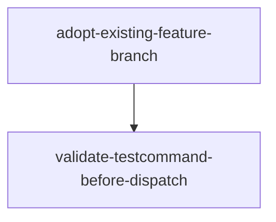

# Implementation Plan (TASKS.md)

## Dependency Graph

## guard-duplicate-local-llm-toml: R1 — Clear error on duplicate [local_llm] TOML table (#265)
Wrap the tomllib.load call in load_config()/_load_raw_config() so a config.toml containing two [local_llm] headers raises a clear, actionable error naming the offending file path instead of a raw TOMLDecodeError.

- **Acceptance Criteria**:
  - _load_raw_config() raising on a duplicate [local_llm] table converts the tomllib.TOMLDecodeError into a ValueError (or dedicated DatumConfigError) whose message contains the offending config file path and the phrase 'duplicate' and 'local_llm'
  - load_config() surfaces the same actionable error (no unhandled TOMLDecodeError traceback) when the selected config file has two [local_llm] headers
  - Loading assets/config.toml.default and a single-[local_llm] fixture still returns a valid parsed dict unchanged
- **Files**: datum/local_llm.py, tests/test_local_llm_config_dup.py
- **RED Note**: pytest: write a fixture config.toml with two [local_llm] headers, point _load_raw_config()/load_config() at it, and assert it raises a ValueError whose message names the file path — assert it is NOT a bare tomllib.TOMLDecodeError. Add a positive case loading a single-[local_llm] fixture that still parses.
- **Estimated LOC**: 45

## path-boundary-file-ownership: R2 — Path-boundary matching in verifyFileOwnership (#269)
Replace suffix/substring matching in verifyFileOwnership with exact path equality or path-segment-boundary matching so a changed file whose name is a suffix of an allowed file (NewFoo.test.ts vs Foo.test.ts) no longer false-positives, while genuine out-of-scope files still violate. Rebuild the generated JS.

- **Acceptance Criteria**:
  - verifyFileOwnership with changed=['NewFoo.test.ts'] and allowedFiles=['Foo.test.ts'] returns a violation (i.e. NewFoo is treated as forbidden/not-allowed) — the suffix collision does NOT make NewFoo.test.ts count as the allowed Foo.test.ts
  - verifyFileOwnership with changed=['src/Foo.test.ts'] and allowedFiles=['src/Foo.test.ts'] returns no file_ownership_violation (exact path match)
  - verifyFileOwnership with changed=['src/Unrelated.ts'] and allowedFiles=['src/Foo.test.ts'] still returns file_ownership_violation
  - skills/datum-tdd-act-lane.js is regenerated from the TS via bash scripts/build-workflows.sh (never hand-edited)
- **Files**: skills/src/datum-tdd-act-lane.ts, skills/datum-tdd-act-lane.js, skills/src/datum-tdd-act-lane.test.ts
- **RED Note**: TS test runner (as used by skills/src/shared/utils.test.ts): call verifyFileOwnership directly with the suffix-collision case (changed NewFoo.test.ts, allowed Foo.test.ts) and assert it is flagged as a violation; add a positive exact-match case and a genuine-violation case. Test must fail against the current substring/suffix implementation.
- **Estimated LOC**: 40

## relax-test-artifact-convention: R3 — Support test-package/directory conventions in skeleton_creator (#270)
Extend the extension-matching logic (L267-298) so a task can declare a test-package directory or glob convention in addition to a single flat file extension, and a docs-only task is not forced to generate a flat-extension test stub. Additive — existing single-extension behavior preserved.

- **Acceptance Criteria**:
  - The stub-decision logic accepts a task declaring a directory-path/glob test convention (e.g. a Swift/JVM-style test package dir) and produces the correct package-style stub target instead of a flat single-extension file
  - A docs-only task (no source test file expected) does NOT generate a flat-extension test-file stub
  - An existing single-flat-extension task continues to generate the same flat test-file stub as before (no regression)
- **Files**: datum/skeleton_creator.py, tests/test_skeleton_test_convention.py
- **RED Note**: pytest: drive the skeleton_creator extension/convention logic with three task shapes — (a) a directory/package test convention, (b) a docs-only task, (c) an existing flat-extension task — and assert the stub target for each. The directory-convention and docs-only cases must fail against the current single-extension inference.
- **Estimated LOC**: 55

## adopt-existing-feature-branch: R4 — Bootstrap epic from an existing feature branch (#213)
Add an 'adopt current branch as epic branch' path to datum-go.ts's bootstrap step, exposed through the datum init CLI subcommand (not inline script). Detect an already-checked-out non-default branch lacking TICKET.md/lane-plan artifacts and adopt it, producing the same epicBranch/lanePlanPath state downstream phases expect; hard-fail with a clear error if adoption is unsafe.

- **Acceptance Criteria**:
  - datum init exposes an adopt-existing-branch path that, when run on a non-default branch with no existing TICKET.md/lane-plan artifacts, sets epicBranch to the current branch and produces the lanePlanPath state shape downstream phases expect
  - When the current branch has unsafe/conflicting state (e.g. uncommitted conflicting changes or divergence from base), the CLI exits with a non-zero clear error rather than proceeding
  - datum-go.ts's bootstrap step routes to the CLI adopt path (no inline shell bootstrap) and skills/datum-go.js is regenerated via bash scripts/build-workflows.sh
  - A default-branch or artifact-present case does NOT trigger adoption (existing behavior preserved)
- **Files**: datum/cli.py, skills/src/datum-go.ts, skills/datum-go.js, skills/src/datum-go.test.ts
- **RED Note**: pytest for the CLI init adopt path: invoke datum init's adopt mode on a simulated non-default branch with no TICKET.md and assert epicBranch/lanePlanPath state is produced; assert a conflicting/unsafe branch state exits non-zero with a clear error. TS test asserts datum-go bootstrap calls the CLI adopt path rather than inline bootstrap.
- **Estimated LOC**: 70

## recognize-bug-squash-branch-slug: R5 — Recognize non-epic-NNN branch slugs in closeout (#301)
Broaden detect_context()'s L39 regex to recognize both epic-(\d+) and bug-squash-(\d+) patterns; keep the existing explicit epic_number override taking precedence; emit a clear warning (not a silent epic_number=0) when a branch matches neither pattern and no override is supplied.

- **Acceptance Criteria**:
  - detect_context(branch='bug-squash-306', epic_number=None) returns epic_number=306
  - detect_context(branch='epic-23', epic_number=None) returns epic_number=23 (existing pattern unchanged)
  - detect_context(branch='some-random-branch', epic_number=None) does not silently return 0 — it emits a clear warning and signals unrecognized detection
  - detect_context(branch='some-random-branch', epic_number=42) returns epic_number=42 (explicit override wins over regex)
- **Files**: datum/closeout_cmd.py, tests/test_closeout_cmd.py
- **RED Note**: pytest in tests/test_closeout_cmd.py: assert detect_context resolves bug-squash-306 → 306, epic-23 → 23, an override wins over regex, and an unrecognized slug produces a warning rather than a silent epic_number=0. The bug-squash and unrecognized-warning cases must fail against the current epic-(\d+)-only regex.
- **Estimated LOC**: 35

## git-fallback-retro-delivery: R6 — Git-derived fallback for RETRO.md Delivery section (#302)
In commit_closeout.py's Delivery-section generation, when .datum/runs/<runId>/lane-state/ is absent, derive delivered/total task counts from git log commits matching the repo's green(task-N)-style trailers on the epic branch, and label the numbers as git-derived. Leave the lane-state-present path unchanged.

- **Acceptance Criteria**:
  - When lane-state dir is missing, Delivery-section generation returns a non-0/0 delivered/total count derived from git log green(task-N) trailers on the epic branch
  - The RETRO.md Delivery output labels fallback numbers with an explicit git-derived provenance marker distinct from lane-state-derived output
  - When lane-state IS present, the existing lane-state-derived Delivery counts are produced unchanged
- **Files**: datum/closeout/commit_closeout.py, tests/test_commit_closeout.py
- **RED Note**: pytest: simulate a missing .datum/runs/<runId>/lane-state/ directory with a git history containing green(task-N) commits, call the Delivery-section generator, and assert a non-0/0 count that is labeled git-derived. Add a case with lane-state present asserting the original path is untouched.
- **Estimated LOC**: 55

## fail-loud-walkthrough: R7 — Fail loud on walkthrough generation failure (#303)
In datum-closeout.ts's generate_walkthrough, only print the success checkmark when the LLM actually produced walkthrough content; on escalation failure show a clear degraded-mode indicator instead of a false checkmark. Closeout still completes. Rebuild the generated JS.

- **Acceptance Criteria**:
  - generate_walkthrough prints the success checkmark only when the returned walkthrough content is non-empty/LLM-produced
  - When LLM escalation fails and content degrades to empty, output shows a clear failure/degraded-mode indicator (not a checkmark) and closeout still completes (does not hard-abort)
  - skills/datum-closeout.js is regenerated from the TS via bash scripts/build-workflows.sh
- **Files**: skills/src/datum-closeout.ts, skills/datum-closeout.js, skills/src/datum-closeout.test.ts
- **RED Note**: TS test runner: stub generate_walkthrough's LLM path to return empty/failed content and assert the emitted status is a degraded-mode indicator, not a success checkmark; stub a successful non-empty return and assert the checkmark is shown. The empty-path case must fail against the current always-checkmark behavior.
- **Estimated LOC**: 35

## filter-transcript-noise-memory-extract: R8 — Filter transcript/tool-call noise from memory extraction (#304)
In _extract_from_transcript, skip or downgrade confidence for matches whose surrounding text is tool-call/transcript noise (JSON tool_use/tool_result blobs, raw code blocks, file-path-only lines) before applying CORRECTION_PATTERNS, so only genuine correction statements surface as high-confidence candidates.

- **Acceptance Criteria**:
  - _extract_from_transcript given a transcript mixing a genuine correction statement with tool_use/tool_result JSON and code-block noise returns the genuine statement as the only high-confidence candidate
  - Lines that are pure file paths or raw code/JSON blobs matching a CORRECTION_PATTERN (e.g. an 'always' inside a JSON blob) are skipped or downgraded below high-confidence
  - A clean transcript with a genuine correction and no noise still yields the same high-confidence candidate as before (no regression)
- **Files**: datum/memory_extract.py, tests/test_memory_extract.py
- **RED Note**: pytest: feed _extract_from_transcript a transcript containing (a) a real correction line and (b) tool_use/tool_result JSON plus a code block that would spuriously match CORRECTION_PATTERNS; assert only the genuine line surfaces high-confidence. Add a clean-transcript regression asserting unchanged extraction. Noise case must fail against current uniform high-confidence tagging.
- **Estimated LOC**: 50

## validate-testcommand-before-dispatch: R9 — Validate testCommand against sub-package files before lane dispatch (#307)
Add a datum CLI subcommand (invoked from datum-tdd-act-setup.ts, per CLI-first) that validates a lane's testCommand is runnable against its targeted sub-package files before batching lanes to worktrees. Invalid/non-runnable testCommand hard-fails setup with an actionable error naming the lane and reason; valid testCommand proceeds unchanged. Rebuild the generated JS.

- **Acceptance Criteria**:
  - A new/extended datum CLI subcommand validates a testCommand against target sub-package files and exits non-zero with an actionable error naming the lane and the failure reason when the command is not runnable
  - A valid, runnable testCommand passes validation and returns success (setup proceeds unchanged)
  - datum-tdd-act-setup.ts calls the datum CLI validation subcommand before worktree distribution (no inline TS shell logic) and halts setup on failure
  - skills/datum-tdd-act-setup.js is regenerated from the TS via bash scripts/build-workflows.sh
- **Files**: datum/cli.py, datum/testcommand_validate.py, tests/test_testcommand_validate.py, skills/src/datum-tdd-act-setup.ts, skills/datum-tdd-act-setup.js
- **Depends on**: adopt-existing-feature-branch
- **RED Note**: pytest against the new validation module/CLI subcommand: assert a non-runnable testCommand for a lane returns a non-zero result with an error naming the lane and reason, and a valid testCommand returns success. Both cases must fail against the current absence of any testCommand validation.
- **Estimated LOC**: 80

## cleanup-orphaned-zero-commit-lane-branches: R10 — Delete orphaned zero-commit lane branches on cleanup (#309)
Extend cleanup_run_worktrees() to enumerate lane branches via git for-each-ref refs/heads/<epic_branch>--* (not just on-disk worktree dirs) and delete any with zero commits ahead of the epic/base branch, whether or not their worktree dir exists. Branches with commits ahead of base are left untouched even when their worktree dir is missing.

- **Acceptance Criteria**:
  - cleanup_run_worktrees() enumerates lane branches via git for-each-ref refs/heads/<epic_branch>--* independent of on-disk worktree directories
  - A lane branch with zero commits ahead of its epic/base branch and no worktree directory on disk is deleted by cleanup
  - A lane branch WITH commits ahead of base is NOT deleted even when its worktree directory is missing
- **Files**: datum/worktree_manager.py, tests/test_worktree_manager.py
- **RED Note**: pytest: set up a git repo with an epic branch and a lane branch <epic>--laneX that has zero commits ahead and NO worktree directory; call cleanup_run_worktrees() and assert the branch is deleted. Add a lane branch with a commit ahead and no worktree dir and assert it survives. Deletion case must fail against the current worktree-dir-only discovery.
- **Estimated LOC**: 55
