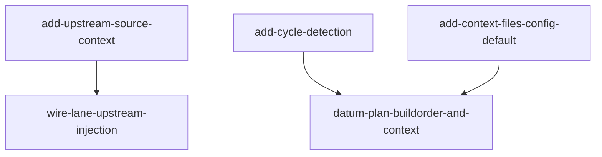

# Implementation Plan (TASKS.md)

## Dependency Graph

## add-context-files-config-default: Add context_files default to DEFAULT_CONFIG
Add an optional context_files: string[] key (default []) to DEFAULT_CONFIG in shared/models.ts so datum-plan can later read project-declared build-constraint docs. READ_CONFIG_PROMPT merges config generically and needs no change.

- **Acceptance Criteria**:
  - DEFAULT_CONFIG.context_files deep-equals [] (empty array) by default
  - DEFAULT_CONFIG still exposes existing keys language, test_framework, test_command, skills_dir unchanged
  - A config object merged over DEFAULT_CONFIG that omits context_files resolves context_files to [] (default applied, not undefined)
- **Files**: skills/src/shared/models.ts, skills/src/shared/models.test.ts
- **RED Note**: This is a TypeScript/vitest project (.test.ts files built via scripts/build-workflows.sh), NOT pytest. Write skills/src/shared/models.test.ts importing DEFAULT_CONFIG from './models' and assert expect(DEFAULT_CONFIG.context_files).toEqual([]) plus that the existing keys are still present. The test must fail today because context_files does not exist on DEFAULT_CONFIG.
- **Estimated LOC**: 25

## add-upstream-source-context: Add TaskPacket.upstream_source, resolveUpstreamSource helper, and buildPacket wiring
Add optional upstream_source?: Record<string,string> to the TaskPacket interface in shared/types.ts; add a deterministic resolveUpstreamSource(lane, allLanes, worktreeDir) helper in shared/utils.ts that enumerates a lane's transitive depends_on, classifies implFiles vs testFiles via the existing classifyFiles convention, reads each upstream implFile from the worktree, and throws a structured Error naming the missing file+lane if any dependency implFile is absent on disk; and extend buildPacket to accept an optional upstream_source argument and emit it into the returned packet object. testFiles of upstream lanes are excluded.

- **Acceptance Criteria**:
  - TaskPacket interface declares optional upstream_source?: Record<string, string> (type-checks under tsc)
  - resolveUpstreamSource(lane, allLanes, worktreeDir) returns a Record mapping each transitive-depends_on implFile path to its full file contents read from worktreeDir
  - resolveUpstreamSource excludes testFiles of upstream lanes (only implFiles per classifyFiles are included)
  - resolveUpstreamSource throws an Error whose message names the missing file path and owning lane when a required upstream implFile does not exist on disk
  - buildPacket, when passed an upstream_source map, includes it verbatim under packet.upstream_source; when not passed, packet.upstream_source is absent or empty
- **Files**: skills/src/shared/types.ts, skills/src/shared/utils.ts, skills/src/shared/utils.test.ts
- **RED Note**: TypeScript/vitest, not pytest. In skills/src/shared/utils.test.ts create a temp worktree dir (os.tmpdir/mkdtemp), write a fixture upstream impl file (e.g. vdj-state.js) and a fixture test file, define two Lane objects where the downstream lane has depends_on referencing the upstream lane, then assert resolveUpstreamSource returns { 'vdj-state.js': '<contents>' } and does NOT include the upstream test file. Add a case where the upstream impl file is not written and assert resolveUpstreamSource throws with the missing path in the message. Add a buildPacket case asserting the returned packet carries upstream_source when supplied. utils.ts is high blast-radius (14 importers) — keep changes additive; do not alter existing buildPacket parameters' behavior.
- **Estimated LOC**: 70

## wire-lane-upstream-injection: Inject upstream_source into RED/GREEN/REFACTOR packets in datum-tdd-act-lane
In datum-tdd-act-lane.ts, have runLane compute upstream source via resolveUpstreamSource for the lane's depends_on chain and pass it into buildPacket at each of the RED/GREEN/REFACTOR stages, so every stage's TaskPacket carries the full source of already-built upstream implFiles. Missing-file failures from resolveUpstreamSource must propagate (fail fast) rather than be swallowed.

- **Acceptance Criteria**:
  - For a lane with depends_on:['lane:vdj-state'] whose upstream produced vdj-state.js on disk, the written RED-stage TaskPacket JSON contains the full contents of vdj-state.js under upstream_source['vdj-state.js']
  - For a lane with no depends_on, the written TaskPacket has upstream_source empty or absent (no injected upstream content)
  - When a depends_on lane's implFile is missing from the worktree at packet-build time, runLane surfaces the resolveUpstreamSource Error (fail fast) instead of writing a packet with empty upstream content
- **Files**: skills/src/datum-tdd-act-lane.ts, skills/src/datum-tdd-act-lane.test.ts
- **Depends on**: add-upstream-source-context
- **RED Note**: TypeScript/vitest, not pytest. In skills/src/datum-tdd-act-lane.test.ts set up a fixture worktree with an upstream impl file present and two lanes (dependent + upstream), invoke the packet-building path for the dependent lane, and assert the emitted TaskPacket JSON includes upstream_source with the upstream file contents. Add a negative case: a lane with no depends_on yields no/empty upstream_source. Add a missing-file case asserting the build path throws. datum-tdd-act-lane.ts is the largest file in scope (761 LOC) with existing coverage in datum-tdd-act-lane.test.ts — keep this lane's new assertions in a dedicated describe block and do not reuse other lanes' test files.
- **Estimated LOC**: 55

## add-cycle-detection: Add deterministic import-graph cycle detection module
Create skills/src/shared/graph.ts exporting a pure detectCycles(tasks) function that, given task nodes with { id, depends_on }, returns the set(s) of ids participating in any directed cycle (direct A->B->A or transitive A->B->C->A) and an empty array for an acyclic DAG. This is the deterministic guard datum-plan will invoke post-decompose, pre lane-plan shellout, honoring the chosen coded cycle-guard approach.

- **Acceptance Criteria**:
  - detectCycles([]) and detectCycles for any acyclic DAG returns [] (no cycles)
  - detectCycles detects a direct cycle: tasks A(depends_on:[B]) and B(depends_on:[A]) returns a cycle containing both A and B
  - detectCycles detects a transitive cycle: A->B->C->A returns a cycle containing A, B, and C
  - detectCycles is pure (no I/O, no filesystem, deterministic for identical input)
- **Files**: skills/src/shared/graph.ts, skills/src/shared/graph.test.ts
- **RED Note**: TypeScript/vitest, not pytest. In skills/src/shared/graph.test.ts import detectCycles from './graph' and assert: empty input -> []; a linear DAG -> []; two-node mutual depends_on -> a returned cycle set containing both ids; a three-node transitive loop -> a set containing all three ids. Tests must fail because graph.ts does not exist yet. Assertions must check actual cycle membership (deleting the function body must fail the test), not just truthiness.
- **Estimated LOC**: 50

## datum-plan-buildorder-and-context: Wire cycle guard, context_files injection, and build-order prompt into datum-plan
Integrate the plan-time changes into skills/src/datum-plan.ts and its decompose prompt. (1) After decompose and before writing lane-plan.json, call detectCycles on the emitted tasks; if any cycle is found, halt with an explicit Error naming the cyclic task/file set rather than emitting a cyclic depends_on graph (AC1.4, fail-fast). (2) In the config-read step, read context_files from the merged config, resolve each path relative to the project root, read its contents into the decompose prompt payload, and on a missing path log a warning and continue without failing the run. (3) Edit prompts/plan-decompose.md to add a named BUILD-ORDER / IMPORT ANALYSIS CHECK instructing the decomposer to infer likely import direction across every file pair and populate depends_on/reads accordingly, plus a PROJECT BUILD CONSTRAINTS section that surfaces context_files content and states it takes precedence over the LLM's own inferred import graph. When context_files is absent or [], no new prompt section content is rendered and behavior is unchanged.

- **Acceptance Criteria**:
  - When the decomposed tasks contain a dependency cycle, datum-plan throws/halts with an explicit Error naming the cyclic task ids/files before lane-plan.json is written (never emits a cyclic depends_on graph)
  - When tasks are acyclic, datum-plan proceeds to lane-plan generation unchanged
  - datum-plan reads context_files from the merged config and injects each existing file's full contents (resolved relative to project root) into the decompose prompt payload
  - A context_files entry whose path does not exist relative to project root produces a logged warning and is skipped; the plan run continues (no throw)
  - When context_files is absent or [], no context-files prompt section content is injected and the decompose prompt payload is byte-identical to today's (backward compatible)
  - prompts/plan-decompose.md contains a section titled with 'BUILD-ORDER' / 'IMPORT ANALYSIS CHECK' and a 'PROJECT BUILD CONSTRAINTS' section that references context_files and states project docs take precedence over inferred imports
- **Files**: skills/src/datum-plan.ts, skills/src/prompts/plan-decompose.md, skills/src/datum-plan.test.ts
- **Depends on**: add-cycle-detection, add-context-files-config-default
- **RED Note**: TypeScript/vitest, not pytest. skills/src/datum-plan.test.ts does NOT exist today (confirmed coverage gap) — create it. Cover: (a) feeding cyclic tasks through the plan step throws an Error naming the cyclic ids before lane-plan.json is written; (b) acyclic tasks do not throw; (c) with a config listing an existing context_files path, the built decompose prompt payload string includes that file's contents and the 'PROJECT BUILD CONSTRAINTS' text; (d) a non-existent context_files path warns and is skipped without throwing; (e) with context_files absent/[], the rendered prompt contains no injected constraints section; (f) assert the plan-decompose.md template string includes 'BUILD-ORDER' and 'PROJECT BUILD CONSTRAINTS'. datum-plan.ts is imported by datum-go.ts and datum-properties.ts — keep changes additive. Note: skills/datum-plan.js is generated via scripts/build-workflows.sh; edit only the .ts and .md source.
- **Estimated LOC**: 110

## Research Findings

### add-context-files-config-default: Add context_files default to DEFAULT_CONFIG
- **Pattern**: `DEFAULT_CONFIG` lives at `skills/src/shared/models.ts:56` as an `as const` object literal (`{ language: '', test_framework: '', test_command: '', skills_dir: '' }`). Adding `context_files: []` under `as const` yields a `readonly []`/`readonly string[]` inferred type — fine for `toEqual([])` assertions but downstream consumers that assign into it must widen the type (e.g. `string[]`) rather than mutate the const array in place.
- **Convention**: `READ_CONFIG_PROMPT` (same file, line 63) merges global+repo config generically via an agent JSON round-trip — confirmed no per-key logic needs updating there, matching the task's own note.
- **Convention**: No `models.test.ts` exists yet in `skills/src/shared/` — this will be a **new** test file. Sibling test `skills/src/shared/agents.test.ts` is small (3.7K) and uses plain `describe/it/expect` from vitest with no fixture setup; follow that minimal style rather than `utils.test.ts`'s heavier fixture patterns.
- **Pitfall**: `datum-plan.ts:56-57` already destructures `repoCfg.language || DEFAULT_CONFIG.language` and `repoCfg.test_framework || DEFAULT_CONFIG.test_framework` — the `datum-plan-buildorder-and-context` task must follow this exact fallback idiom (`repoCfg.context_files || DEFAULT_CONFIG.context_files`) for consistency, not reinvent a different merge shape.

### add-upstream-source-context: Add TaskPacket.upstream_source, resolveUpstreamSource helper, and buildPacket wiring
- **Pattern**: `buildPacket` (`skills/src/shared/utils.ts:709`) already takes an `extras: Record<string, unknown> = {}` param that is spread (`...extras`) into the returned packet last — the cleanest way to wire `upstream_source` through without changing `buildPacket`'s own signature is to pass it inside the existing `extras` argument from call sites, OR add it as a named optional param after `extras`. `TaskPacket` (`skills/src/shared/types.ts:183`) already has a `[key: string]: unknown` index signature and a precedent optional field `target_context?: Record<string, string[]>` — `upstream_source?: Record<string, string>` should be added the same way, right next to `target_context`.
- **Pattern**: `classifyFiles` (`skills/src/shared/utils.ts:383`) is the canonical test/impl splitter — it classifies via filename/path heuristics (`.test.ts`, `/tests/`, `/Mocks/`, etc.) and returns `{ testFiles, implFiles }`. `resolveUpstreamSource` must reuse this exact function (already imported in `datum-tdd-act-lane.ts`) rather than reimplementing test/impl detection.
- **Convention**: Fixture-based temp-worktree tests exist precedent in `skills/src/datum-go.test.ts` (not `utils.test.ts`): `mkdtempSync(join(tmpdir(), 'datum-adopt-'))` + `writeFileSync`/`mkdirSync`/`rmSync` from `node:fs`, `tmpdir` from `node:os`, `join` from `node:path`, with `beforeEach`/`afterEach` create/cleanup. `utils.test.ts` itself has no mkdtemp usage today — the new upstream-source tests will be the first in `utils.test.ts` to need real filesystem fixtures; import the same `node:fs`/`node:os`/`node:path` helpers used in `datum-go.test.ts`.
- **Pitfall**: `utils.ts` is flagged in the task's own note as having 14 importers — confirmed via `buildPacket`/`classifyFiles` both being imported directly into `datum-tdd-act-lane.ts`. Any change to `buildPacket`'s positional-argument order (rather than appending) would break every call site listed in that file (3 call sites: RED at line 360, GREEN at line 701, REFACTOR at line 835). Prefer additive extension only.

### wire-lane-upstream-injection: Inject upstream_source into RED/GREEN/REFACTOR packets in datum-tdd-act-lane
- **Pattern**: `runLane` (`skills/src/datum-tdd-act-lane.ts:83`) already classifies `testFiles`/`implFiles` via `classifyFiles(lane.files)` at line 104 before any packet is built, and builds three packets from the same `lane`/`wt`/`cfg` (RED line 360, GREEN line 701, REFACTOR line 835) — `resolveUpstreamSource(lane, lanePlan.lanes, wt)` should be computed once near line 104-107 (alongside the existing `laneCfg`/`scopedLaneCfg` derivation) and threaded into all three `buildPacket` calls' `extras`, not recomputed per stage.
- **Convention**: Lane dependency resolution already happens elsewhere in this file — `lanes[taskId].depends_on || []` appears at line 892 for blocking/wave logic. `resolveUpstreamSource`'s transitive walk should reuse the same `depends_on` field/shape rather than a new one.
- **Pitfall**: The task's own note is correct that `datum-tdd-act-lane.ts` (761 LOC) is the largest file in scope — confirmed 3 separate `buildPacket` call sites at lines 360/701/835 that must all receive the same computed `upstream_source`, so a single shared local variable computed once (fail-fast on missing upstream file) is required; computing it independently per stage risks one stage silently omitting it if the refactor is done as three separate edits.

### add-cycle-detection: Add deterministic import-graph cycle detection module
- **Pattern**: No existing `graph.ts`/cycle-detection module found under `skills/src/shared/` — this is genuinely new. `LanePlan`/`Lane` types (`skills/src/shared/types.ts:66-76`) already carry `depends_on?: string[]`, so `detectCycles(tasks)` should accept the same `{ id, depends_on }` shape the rest of the codebase uses (matches task's own spec) rather than inventing a new node shape.
- **Convention**: New pure-function modules in this codebase (e.g. `classifyFiles`, `buildPacket`) are plain exported functions with no classes — follow that style for `detectCycles`, and colocate `graph.test.ts` next to `graph.ts` per the `utils.ts`/`utils.test.ts` sibling-file convention already used throughout `skills/src/shared/`.

### datum-plan-buildorder-and-context: Wire cycle guard, context_files injection, and build-order prompt into datum-plan
- **Pattern**: `datum-plan.ts` is a **workflow DSL script**, not a plain importable module — it uses top-level `await`, and relies on ambient globals declared in `skills/src/shared/sandbox.d.ts` (`agent`, `phase`, `log`, `args`, `parallel`, `pipeline`, `workflow`, `budget`) that only exist at runtime inside the datum workflow harness. `datum-go.ts`, the only other workflow script with a `.test.ts`, is tested via `execFileSync` shelling out to the compiled CLI (`datum-go.test.ts` never `import`s `datum-go.ts` directly) — it does not stub the globals and import the script as a unit.
- **Pitfall (significant, blocks the RED note as written)**: `skills/src/datum-plan.test.ts` does not exist and would be the **first** test in the repo to attempt directly importing/executing a top-level workflow script. Doing so would require either (a) stubbing `globalThis.agent`/`phase`/`log`/`args` before import and controlling every `agent()` call's mocked JSON return (fragile — `datum-plan.ts` makes 5+ sequential `agent()` calls: read-context, read-config, propose-approaches, impact-analysis, decompose-tasks, each consumed differently), or (b) extracting the new logic (cycle-guard-and-halt, context_files resolution+injection into the prompt payload) into pure, separately-exported helper functions in `shared/utils.ts` or a new module, unit-testing those directly, and only wiring them into `datum-plan.ts` with a thin, non-branching call. Recommend (b): mirrors how `detectCycles` (task `add-cycle-detection`) is already pure/testable — extract e.g. `guardAcyclic(tasks)` (wraps `detectCycles` + throws) and `resolveContextFiles(contextFiles, projectRoot)` (reads files, warns+skips missing) as named exports, test those directly, and keep `datum-plan.ts`'s own integration point a 2-3 line call that isn't independently unit-tested (consistent with the rest of the file, which has no test coverage today for its agent-orchestration lines).
- **Pattern**: `planDecomposeTemplate` is loaded via `import planDecomposeTemplate from './prompts/plan-decompose.md'` (declared valid by `declare module '*.md'` in `sandbox.d.ts`) and interpolated with `renderPrompt(planDecomposeTemplate, {...})` (`datum-plan.ts:88-91`). The new "PROJECT BUILD CONSTRAINTS" / "BUILD-ORDER" sections should be added as new `{{placeholder}}`-style template variables consistent with existing ones (`specContent`, `chosenApproach`, `scanContext`, `priorFailures`, `language`, `testFramework`), not string-concatenated ad hoc — check `renderPrompt`'s implementation in `shared/utils.ts` for its exact placeholder syntax before editing the `.md`.
- **Convention**: Config read-and-fallback idiom is `repoCfg.language || DEFAULT_CONFIG.language` (`datum-plan.ts:56-57`) — apply the identical idiom for `context_files` (depends on `add-context-files-config-default` landing first, per the existing `Depends on` edge).
- **Pitfall**: `skills/datum-plan.js` is generated from `skills/src/datum-plan.ts` via `scripts/build-workflows.sh` (per project CLAUDE.md) — confirmed the `.ts` files carry no `// @generated` banner themselves but the sibling `.js` do; edits must go in `.ts`/`.md` only and `scripts/build-workflows.sh` must be re-run before the change takes effect for real pipeline runs.
