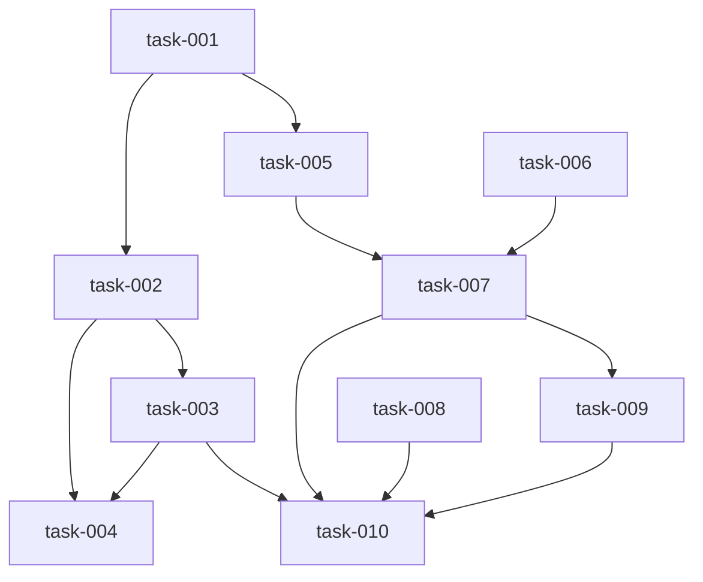

# Implementation Plan (TASKS.md)

## Dependency Graph

## task-001: QUESTIONS.md and SPEC.md template updates
Create the QUESTIONS.md template with structured format. Add Assumption Audit and Classification Metadata sections to SPEC.md template.

- **Acceptance Criteria**:
  - templates/QUESTIONS.md exists with: date headers (## Phase — YYYY-MM-DD), numbered questions (### Q1:), category tags ([Category]), context blocks (> ...), and [Answer]: tags
  - templates/SPEC.md gains ## Assumption Audit section with table: #, Assumption, Justification, Status (confirmed/guess), Resolves (Q<N> or n/a)
  - templates/SPEC.md gains ## Classification Metadata section with YAML-style fields: estimated_files, estimated_loc, clusters_touched, new_public_api, dependency_additions
- **Files**: templates/QUESTIONS.md, templates/SPEC.md
- **RED Note**: Test templates/QUESTIONS.md contains [Answer]:, ### Q, and > context block. Test templates/SPEC.md contains ## Assumption Audit with Status and Resolves columns, and ## Classification Metadata with all 5 fields.
- **Estimated LOC**: 60

## task-002: Refine reference doc — QUESTIONS.md + Classification Metadata mandates
Update 01-refine.md: mandate generating QUESTIONS.md during gap identification, mandate filling Classification Metadata in SPEC, list both as outputs.

- **Acceptance Criteria**:
  - 01-refine.md step 2 mandates writing questions to docs/epics/<branch>/QUESTIONS.md instead of batching in chat
  - 01-refine.md step 4 mandates filling Classification Metadata section in SPEC.md
  - 01-refine.md outputs section lists QUESTIONS.md alongside TICKET.md and SPEC.md
- **Files**: references/01-refine.md
- **Depends on**: task-001
- **RED Note**: Test 01-refine.md references QUESTIONS.md in step 2 and outputs. Test it references Classification Metadata in step 4.
- **Estimated LOC**: 30

## task-003: Plan reference doc — QUESTIONS.md append + assumption audit + units step
Update 02-plan.md: append Plan-section questions to QUESTIONS.md, mandate assumption audit before gate, add unit decomposition step for System-tier.

- **Acceptance Criteria**:
  - 02-plan.md step 0.5 references appending Plan-section questions to QUESTIONS.md with a Plan date header
  - 02-plan.md step 6 (Gate) includes assumption audit mandate: agent must fill ## Assumption Audit in SPEC.md before gate
  - 02-plan.md gains step 2.5 (Unit decomposition) for System-tier epics: identify clusters, assign unit IDs, map tasks to units, define inter-unit deps
  - Step 2.5 explicitly skipped for Patch and Feature tiers
  - 02-plan.md outputs section lists QUESTIONS.md as a modified artifact
- **Files**: references/02-plan.md
- **Depends on**: task-002
- **RED Note**: Test 02-plan.md contains QUESTIONS.md append references, assumption audit mandate, and unit decomposition step with System-tier gating.
- **Estimated LOC**: 60

## task-004: Gate enhancements — QUESTIONS.md checks + overconfidence gate
Add QUESTIONS.md validation to gate_refine() and gate_plan(). Add Assumption Audit validation to gate_plan(). Gate fails on empty answers or unresolved guesses. Also add epic directory path resolution so gates find artifacts at docs/epics/<branch>/ instead of root.

- **Acceptance Criteria**:
  - Add resolve_epic_dir() helper that returns docs/epics/<branch>/ path using git rev-parse --abbrev-ref HEAD
  - gate_refine() resolves SPEC.md and QUESTIONS.md from epic dir, not root
  - gate_refine() checks QUESTIONS.md if it exists; fails if any [Answer]: line has empty/whitespace-only content
  - gate_plan() resolves SPEC.md, TASKS.md, and QUESTIONS.md from epic dir (TASKS.md also checked at root for execution copy)
  - gate_plan() checks Plan-section [Answer]: entries the same way
  - gate_plan() checks SPEC.md for ## Assumption Audit section; fails if missing (unless config disables)
  - gate_plan() fails if any assumption has Status 'guess' without Resolves: Q<N> pointing to an answered question
  - gate_plan() emits warning if QUESTIONS.md has zero Refine-section entries
  - Backward compatibility: passes when QUESTIONS.md absent; passes when Assumption Audit absent and overconfidence_check disabled in config
  - Tests in tests/test_gate_enhancements.py cover all cases
- **Files**: datum/gate.py, tests/test_gate_enhancements.py
- **Depends on**: task-002, task-003
- **RED Note**: Test gate with empty [Answer]: → exit 1. Filled answers → exit 0. Missing QUESTIONS.md → exit 0. Missing Assumption Audit → exit 1. Guess without Resolves → exit 1. Guess with valid Resolves → exit 0. All confirmed → exit 0.
- **Estimated LOC**: 100

## task-005: Classifier module — parse metadata and classify
Create datum/classify.py with parse_classification_metadata() and classify() functions. Pure logic, no CLI wiring yet.

- **Acceptance Criteria**:
  - datum/classify.py exists with parse_classification_metadata(spec_text) → dict and classify(metadata, config) → dict
  - parse_classification_metadata extracts 5 fields from ## Classification Metadata section
  - classify() returns {tier, signals, pipeline_shape} applying threshold rules from config
  - Patch: estimated_loc < 50 AND clusters_touched <= 1 AND new_public_api is false → express
  - System: clusters_touched > 5 OR (new_public_api AND estimated_loc > 500) → extended
  - Feature: everything else → standard
  - Tests in tests/test_classify.py cover all three tiers with boundary values
- **Files**: datum/classify.py, tests/test_classify.py
- **Depends on**: task-001
- **RED Note**: Test classify() with 20-LOC single-cluster no-new-API → Patch. 6-cluster change → System. 200-LOC 3-cluster feature → Feature. Boundary: 50-LOC single-cluster → Feature (not Patch). Test parse with sample SPEC section.
- **Estimated LOC**: 100

## task-006: Landscape module — filesystem scaffold generator
Create datum/landscape.py with generate_scaffold() function. Scans filesystem for tech stack, file tree with LOC, module descriptions. Caches content hash.

- **Acceptance Criteria**:
  - datum/landscape.py exists with generate_scaffold(root_path) → str function
  - Scaffold includes: tech stack (from pyproject.toml/package.json), file tree with LOC per directory, top-level module docstrings
  - Output is valid markdown with clearly marked sections and gitnexus markers for enrichment
  - Caches content hash in .datum/landscape-hash; returns cached if hash matches
  - Force parameter bypasses cache
  - Tests in tests/test_landscape.py: scaffold on temp dir with known structure, cache hit, force bypass
- **Files**: datum/landscape.py, tests/test_landscape.py
- **RED Note**: Test generate_scaffold on temp dir with pyproject.toml + src/ → markdown has Tech Stack heading and LOC counts. Test cache hit returns same content without re-scan. Test force=True regenerates.
- **Estimated LOC**: 150

## task-007: CLI commands — classify + landscape + config
Wire classify and landscape commands into datum/cli.py. Add [classification] section to config.toml.default with threshold overrides.

- **Acceptance Criteria**:
  - datum/cli.py gains classify command: reads SPEC.md, calls classify(), prints JSON result
  - datum/cli.py gains landscape command with --force flag: calls generate_scaffold(), writes docs/LANDSCAPE.md
  - assets/config.toml.default gains [classification] section: patch_max_loc, patch_max_clusters, system_min_clusters, system_min_loc_with_api
  - uv run datum classify --help works
  - uv run datum landscape --help works
- **Files**: datum/cli.py, assets/config.toml.default
- **Depends on**: task-005, task-006
- **RED Note**: Test datum classify --help exits 0. Test datum landscape --help exits 0. Test config.toml.default contains [classification] section with threshold keys.
- **Estimated LOC**: 50

## task-008: lane_plan.py units of work extension
Extend lane_plan.py to support optional unit field on tasks and top-level units object. Validate unit DAG, task-to-unit coverage, render units as sections in TASKS.md.

- **Acceptance Criteria**:
  - Accepts tasks with optional 'unit' field (string unit ID)
  - Accepts input as object with 'tasks' and 'units' keys (not just a list)
  - Unit dependency graph validated as acyclic (reuse topological_sort)
  - All tasks must reference valid unit IDs when units are present; missing unit → error
  - render_tasks_md groups tasks by unit with dependency annotations when units present
  - lane-plan.json output includes units metadata when present
  - Backward compatible: plain list input (no units) still works
  - Tests in tests/test_units.py: valid units, cyclic unit deps, invalid unit ref, plain list compat
- **Files**: datum/lane_plan.py, tests/test_units.py
- **RED Note**: Test with tasks+units → validates output has unit groupings. Cyclic unit deps → exit 1. Task references unknown unit → exit 1. Plain list → still works identically to before.
- **Estimated LOC**: 120

## task-009: Discovery reference doc — landscape integration
Update 00-discovery.md to call datum landscape, enrich with GitNexus data when available, and update skip conditions.

- **Acceptance Criteria**:
  - Step 2 runs datum landscape before GitNexus survey
  - Step 2 adds agent enrichment: query GitNexus for clusters/processes, append to LANDSCAPE.md between <!-- gitnexus:start --> / <!-- gitnexus:end --> markers
  - Outputs section lists docs/LANDSCAPE.md as optional artifact
  - Skip condition adds LANDSCAPE.md staleness check alongside CURRENT_STATE.md
- **Files**: references/00-discovery.md
- **Depends on**: task-007
- **RED Note**: Test 00-discovery.md references datum landscape command, GitNexus enrichment with markers, and LANDSCAPE.md in outputs.
- **Estimated LOC**: 40

## task-010: SKILL.md — dispatcher, gates, artifacts, commands
Final SKILL.md update: classification dispatch, three pipeline shapes, gate matrix with overconfidence, artifact registry with QUESTIONS.md and LANDSCAPE.md, units in Plan, new commands.

- **Acceptance Criteria**:
  - Dispatcher step 2.5 calls datum classify and routes to pipeline shape
  - Three pipeline shapes documented: Express (Patch), Standard (Feature), Extended (System)
  - System tier mandates all Properties categories and architect sidecar; Patch routes to Express
  - Gate matrix includes overconfidence check under plan_human_approval
  - Artifact archival lists QUESTIONS.md and LANDSCAPE.md
  - Commands section includes datum classify and datum landscape
  - Plan phase references unit decomposition for System-tier
- **Files**: SKILL.md
- **Depends on**: task-003, task-007, task-008, task-009
- **RED Note**: Test SKILL.md contains: datum classify, datum landscape, QUESTIONS.md in artifacts, LANDSCAPE.md in artifacts, overconfidence in gate, three pipeline shapes, units in Plan.
- **Estimated LOC**: 80

## Research Findings

### task-004: Gate enhancements
- **Pattern**: Gate validators check sections via `content.lower()` membership (gate.py:76). Branch resolution uses `current_branch()` in state.py:45-57 via `git rev-parse --abbrev-ref HEAD`. Path resolution follows path_utils.py:14-26.
- **Pitfall**: Gates currently load files from root (`Path("SPEC.md")` at gate.py:63, `Path("TASKS.md")` at gate.py:103). Must add `resolve_epic_dir()` helper. TASKS.md should remain resolvable from root (execution copy) AND epic dir (archive).
- **Config**: Use `gate_policy()` pattern (gate.py:45-46) for overconfidence_check flag. Config sections accessed via `dict.get()` with defaults.

### task-005: Classifier
- **Pattern**: Config loading uses try/except for tomllib (gate.py:33-39). Markdown section extraction can follow knowledge_drift.py:17-50 — split by `## ` headers, parse line-by-line.
- **Pitfall**: No YAML-style metadata parser exists in codebase. Must implement custom parser for `## Classification Metadata`. Design as fault-tolerant: missing fields return None so classify() can apply defaults. Boundary cases: exactly 50 LOC (Patch edge), exactly 5 clusters (System edge).

### task-006: Landscape
- **Pattern**: Path utilities in path_utils.py:14-26. State JSON write-through for caching. No existing filesystem walker with LOC counts.
- **Pitfall**: Hash caching pattern not yet in codebase — use `hashlib.md5(content.encode()).hexdigest()`. Tech stack detection: check pyproject.toml, package.json, go.mod presence.

### task-007: CLI commands
- **Pattern**: Commands via `@app.command()` typer decorators (cli.py:1-144). Args via `typer.Option()`. Output JSON via `json.dumps()`. Config loading: tomllib with tomli fallback.
- **Pitfall**: classify reads SPEC.md from epic dir. landscape writes to docs/LANDSCAPE.md. Both need `--help` (automatic with typer).

### task-008: lane_plan.py units extension
- **Pattern**: Input is `json.loads()` as list (lane_plan.py:181-236). Topological sort at 58-83. File ownership at 43-55. Lane plan build at 130-164. Render at 86-127. Task fields: id, title, description, acceptance_criteria, files, depends_on, red_note, introduces_stubs, estimated_loc.
- **Pitfall**: Must accept list OR dict with 'tasks'/'units' keys. Input normalization: if list, wrap as `{tasks: list, units: {}}`. Reuse `topological_sort()` for unit DAG. render_tasks_md must group by unit when present. Error messages must distinguish unit-level vs task-level cycles.
- **Backward compat**: All unit fields optional. Plain list input must produce identical output to current behavior.
