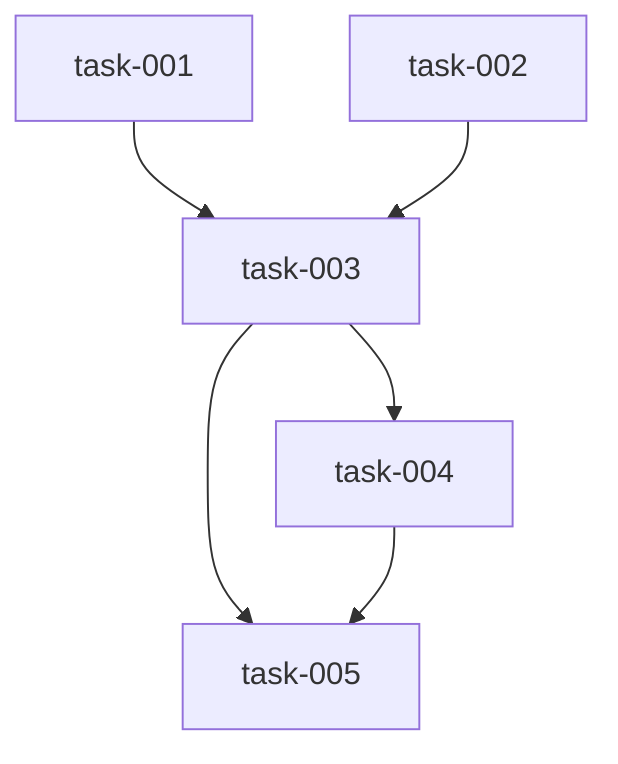

# Implementation Plan (TASKS.md)

## Dependency Graph

## task-001: Create WalkthroughSummary Pydantic schema
Define the `WalkthroughSummary` Pydantic model in `datum/models/walkthrough_schema.py` to structure the LLM output. Fields: `summary` (str), `lanes` (list of lane narratives), `files_touched` (list[str]), `key_decisions` (list[str]), and `excluded` (list[str]).

- **Acceptance Criteria**:
  - datum/models/walkthrough_schema.py defines WalkthroughSummary
  - Schema validates cleanly with Pydantic v2
- **Files**: datum/models/walkthrough_schema.py
- **RED Note**: None
- **Estimated LOC**: 40

## task-002: Create WALKTHROUGH.md template
Create `templates/WALKTHROUGH.md` as a template for the walkthrough artifact. It must include sections for summary, lane narratives (RED/GREEN/REFACTOR), files touched, key design decisions, and exclusions.

- **Acceptance Criteria**:
  - templates/WALKTHROUGH.md exists with all required sections
  - Template uses clear placeholders for LLM output
- **Files**: templates/WALKTHROUGH.md
- **RED Note**: None
- **Estimated LOC**: 60

## task-003: Create walkthrough generator module
Implement `datum/walkthrough.py` to handle the generation logic. This includes reading `SPEC.md`, `TASKS.md`, and `git diff`, calling `run_phase("sidecar_docs", ...)` with the schema, and rendering the result into the template. It must also handle the deterministic fallback if the LLM is unavailable or returns malformed JSON.

- **Acceptance Criteria**:
  - datum/walkthrough.py reads necessary files and git diff
  - LLM output is correctly rendered into the template
  - Deterministic fallback works if sidecar_docs is unavailable or returns malformed JSON
- **Files**: datum/walkthrough.py
- **Depends on**: task-001, task-002
- **RED Note**: None
- **Estimated LOC**: 80

## task-004: Register walkthrough CLI command and integrate with closeout
Add the `datum walkthrough` subcommand to `datum/cli.py` and integrate it into the `datum closeout` command pipeline to ensure it runs after archiving artifacts.

- **Acceptance Criteria**:
  - datum walkthrough subcommand is registered
  - datum closeout calls the walkthrough generation process
- **Files**: datum/cli.py
- **Depends on**: task-003
- **RED Note**: None
- **Estimated LOC**: 40

## task-005: Write unit and integration tests
Implement `tests/test_walkthrough.py` to cover template existence, schema validation, deterministic fallback, and CLI command execution. All LLM calls must be mocked to prevent actual calls to Gemma during testing.

- **Acceptance Criteria**:
  - tests/test_walkthrough.py contains at least 5 tests
  - All tests pass with `uv run pytest tests/test_walkthrough.py`
  - No actual calls to Gemma are made during testing
- **Files**: tests/test_walkthrough.py
- **Depends on**: task-003, task-004
- **RED Note**: None
- **Estimated LOC**: 90

## Research Findings

### task-001
* Use nested `BaseModel` classes with Pydantic v2 validators (e.g., `confloat`, `AwareDatetime`).
* Include `from __future__ import annotations` and avoid dataclass generation.
* Implement required fields: `summary`, `lanes`, `files_touched`, `key_decisions`, and `excluded`.

### task-002
* Follow `templates/SPEC.md` structure using numbered sections and front matter (Run ID, Phase, Status).
* Use markdown bullet lists and comment blocks for LLM fill-in areas.
* Include summary, lane narratives, files touched, key decisions, and exclusions.

### task-003
* Follow `render.py` pattern: read inputs, apply deterministic logic, and output markdown.
* Implement `run_phase` to return a dict with `result/escalated/phase/reason` keys.
* Use `structured()` when a schema is provided and `chat()` when it is not.
* Use `subprocess.run(capture_output=True, text=True)` for git diffs and handle return codes 1 and 2.
* Implement deterministic fallback to render from `TASKS.md` upon escalation or exceptions.

### task-004
* Use `typer.Typer()` with `@app.command()` decorators and module-level functions.
* Follow `datum/cli.py` pattern: import local modules, execute logic, and use `console.print()` for output.
* Use `raise typer.Exit(1)` for failures and `rich` formatting for error messages.

### task-005
* Use `unittest.TestCase` and `tempfile.TemporaryDirectory` for test fixtures.
* Use `unittest.mock.patch` to mock `run_phase` calls.
* Follow the pattern of creating temp dirs, writing input files, and asserting on output files.
