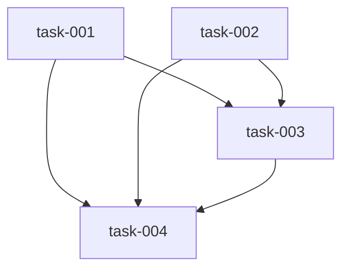

# Implementation Plan (TASKS.md)

## Dependency Graph

## task-001: Fix DEFAULTS max_tokens to 8192
Change DEFAULTS["max_tokens"] from 131072 to 8192 (sensible output cap). Keep DEFAULTS["context_window"] at 131072. Update docstring of check_context_budget() to clarify that max_tokens is output length and context_window is total model context.

- **Acceptance Criteria**:
  - DEFAULTS["max_tokens"] is 8192
  - DEFAULTS["context_window"] is 131072
  - check_context_budget() docstring updated to clarify semantics
  - check_context_budget("hello world", 8192) returns fits=True on any model
  - Budget check passes for a 100-token prompt + 8192 max_tokens against 131072 window
  - Existing tests in test suite still pass
- **Files**: datum/local_llm.py
- **RED Note**: Test that check_context_budget('hello world', 8192) returns fits=True before implementation
- **Estimated LOC**: 2

## task-002: Add _cache_offset(cache) helper function
Implement pure function _cache_offset(cache: list) -> int that returns the current offset from an MLX KVCache object list. Returns cache[0].offset if available, else falls back to 0. Include AttributeError handling for older MLX versions.

- **Acceptance Criteria**:
  - _cache_offset([]) returns 0
  - _cache_offset with mock cache object containing .offset attribute returns the offset value
  - Gracefully handles AttributeError when .offset is not available
  - Function is pure (no side effects)
- **Files**: datum/local_llm.py
- **RED Note**: Test _cache_offset([]) = 0 and _cache_offset([mock_with_offset_500]) = 500 before implementation
- **Estimated LOC**: 10

## task-003: Add prompt_cache threading in multi_turn_phase()
Implement delta-only prompt caching in multi_turn_phase(). Before the turn loop, create a prompt_cache via make_prompt_cache(model, max_kv_size=config.get('max_kv_size')). On turn 0, pass full prompt normally (cache is empty). On turns 1+, tokenize the full new prompt, slice delta = tokens[_cache_offset(cache):], and pass the delta token array directly to stream_generate(model, tokenizer, delta_tokens, prompt_cache=cache). Include fallback to full-prompt mode if offset >= len(tokens). The synthesis turn (last turn with schema) uses structured() with delta tokens pre-tokenized.

- **Acceptance Criteria**:
  - multi_turn_phase() creates one prompt_cache before the turn loop
  - Turn 0 receives and processes full prompt
  - Turns 1+ receive only delta tokens (new tokens since last turn)
  - Cache offset is tracked and incremented correctly after each turn
  - A 3-turn multi-turn run generates fewer total tokens prefilled than 3× the first turn's prompt length
  - Falls back to full-prompt mode (no delta) if cache offset tracking fails or offset >= len(tokens)
- **Files**: datum/local_llm.py
- **Depends on**: task-001, task-002
- **RED Note**: Mock verifies make_prompt_cache called once before loop; turn 1 receives fewer tokens in prompt than turn 0 before implementation
- **Estimated LOC**: 60

## task-004: Write tests for hardening in test_local_llm_hardening.py
Implement 5 tests in tests/test_local_llm_hardening.py covering R1, R3, and R4 acceptance criteria. Tests must fail before implementation (RED phase). Tests: test_budget_check_fix, test_budget_check_fails_when_prompt_too_large, test_cache_offset_empty, test_cache_offset_populated, test_multi_turn_uses_prompt_cache.

- **Acceptance Criteria**:
  - test_budget_check_fix: check_context_budget passes for 100-token prompt + 8192 max_output against 131072 window
  - test_budget_check_fails_when_prompt_too_large: prompt alone exceeds window → fails correctly
  - test_cache_offset_empty: _cache_offset([]) returns 0
  - test_cache_offset_populated: mock cache with .offset = 500 → returns 500
  - test_multi_turn_uses_prompt_cache: mock verifies make_prompt_cache called once before loop
  - All 5 tests fail before implementation
  - All 5 tests pass after implementation
  - No regressions in existing test suite
- **Files**: tests/test_local_llm_hardening.py
- **Depends on**: task-001, task-002, task-003
- **RED Note**: All 5 tests must fail before implementation (RED phase)
- **Estimated LOC**: 80
