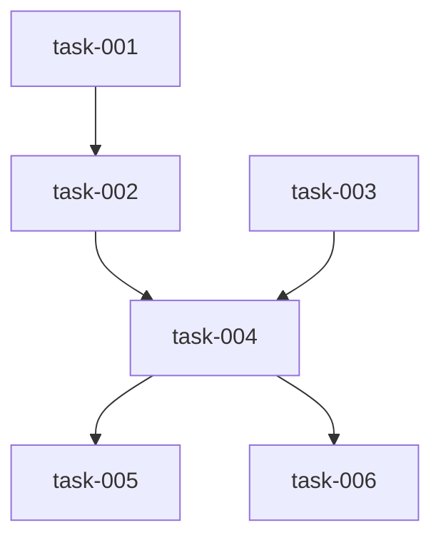

# Implementation Plan (TASKS.md)

## Dependency Graph

## task-001: Add build_issue_body and parse_issue_metadata to github_issues.py
Add a public build_issue_body(lane) function that serializes lane metadata into a datum:metadata HTML comment body string, and a parse_issue_metadata alias for the existing parse_metadata function. The lane dict contains files, depends_on, acceptance_criteria keys.

- **Acceptance Criteria**:
  - build_issue_body(lane) returns a string containing the substring '<!-- datum:metadata'
  - parse_issue_metadata(build_issue_body(lane)) returns a dict with keys 'files', 'depends_on', 'acceptance_criteria' matching the original lane dict values
  - parse_issue_metadata(body_without_comment) returns None when no '<!-- datum:metadata' comment is present
  - json.loads succeeds on the JSON extracted from the HTML comment inside build_issue_body output (valid JSON)
  - parse_issue_metadata is callable as a public name from datum.github_issues (alias for parse_metadata)
  - The existing _build_issue_body still works and create_task still calls it without regression
- **Files**: datum/github_issues.py, tests/test_github_issues.py
- **RED Note**: Write tests that call build_issue_body({'files': ['a.py'], 'depends_on': [], 'acceptance_criteria': ['x works']}) and assert the return value contains '<!-- datum:metadata', that parse_issue_metadata round-trips, that parse_issue_metadata("no comment") is None, and that the extracted JSON parses without error. These must fail before the functions exist.
- **Estimated LOC**: 30

## task-002: Add create_issues_from_plan with title-based dedup to github_issues.py
Add create_issues_from_plan(lane_plan, repo) that iterates over lane_plan['lanes'], searches for existing open GH issues matching each lane's title (case-insensitive), reuses matches instead of creating duplicates, creates new issues with datum-task label when no match exists, and returns dict[str, int] mapping task_id to GH issue number.

- **Acceptance Criteria**:
  - create_issues_from_plan({'lanes': {'t-1': {'title': 'A', ...}, 't-2': {'title': 'B', ...}, 't-3': {'title': 'C', ...}}}, repo) returns a dict with exactly 3 entries mapping task_id strings to positive ints
  - When _gh is mocked to return an existing issue for title 'A', create_issues_from_plan reuses that issue number and does not call gh issue create for that lane
  - The returned dict contains every task_id key present in lane_plan['lanes']
  - Issues are created with label 'datum-task' (verified via mock call args)
  - When a lane's task_id value is not a string, create_issues_from_plan raises TypeError
  - create_issues_from_plan with all three lanes returns a 3-entry dict where all values are positive integers
- **Files**: datum/github_issues.py, tests/test_github_issues.py
- **Depends on**: task-001
- **RED Note**: Write tests mocking _gh and _gh_check at the module level. The dedup test should mock gh issue list --search to return a JSON list with one matching issue and assert no gh issue create call occurs for that lane. These must fail before create_issues_from_plan exists.
- **Estimated LOC**: 50

## task-003: Add link_sub_issues batch linker with 409 swallowing to github_issues.py
Add link_sub_issues(parent_number, child_numbers, repo) that resolves issue numbers to node IDs via gh issue view, links each child as a sub-issue of parent using the existing link_sub_issue GraphQL primitive, and silently swallows RuntimeError when the error message contains 'already' (409-equivalent already-linked conflict). Non-already errors are re-raised.

- **Acceptance Criteria**:
  - link_sub_issues(parent_number=1, child_numbers=[2, 3], repo='o/r') calls link_sub_issue twice (mocked) with the node IDs of issues 2 and 3
  - link_sub_issues called twice with the same args does not raise when the second call's link_sub_issue raises RuntimeError('already linked')
  - link_sub_issues(1, [], 'o/r') returns None without making any gh API calls
  - link_sub_issues raises RuntimeError when link_sub_issue raises RuntimeError('not found') (non-already error propagates)
  - link_sub_issues resolves parent and child node IDs via gh issue view --json id --jq .id
- **Files**: datum/github_issues.py, tests/test_github_issues.py
- **RED Note**: Write tests mocking _gh_check to return fake node IDs for issue view calls. The idempotent test should mock link_sub_issue to raise RuntimeError('already linked') on second call and assert no exception is raised. The non-409 test should mock link_sub_issue to raise RuntimeError('not found') and assert RuntimeError propagates. All must fail before link_sub_issues exists.
- **Estimated LOC**: 40

## task-004: Add create_epic_with_tasks orchestrator to github_issues.py
Add create_epic_with_tasks(lane_plan, repo) that calls create_epic to create a datum-epic parent issue, calls create_issues_from_plan to create child tasks, calls link_sub_issues to link all children to the parent, and returns {'epic_number': int, 'task_map': dict[str, int]}. Fails fast if child creation raises.

- **Acceptance Criteria**:
  - create_epic_with_tasks(lane_plan, repo) returns a dict with keys 'epic_number' (positive int) and 'task_map' (dict mapping each task_id to a positive int)
  - The epic issue is created with label 'datum-epic' (verified via mock call args to create_epic)
  - After create_epic_with_tasks, link_sub_issues is called with the epic_number and all task issue numbers as child_numbers
  - If create_issues_from_plan raises RuntimeError, create_epic_with_tasks propagates the exception without silently continuing
  - create_epic_with_tasks returns task_map containing every task_id from lane_plan['lanes']
- **Files**: datum/github_issues.py, tests/test_github_issues.py
- **Depends on**: task-002, task-003
- **RED Note**: Write tests mocking create_epic, create_issues_from_plan, and link_sub_issues at module scope. The fail-fast test should mock create_issues_from_plan to raise RuntimeError and assert it propagates. These must fail before create_epic_with_tasks exists.
- **Estimated LOC**: 35

## task-005: Add --gh-issues flag to datum lane-plan CLI command
Add a --gh-issues boolean typer.Option to lane_plan_cmd in datum/cli.py. When passed, after lane_plan_main() runs, the command reads the written lane-plan.json, calls create_epic_with_tasks, remaps lane task_id fields and depends_on references from task-XXX format to #N format using the returned task_map, writes epic_issue at the top level, and overwrites lane-plan.json. When omitted, behavior is unchanged with zero GH API calls.

- **Acceptance Criteria**:
  - datum lane-plan without --gh-issues produces a lane-plan.json with task-XXX-style task_id fields and makes no GH API calls (existing behavior unchanged)
  - datum lane-plan --gh-issues produces a lane-plan.json where every lane's task_id matches the regex r'^#\d+$'
  - datum lane-plan --gh-issues produces a lane-plan.json with 'epic_issue' key at the top level containing a positive integer
  - datum lane-plan --gh-issues rewrites depends_on references so that any task-XXX reference is replaced with the corresponding #N from task_map
  - wave_builder.validate_lane_plan passes on the lane-plan.json produced by --gh-issues without modification
  - If task_map is missing a task_id present in lanes, a KeyError propagates and lane-plan.json is not overwritten with partial data
- **Files**: datum/cli.py, tests/test_units.py
- **Depends on**: task-004
- **RED Note**: Write CLI tests using typer.testing.CliRunner invoking the lane-plan command with --gh-issues, mocking create_epic_with_tasks at the datum.cli module boundary. Assert the written lane-plan.json has #N task_ids and epic_issue key. The without-flag test asserts no mock call. These must fail before the flag is added.
- **Estimated LOC**: 60

## task-006: Add GH lane status sync to datum-tdd-act TS source
In skills/src/datum-tdd-act.ts, after the results collection loop (lines ~124-132), add logic that for each completed lane: if task_id starts with '#', shell out to `datum gh-sync-lane --issue N --status completed`; for each failed lane: if task_id starts with '#', shell out to `datum gh-sync-lane --issue N --status failed --error '<reason>'`. Add a `datum gh-sync-lane` CLI subcommand in datum/cli.py that calls update_issue_stage for completed (stage='done') or posts a failure comment for failed. GH sync errors are caught and logged to stderr without aborting. After editing .ts, run bash scripts/build-workflows.sh to regenerate the .js file.

- **Acceptance Criteria**:
  - When a lane with task_id '#42' has status 'completed', datum gh-sync-lane --issue 42 --status completed calls update_issue_stage(42, 'done') and closes GH issue #42
  - When a lane with task_id '#42' has status 'failed' with error 'some reason', datum gh-sync-lane --issue 42 --status failed --error 'some reason' posts a comment containing 'some reason' to GH issue #42 and does NOT close it
  - When a lane with task_id 'task-001' (no # prefix), no datum gh-sync-lane call is made in datum-tdd-act
  - A GH API error in gh-sync-lane is caught and printed to stderr; the process exits 0 so pipeline is unaffected
  - skills/datum-tdd-act.js is regenerated from skills/src/datum-tdd-act.ts via bash scripts/build-workflows.sh after TS changes
- **Files**: skills/src/datum-tdd-act.ts, skills/datum-tdd-act.js, datum/cli.py
- **Depends on**: task-004
- **RED Note**: Write a CLI test for datum gh-sync-lane --issue 42 --status completed mocking update_issue_stage and asserting it is called with (42, 'done'). Write a test for --status failed --error 'msg' asserting a GH comment is posted and issue is NOT closed. Both must fail before gh-sync-lane subcommand exists.
- **Estimated LOC**: 65
