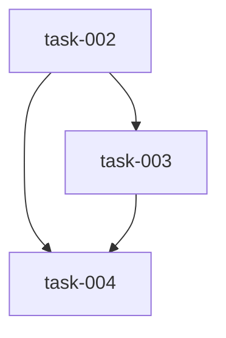

# Implementation Plan (TASKS.md)

## Dependency Graph

## task-001: Lane digest and exported lane spec carry expect_tests_pass for integration lanes
- **Slug**: digest-carries-expect-tests-pass
Add 'expect_tests_pass' to datum/lane_plan_digest.py's _LANE_FIELDS so the digest the TS runner loads carries the flag without opening the spec file, and pin (not re-implement) that `datum lane-spec-export`'s existing `**lane` spread already writes expect_tests_pass and depends_on into the per-lane spec file. Cross-language contract slice: Python producer + the exact fields the TS lane runner and RED agent consume. R4.1, R4.3.

- **Acceptance Criteria**:
  - `from datum.lane_plan_digest import _LANE_FIELDS` — `'expect_tests_pass' in _LANE_FIELDS` is True, and `'depends_on'` and `'kind'` are still present (no reordering-driven removal)
  - `digest_plan_file` (or the digest builder it uses) applied to a plan whose lane dict contains `{'kind': 'integration', 'expect_tests_pass': True, 'depends_on': ['task-002','task-003']}` yields a per-lane digest entry where `entry['expect_tests_pass'] is True`, `entry['kind'] == 'integration'`, and `entry['depends_on'] == ['task-002','task-003']`
  - A lane dict WITHOUT `expect_tests_pass` (a normal behavioral lane) produces a digest entry with no `expect_tests_pass` key at all (the existing `if field in lane and lane[field] is not None` behaviour is unchanged — absent, not False)
  - A lane dict with `expect_tests_pass: False` round-trips as `entry['expect_tests_pass'] is False`, not dropped
  - The spec file written by `datum/lane_spec_export.py` for an integration lane parses as JSON containing `expect_tests_pass: true` and `depends_on` equal to the lane's covered task ids, in lane order
- **Files**: datum/lane_plan_digest.py, tests/test_lane_plan_digest_expect_tests_pass.py, tests/test_lane_spec_export_integration_fields.py
- **RED Note**: pytest. Write tests/test_lane_plan_digest_expect_tests_pass.py asserting `'expect_tests_pass' in _LANE_FIELDS` and that a digest built from an integration lane dict carries the flag, the kind, and depends_on through — plus the absent/False cases so the fix cannot be a blanket setdefault. Write tests/test_lane_spec_export_integration_fields.py as a pure assertion against the ALREADY-WORKING `**lane` spread in datum/lane_spec_export.py (do NOT modify lane_spec_export.py — it is in reads, verification only): export a lane spec for an integration lane and assert the written JSON contains expect_tests_pass: true and the covered depends_on ids. The digest test must fail today because _LANE_FIELDS lacks 'expect_tests_pass'; the export test may pass on first run — that is expected and is the regression pin AC4.3 asks for, state it in the test docstring. Do not touch datum/lane_plan.py or datum/integration_invariants.py (slice 1, out of scope per SPEC §6).
- **Estimated LOC**: 60

## task-002: runLane executes an integration lane RED-only and decides it on the independent verify
- **Slug**: integration-lane-red-only-fast-path
Add an `isIntegration` fast path in runLane (skills/src/datum-tdd-act-lane.ts) mirroring the existing isStructural precedent at line 443: run RED once, run the existing postRedSteps batch with the lane's test command as verifyTestCmd (one command-runner call, no second runBatch), never dispatch GREEN/runSkepticPanel/runRefactor, and turn the `test-verify` exit code into the lane outcome. Also widen the shared Lane type (kind union + expect_tests_pass) and add the expect_tests_pass RED prompt text — the consumers of both live in this same lane. R1, R2, R4.2.

- **Acceptance Criteria**:
  - `Lane` in skills/src/shared/types.ts accepts `kind: 'integration'` and `expect_tests_pass?: boolean` with no cast (both additive/optional; 'structural' and 'behavioral' still accepted)
  - Given a lane with `kind: 'integration'` and a fake agent runner, RED is dispatched exactly once (one `red:<taskId>`-labelled agent call)
  - For that same lane, zero calls are dispatched to GREEN, runSkepticPanel, and runRefactor (assert on the call log's labels, following the skills/src/datum-tdd-act-lane.calls.test.ts convention)
  - For that same lane, exactly one command-runner/`datum-cli` batch call is made (the postRedSteps batch), and it includes a `test-verify` step — no additional runBatch invocation beyond it
  - The RED prompt rendered for an `expect_tests_pass` lane contains, verbatim as substrings, `This lane covers invariants: ` followed by the leading `ID:` tokens of the lane's acceptance criteria in order, and the sentence `The code under test is already merged: these tests must PASS on your first run; a failing test is a finding, report it, do not weaken it.`
  - `test-verify` exit 0 → `result.results.T1.status === 'completed'` and `result.results.T1.stage === 'RED'`, with follow_ups unchanged from what RED/post-RED produced
  - `test-verify` exit 1 → `status === 'failed'` and `error === 'integration_failed: covered task-002, task-003; invariants INV-01, INV-03 (independent verify exit=1)'` for a lane with depends_on ['task-002','task-003'] and invariant ids INV-01, INV-03 (task ids from depends_on in order joined ', '; invariant ids from acceptance criteria in order joined ', ')
  - `test-verify` step omitted/refused/with no `TEST_EXIT=` line → `status !== 'completed'` and `error` starts with `green_verify_unavailable:`, produced via the same `verifyVerdict(...).kind === 'unavailable'` path GREEN uses — a null exit is never treated as a pass
  - A lane with `kind: 'integration'` but `expect_tests_pass` missing/false still takes the RED-only fast path (kind is authoritative per Assumption 9) and logs a warning about the disagreement rather than falling back to the task-lane flow
  - Existing structural and behavioral lanes are unaffected: a `kind: 'structural'` lane still short-circuits to runRefactor and a behavioral lane still runs RED→GREEN→REFACTOR
- **Files**: skills/src/datum-tdd-act-lane.ts, skills/src/shared/types.ts, skills/src/shared/prompts.ts, skills/src/prompts/red.md, skills/src/datum-tdd-act-lane.integration.test.ts
- **RED Note**: vitest (NOT pytest — this lane is TypeScript). Create ONE new test file, skills/src/datum-tdd-act-lane.integration.test.ts; do not add cases to datum-tdd-act-lane.test.ts or datum-tdd-act-lane.calls.test.ts (other lanes' territory), but read datum-tdd-act-lane.calls.test.ts for the fake-agent / call-log harness convention and copy it. The failing test must drive a lane with kind: 'integration', depends_on ['task-002','task-003'] and acceptance criteria whose leading tokens are INV-01/INV-03 through runLane with a stubbed command runner, and assert: RED call count === 1; zero GREEN/skeptic/refactor labels in the call log; exactly one datum-cli batch containing a 'test-verify' step; and the three outcome branches (exit 0 completed@RED, exit 1 with the byte-exact integration_failed string, absent verify → green_verify_unavailable prefix). The error string is specified byte-for-byte in SPEC R2 and is consumed by the classifier in task-003 — do not paraphrase it. Reuse the existing postRedSteps `verifyTestCmd` parameter and the existing verifyVerdict helper in skills/src/shared/lane-steps.ts (read-only here); do NOT add a second runBatch call — the NFR is one command-runner invocation per lane. Do not edit any skills/*.js bundle (generated).
- **Estimated LOC**: 140

## task-003: Triage classifies integration_failed as a code defect naming the covered tasks
- **Slug**: classify-integration-failed-as-code-defect
Add a `code_defect` member to TriageClassifyCategory and a PREFIX_RULES entry matching /^integration_failed:/ that classifies to it, with `reason` carrying the covered task ids extracted via a `covered ([^;]+)` regex. Add the required DESTINATION_BY_CATEGORY entry and the corresponding label mapping in datum-tdd-act-triage.ts (both are exhaustive Record<TriageClassifyCategory, ...> maps that will not type-check without it), and widen the category enumerations in the two existing tests that assert the closed set. R3.

- **Acceptance Criteria**:
  - `classifyLaneError('integration_failed: covered task-002, task-003; invariants INV-01, INV-03 (independent verify exit=1)')` returns `category === 'code_defect'` (a member that is not `agent_behavior` and not any of the seven pre-existing values) with deterministic confidence
  - The same call's `reason` string contains both `task-002` and `task-003`, extracted from the error via a `covered ([^;]+)` match rather than hardcoded
  - An `integration_failed:` error with a single covered id yields a reason containing that one id; an `integration_failed:` error with no `covered ` segment still classifies as `code_defect` without throwing
  - `code_defect` has an entry in `DESTINATION_BY_CATEGORY` and a bidirectional label mapping in skills/src/datum-tdd-act-triage.ts, so the exhaustive Record types compile
  - Every pre-existing PREFIX_RULES prefix still classifies exactly as before — specifically `lane_intake_failed`, `green_verify_unavailable`, `count_gate_failed`, `refactor_failed` and the existing agent_behavior prefixes keep their current categories, proving the new rule was inserted without reordering the linear list
- **Files**: skills/src/shared/triage-classify.ts, skills/src/datum-tdd-act-triage.ts, skills/src/shared/triage-classify-code-defect.test.ts, skills/src/shared/triage-classify.test.ts, skills/src/shared/verdicts.property.test.ts
- **Depends on**: task-002
- **RED Note**: vitest (NOT pytest). Put the NEW assertions in a new file skills/src/shared/triage-classify-code-defect.test.ts: the exact SPEC AC3.1 error string in, `code_defect` + a reason containing task-002 and task-003 out, plus the single-id and no-`covered`-segment edge cases. Depends on task-002 because that lane produces the byte-exact `integration_failed: covered <ids>; invariants <ids> (independent verify exit=<n>)` string this rule consumes — assert against that literal, not a paraphrase. TriageClassifyCategory is enumerated exhaustively in three other places that will break when the member is added, which is why they are in files, not reads: DESTINATION_BY_CATEGORY (same file), the two label maps at skills/src/datum-tdd-act-triage.ts:14 and :26, the destination map at skills/src/shared/triage-classify.test.ts:262, and the closed-set assertion at skills/src/shared/verdicts.property.test.ts:115 — widen those enumerations, do not otherwise rewrite those files (AC3.2 requires their existing cases to keep passing unchanged). Do not add a structured taskIds field to TriageClassification (SPEC §6, out of scope).
- **Estimated LOC**: 45

## task-004: Document the integration-lane runtime path in FLOW.md and mark integration_failed live in SKILL.md
- **Slug**: document-integration-lane-runtime-path
Docs-only closeout for the slice: describe the integration-lane execution path beside the existing task-lane diagram in docs/FLOW.md §3, correct §5's slice-1 ledger entry so it no longer reads as Plan-side scheduling only, and drop the 'reserved' wording next to integration_failed in SKILL.md. R5.

- **Acceptance Criteria**:
  - docs/FLOW.md §3 contains a paragraph adjacent to the existing task-lane RED→GREEN→REFACTOR mermaid diagram that names the integration lane and describes its path: RED → post-RED batch including the independent verify → completed at stage RED, or `integration_failed` naming the covered tasks
  - That paragraph states explicitly that an integration lane never runs GREEN, the skeptic panel, or REFACTOR, and that a null/unavailable verify is `green_verify_unavailable`, never a pass
  - docs/FLOW.md §5's slice-1 (`datum/integration-lanes`) ledger entry is edited so it states RED-only execution has shipped, not only Plan-side scheduling
  - SKILL.md no longer describes `integration_failed` as 'reserved' — it is listed as a live failure name (the word 'reserved' no longer appears adjacent to `integration_failed`)
  - No source file is modified by this task — the diff is docs/FLOW.md and SKILL.md only
- **Files**: docs/FLOW.md, SKILL.md
- **Depends on**: task-002, task-003
- **RED Note**: Documentation-only, no testable behaviour — marked structural, so this lane runs a single commit stage with no RED/GREEN. The acceptance criteria are review-checkable prose statements about docs/FLOW.md and SKILL.md, deliberately not phrased as test assertions (a grep-for-a-word test would be a worthless test under TDD-002). Describe the behaviour exactly as task-002 and task-003 shipped it — read those files rather than restating the SPEC from memory, and keep FLOW.md prose unwrapped (one paragraph, one line, per FS-002).
- **Estimated LOC**: 25

## Research Findings

### task-001: Lane digest and exported lane spec carry expect_tests_pass for integration lanes
- **Pattern**: `datum/lane_plan_digest.py:27-35` — `_LANE_FIELDS` is a plain tuple (`title, files, reads, depends_on, kind, github_issue, test_command, green_model`); `build_digest` at line 57-58 does `for field in _LANE_FIELDS: if field in lane and lane[field] is not None:` — confirms the AC's "absent, not False" requirement is the existing loop behavior, not something to add. Appending `'expect_tests_pass'` to the tuple is the entire producer-side change.
- **Convention**: `datum/lane_spec_export.py:176` already does `**lane` spread when writing the per-lane spec file, so `expect_tests_pass`/`depends_on` already flow through untouched — task correctly scopes this file as read-only/verification-only.
- **Pitfall**: Do not add a `setdefault` or blanket default for the new field — the AC explicitly tests that a lane dict without `expect_tests_pass` produces no key at all in the digest entry, and that `False` round-trips distinctly from absent.
- **Convention**: Test naming/placement in this repo pairs one assertion file per producer (`tests/test_lane_plan_digest_expect_tests_pass.py`) and one pin file per already-working consumer path (`tests/test_lane_spec_export_integration_fields.py`) rather than extending an existing broad test file — matches existing `tests/test_integration_invariants_frontier.py` pattern of narrowly-scoped new test modules per slice.

### task-002: runLane executes an integration lane RED-only and decides it on the independent verify
- **Pattern**: `skills/src/datum-tdd-act-lane.ts:218` — `const isStructural: boolean = lane.kind === 'structural'`, then a single early-return block at line 443 (`if (isStructural) { ... return { status: 'completed', stage: 'REFACTOR' } }`) is the exact precedent to mirror for `isIntegration` (kind === 'integration'), branching before the redAlreadyCommitted/greenAlreadyCommitted resume logic.
- **Pattern**: `postRedSteps(...)` (imported from `./shared/lane-steps`, used at line 768) already accepts a `verifyTestCmd` param and is invoked once per lane via `runBatch(postRed, stageOpts('cli', {...}))` (line 769) — the integration fast path should reuse this exact call, not add a second `runBatch`. `testExitCode(stepStdout(postRedResult, 'test-verify'))` (line 832) and `verifyVerdict(...)` (used at GREEN, e.g. line 1175, returning `.kind === 'unavailable'` → `green_verify_unavailable: ${verdict.why}` at line 1188) are the exact helpers to reuse for the three outcome branches (pass/fail/unavailable) so the "null exit is never a pass" invariant is enforced identically to GREEN's path.
- **Convention**: `Lane` type lives in `skills/src/shared/types.ts:187-212`; `kind` is currently `'structural' | 'behavioral'` at line 200 with an explicit comment "Absent = behavioral" — widening to include `'integration'` and adding `expect_tests_pass?: boolean` is a small additive edit at that one line plus a new field.
- **Pitfall**: `redPrompt` (`skills/src/shared/prompts.ts:37`) takes a fixed `PromptVars`-shaped object and calls `withLaneSpec(redTemplate, rest, laneSpec)` — the new "This lane covers invariants: ..." text needs either a new optional var threaded through `redPrompt`'s vars object and referenced in `skills/src/prompts/red.md`, or a conditional slot; there is no existing conditional-insert pattern in `prompts.ts` today, so this is genuinely new plumbing, not a copy of an existing conditional prompt.
- **Convention**: Test file convention per RED Note: one new file (`datum-tdd-act-lane.integration.test.ts`) copying the fake-agent/call-log harness from `datum-tdd-act-lane.calls.test.ts` (confirmed to exist), not touching the other two test files for this lane — this matches the repo's per-concern test-file split already used for structural lanes.

### task-003: Triage classifies integration_failed as a code defect naming the covered tasks
- **Pattern**: `skills/src/shared/triage-classify.ts:13-19` defines exactly seven `TriageClassifyCategory` members (`infrastructure, workflow_bug, lane_plan, agent_behavior, test_quality, dependency, unknown`), confirming the AC's "not any of the seven pre-existing values" count. `PREFIX_RULES` (line 37 onward) is a flat ordered array of `{test: RegExp, category, reason}` objects grouped by category with a comment banner (e.g. `// ── infrastructure: ... ──` at line 38) — the new `code_defect` rule should be appended as its own new banner section, not interleaved, matching the file's existing grouping convention.
- **Pattern**: `DESTINATION_BY_CATEGORY` (`triage-classify.ts:291`) is explicitly typed `Record<TriageClassifyCategory, TriageDestination>` specifically so TypeScript's exhaustiveness check forces a decision when a category is added (comment cites bug #417: a silently-defaulting new category misfiled a consumer-code finding) — this is exactly the mechanism the task is relying on, confirmed present today.
- **Convention**: `datum-tdd-act-triage.ts:10-16` (`CATEGORY_LABEL`) and `:22-28` (`LABEL_TO_CATEGORY`) are the two Record maps needing a `code_defect` entry — both currently exclude `dependency`/`unknown` via `Exclude<TriageClassifyCategory, 'dependency' | 'unknown'>`, so `code_defect` must be added to both (not excluded) for the exhaustiveness check to pass, consistent with the other five existing categories.
- **Pitfall**: Existing `green_verify_unavailable` and similar prefixes are matched with `\b<name>\b` word-boundary regexes against the *whole* error string (not anchored to start) — the task's new rule anchors with `/^integration_failed:/` (start-of-string), which is a deliberately different anchoring style from every existing rule in the file; worth flagging in review but not a defect since the byte-exact error string task-002 produces always starts with `integration_failed:`.

### task-004: Document the integration-lane runtime path in FLOW.md and mark integration_failed live in SKILL.md
- **Pattern**: `docs/FLOW.md:193-253` "One lane" is a mermaid sequenceDiagram block for the task-lane RED→GREEN→REFACTOR path; the new paragraph should sit adjacent to this diagram (per AC), not inside the mermaid block itself.
- **Pattern**: `docs/FLOW.md:126` (§2 Plan section, not §3) is the *current* integration-lane description and already states "In this slice an integration lane still runs the full RED → GREEN → skeptic → REFACTOR path; RED-only execution and routing an integration failure to the covered tasks... are slice 2." — this line is stale once task-002/003 ship and is a strong candidate for the "§5 ledger" correction the task references, though the task's AC only names §5's slice-1 ledger entry specifically; worth checking whether line 126 also needs a matching edit even though it's technically §2, not §5 (task text focuses on §3/§5 only — flag as a possible gap, do not silently expand scope).
- **Pattern**: `docs/FLOW.md:313` is an existing §5 closed-items entry for "the integration-lanes epic itself" (a different, already-closed slice) — the "slice-1 ledger entry" the task means is distinct from this and should be searched for near §5's Open/Rotation subsections (`### Open` at line 299) rather than this closed entry.
- **Pattern**: `SKILL.md:141` contains the exact sentence to edit: "`integration_failed` is reserved for the lane runner's verdict on an integration lane whose tests stay red." — replace "is reserved for" with live-verdict phrasing per AC4 ("no longer... 'reserved'").
- **Pitfall**: FLOW.md prose is unwrapped (one paragraph, one line, e.g. line 126 and 313 are each a single long line) — new prose must follow this same no-hard-wrap convention (FS-002), which is already the file's established style, not a new constraint to introduce.
