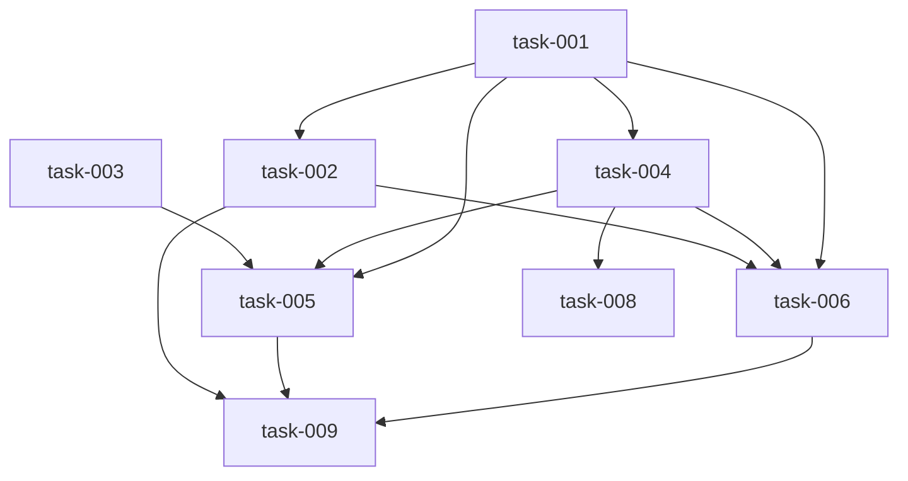

# Implementation Plan (TASKS.md)

## Dependency Graph

## task-001: Parse the `## Integration Invariants` table out of PROPERTIES.md
- **Slug**: parse-integration-invariants-table
New pure-logic module `datum/integration_invariants.py` that locates the `## Integration Invariants` heading in PROPERTIES.md text, parses its `ID | Invariant | Covers | Source` markdown table into structured records, and raises a named structured error on malformed rows. No gate, lane-plan, or skeleton wiring in this lane.

- **Acceptance Criteria**:
  - `parse_integration_invariants(md_text)` returns a list of dicts with keys `id`, `invariant`, `covers` (list[str]), `source` (str), one per table row, preserving table order
  - `parse_integration_invariants` on text whose table columns are not exactly `ID | Invariant | Covers | Source` in that order raises `IntegrationInvariantError` with a message starting `malformed_invariant_table:`
  - `parse_integration_invariants` on a row whose cell count differs from 4 raises `IntegrationInvariantError` with a message starting `malformed_invariant_row:` and naming the row's ID
  - `parse_integration_invariants` on a row whose `Source` matches neither `spec:<section>` nor `question:Q<N>` raises `IntegrationInvariantError` with a message starting `malformed_invariant_source:` and naming the row's ID
  - `parse_integration_invariants` on text with the `## Integration Invariants` heading present but zero data rows returns `[]` (no exception)
  - `has_integration_invariants_section(md_text)` returns False when the `## Integration Invariants` heading is absent and True when present, so callers can distinguish 'absent heading' from 'empty table'
  - `parse_integration_invariants` splits `Covers` on commas and strips whitespace, so `task-001, task-002` yields `['task-001', 'task-002']`
- **Files**: datum/integration_invariants.py, tests/test_integration_invariants_parse.py
- **RED Note**: pytest. The failing test must call `parse_integration_invariants` with literal PROPERTIES.md-shaped markdown strings and assert on the returned list-of-dicts and on `pytest.raises(IntegrationInvariantError)` message prefixes — not on gate exit codes. MODULE PATH NOTE: the SPEC's §9 `new_public_api` places the merge-frontier helper in `lane_plan.py`; the chosen approach overrides that with a dedicated module, and the epic's existing `tasks.json` already names it `datum/integration_invariants.py` — use exactly that path, every downstream lane references it. This lane owns the `malformed_invariant_*` message strings; do NOT assert `invariant_missing_for_question` (task-002) or `invariant_covers_unknown_task` (task-006) here.
- **Estimated LOC**: 110

## task-002: gate_properties enforces the Integration Invariants table and per-question coverage
- **Slug**: gate-properties-invariant-checks
Extend `gate_properties` in datum/gate.py to parse PROPERTIES.md's Integration Invariants table via the new module, fail on a missing heading or malformed rows, and fail when an answered QUESTIONS.md question has no matching invariant row. Reuses the existing `check_questions_answered` regex rather than adding a second parser.

- **Acceptance Criteria**:
  - `gate_properties` fails when PROPERTIES.md lacks the `## Integration Invariants` heading, emitting `missing_integration_invariants_section` (AC1.4)
  - `gate_properties` fails and surfaces the `IntegrationInvariantError` message verbatim when the table has malformed rows/columns/source (AC1.4)
  - `answered_question_ids(questions_md_text)` returns the list of `Q<N>` ids whose block has a non-empty `[Answer]:` line, using the same regex `check_questions_answered` already uses, and excludes questions with an empty or absent `[Answer]:`
  - `gate_properties` fails with `invariant_missing_for_question: Q<N>` (one message per offending question) when an answered question has no invariant row whose `Source` equals `question:Q<N>` (AC2.5)
  - `gate_properties` fails with `invariant_duplicate_for_question: Q<N>` when more than one invariant row carries the same `question:Q<N>` source, so 'exactly one' from AC2.1 is enforced in both directions
  - `gate_properties` passes when every answered question has exactly one matching row and every row is well formed
  - A PROPERTIES.md whose invariant `Covers` list has fewer than 2 entries and whose `Source` is `spec:<section>` fails; the same row with `Source` `question:Q<N>` passes (AC1.2)
  - PROPERTIES.md and QUESTIONS.md are each read and parsed once per `gate_properties` invocation (no repeated re-parsing), per the gate-performance NFR
- **Files**: datum/gate.py, tests/test_gate_properties_integration.py
- **Depends on**: task-001
- **RED Note**: pytest, using tmp_path epic fixtures the way tests/test_gate_properties.py already does. The failing test must drive `gate_properties` end-to-end and assert on the specific new message strings (`invariant_missing_for_question: Q2`, `missing_integration_invariants_section`) plus a non-zero/raising outcome — the existing 11-category and traceability-table checks must keep passing unchanged. This lane owns the `invariant_missing_for_question` / `invariant_duplicate_for_question` / `missing_integration_invariants_section` strings; do NOT assert `invariant_covers_unknown_task` here (task-006 owns it). datum/gate.py is also edited by task-006, which depends on this lane — keep the diff additive and localized to `gate_properties`.
- **Estimated LOC**: 120

## task-003: Widen lane-plan schema id patterns to accept `task-INT-<n>`
- **Slug**: widen-lane-plan-schema-int-ids
Change the three `constr(pattern=r'^task-\d+$')` sites in datum/models/lane_plan_schema.py (`Lanes.id`, `TopologicalOrderItem.root`, `DatumLanePlan.file_ownership` values) to `^task-(\d+|INT-\d+)$` so INT lanes validate, without loosening validation for ordinary task ids.

- **Acceptance Criteria**:
  - A lane-plan payload whose `lanes` contains a lane with `id` `task-INT-1` validates successfully through `datum.contracts.validate_payload` for the `lane-plan` schema key
  - `topological_order` containing `task-INT-2` validates successfully
  - `file_ownership` mapping `tests/integration/test_int_1.py` -> `task-INT-1` validates successfully
  - A plan containing only ordinary `task-001`-style ids validates exactly as before (same accepted set)
  - Malformed ids still fail: `task-abc`, `task-INT-`, `task-INT-x`, `taskINT-1`, `TASK-001`, and `task-INT-1-extra` each raise a pydantic ValidationError (schema-safety NFR: the widening must not weaken ordinary task-id validation)
- **Files**: datum/models/lane_plan_schema.py, tests/test_lane_plan_schema_int_ids.py
- **RED Note**: pytest. The failing test must call the pydantic models (or `datum.contracts.validate_payload`) directly with minimal in-memory plan dicts and assert both the newly-accepted INT ids AND the still-rejected malformed ids — the negative cases are the point, since a lazy `.*` widening would pass the positive ones. Do not edit datum/contracts.py; it is read-only context for the schema key name.
- **Estimated LOC**: 45

## task-004: Group invariants into merge frontiers and build synthetic INT lane dicts
- **Slug**: group-invariants-into-int-lanes
Add the pure merge-frontier grouping to datum/integration_invariants.py: group parsed invariants by the sorted tuple of their `Covers` task ids, order groups topologically with a deterministic tie-break, number them from 1, and emit one fully-formed INT lane dict per group. No lane_plan.py wiring here.

- **Acceptance Criteria**:
  - `derive_integration_lanes(invariants, tasks, test_command)` returns a list of lane dicts, one per distinct sorted `Covers` tuple, with all invariants sharing a tuple merged into one lane
  - Each returned lane has `id` == `task-INT-<n>` numbered from 1, `kind` == `'integration'`, `expect_tests_pass` is True, `depends_on` == the sorted list of the group's covered task ids, and `acceptance_criteria` == the group's invariant texts in table order (AC3.3)
  - Each returned lane's `files` is exactly one path: `tests/integration/test_int_<n>.py` when `test_command` targets pytest, and `src/integration/int-<n>.test.ts` when it targets a TypeScript/JS runner (AC3.3)
  - Group numbering is topological: a group whose covered tasks are all ancestors (per each task's `depends_on` in tasks) of another group's covered tasks is numbered first; ties break on ascending covered-task-id order (AC3.2)
  - Calling `derive_integration_lanes` twice on the same inputs, and on inputs whose invariant/task dicts were constructed in a different insertion order, returns identical lane lists (determinism NFR — no unsorted dict/set iteration)
  - `derive_integration_lanes` with an empty invariant list returns `[]` (AC8.1)
  - `unknown_covered_tasks(invariants, tasks)` returns an ordered list of `(invariant_id, task_id)` pairs for every `Covers` entry absent from tasks, and `[]` when all are present — it returns data, it does not raise or format a gate message
  - Each returned lane also carries `title` and `red_note` keys with non-empty strings so the lane satisfies the lane-plan schema's required fields
- **Files**: datum/integration_invariants.py, tests/test_integration_invariants_frontier.py
- **Depends on**: task-001
- **RED Note**: pytest. The failing test must call `derive_integration_lanes` with hand-built invariant and task lists and assert on the exact returned lane dicts — including the id numbering under a deliberately non-topological input order, and a determinism assertion that shuffled-input runs produce an equal result. This lane shares datum/integration_invariants.py with task-001 (dependency edge declared) but must have its own test file. It owns no gate message strings: `unknown_covered_tasks` returns pairs, and task-006 formats them as `invariant_covers_unknown_task: <ID> -> <task>`.
- **Estimated LOC**: 150

## task-005: build_lane_plan emits INT lanes, ownership, and topological order
- **Slug**: wire-int-lanes-into-lane-plan
Thread an optional PROPERTIES.md path through `build_lane_plan`/`main` in datum/lane_plan.py, call the grouping helper, and merge the resulting INT lanes into `lanes`, `topological_order`, `file_ownership`, and `total_lanes`. The default (no properties path, or a PROPERTIES.md with no invariants) must be a byte-identical no-op.

- **Acceptance Criteria**:
  - `build_lane_plan(..., properties_path=None)` returns a plan byte-identical to the current pre-slice output for the same tasks (default-None keeps every existing caller and test green)
  - With a PROPERTIES.md containing invariants, the returned plan's `lanes` gains one `task-INT-<n>` entry per merge frontier, each with `kind` == `'integration'` and `expect_tests_pass` True
  - Each INT lane id is appended to `topological_order` after all of its covered task ids
  - Each INT lane's single test file is added to `file_ownership` mapped to that INT lane's id
  - `total_lanes` equals `len(lanes)` including the INT lanes
  - A PROPERTIES.md whose `## Integration Invariants` table is present but empty produces zero `task-INT-*` lanes and a plan byte-identical to the `properties_path=None` output (AC8.1)
  - The plan produced with INT lanes validates against the widened lane-plan pydantic schema (no new top-level plan keys — `DatumLanePlan` is `extra='forbid'`)
  - `main()` accepts an optional `--properties` argument and passes it through; omitting it preserves current CLI behavior exactly
- **Files**: datum/lane_plan.py, tests/test_lane_plan_integration_lanes.py
- **Depends on**: task-003, task-004, task-001
- **RED Note**: pytest. The failing test must call `build_lane_plan` directly with in-memory tasks plus a tmp_path PROPERTIES.md and assert on the returned plan dict (lanes/topological_order/file_ownership/total_lanes), and must include an explicit no-op regression assertion that `properties_path=None` output equals the pre-slice output. AC4.1 CONFLICT — READ THIS: AC4.1's clause 'a plan written before this slice digests every lane as kind: "task"' contradicts the backward-compatibility NFR ('zero regression in _LANE_FIELDS output'), and synthesizing a `task` default provably changes digest JSON for pre-slice plans. The failing test MUST assert that a pre-slice plan (no `kind` on any lane) digests byte-identically with NO synthesized `kind` key, and MUST NOT assert a `task` default. Do not edit datum/lane_plan_digest.py — it is read-only here; `kind` is already in its `_LANE_FIELDS`, so INT lanes get it for free once build_lane_plan writes the key.
- **Estimated LOC**: 130

## task-006: gate_plan validates INT lane coverage, dependency direction, and the zero-invariant warning
- **Slug**: gate-plan-integration-lane-checks
Add the integration-lane checks to `gate_plan` in datum/gate.py: unknown covered tasks fail, INT `depends_on` must equal the union of covered tasks, task lanes must never depend on an INT lane, and a zero-invariant epic warns on stderr while exiting 0.

- **Acceptance Criteria**:
  - `gate_plan` fails with `invariant_covers_unknown_task: <ID> -> <task>`, one message per offending covers-entry, when an invariant's `Covers` names a task id absent from tasks.json (AC3.4)
  - `gate_plan` fails when a `task-INT-<n>` lane's `depends_on` as a set is not exactly the union of its invariants' `Covers` task ids (AC9.1)
  - `gate_plan` fails when a lane with `kind` absent or `'task'`/`'behavioral'`/`'structural'` has a `task-INT-*` id in its `depends_on` (AC9.2)
  - `gate_plan` writes `no_integration_invariants` to stderr and exits 0 when the plan has zero `task-INT-*` lanes and PROPERTIES.md's invariant table is empty (AC8.2)
  - `check_zero_lanes`'s existing all-lanes-empty hard failure is unchanged and still fires only when there are zero lanes of any kind
  - Existing `gate_plan` behaviors — schema validation, per-lane field checks, `depends_on` referential integrity, file-overlap-vs-dependency, assumption audit, topological_order/lanes equality — produce identical results for a plan with no INT lanes
  - tasks.json and PROPERTIES.md are each parsed once per `gate_plan` invocation (gate-performance NFR)
- **Files**: datum/gate.py, tests/test_gate_plan_integration_lanes.py
- **Depends on**: task-002, task-004, task-001
- **RED Note**: pytest, tmp_path epic fixture in the style of tests/test_gate_plan_transitive_deps.py. The failing test must run `gate_plan` over hand-built lane-plan.json + tasks.json + PROPERTIES.md fixtures and assert on the exact new strings and the exit/raise behavior, including the exit-0-with-stderr case for `no_integration_invariants` (a warning, not a failure). This lane owns `invariant_covers_unknown_task` and `no_integration_invariants`; do NOT re-assert `invariant_missing_for_question` (task-002 owns it). datum/gate.py is shared with task-002 — that edge is declared, so rebase on its landed `gate_properties` changes and keep this diff confined to `gate_plan`.
- **Estimated LOC**: 140

## task-007: Exported INT lane spec carries the tests-must-pass note and expect_tests_pass
- **Slug**: export-integration-contract-summary
In datum/lane_spec_export.py, prepend an integration-specific note entry to the exported `contract_summary` when the lane's `kind` is `'integration'`, without changing `contract_summary()`'s signature or its output for task lanes.

- **Acceptance Criteria**:
  - For a lane dict with `kind == 'integration'`, the body written by `export_lane_spec` has `contract_summary[0] == {'note': 'This is an integration lane: its tests are expected to PASS against the already-merged code and must not be written to fail.'}` and `contract_summary[1:] == contract_summary(criteria)` unchanged (AC5.1, AC5.2)
  - `contract_summary()`'s signature and return value for any given `acceptance_criteria` list are unchanged — the note is injected by `export_lane_spec`, never by `contract_summary` itself (AC5.2)
  - For a lane with `kind` absent or `'task'`/`'behavioral'`/`'structural'`, the exported `contract_summary` is byte-identical to the current pre-slice output with no note entry (AC5.3)
  - The exported body for an integration lane includes `expect_tests_pass: true`, carried by the existing `**lane` spread with no additional export code (AC4.2)
  - The exported body for a task lane does not include an `expect_tests_pass` key (AC4.3)
  - `ac_count` in the returned summary for an integration lane equals `len(lane['acceptance_criteria'])`, i.e. the invariant count, via the existing unchanged computation (AC7.1)
- **Files**: datum/lane_spec_export.py, tests/test_lane_spec_export_integration.py
- **RED Note**: pytest. `contract_summary()` returns `list[dict]`, NOT a string — the SPEC's 'includes a sentence' is realized as a leading `{'note': ...}` dict entry, pinned verbatim in AC1 above; assert that exact dict, do not invent a different shape. The failing test builds a hand-written plan dict in memory (no dependency on build_lane_plan), calls `export_lane_spec` to a tmp_path, reads the JSON back, and asserts both the integration and the task-lane (byte-identical, no note, no expect_tests_pass) cases. Must NOT reuse tests/test_lane_spec_export.py — that file belongs to no lane in this epic and must stay unedited.
- **Estimated LOC**: 70

## task-008: Skeleton creator emits one shared INT test file with invariant-id-named functions
- **Slug**: skeleton-int-lane-single-file
Route integration-lane skeletons in datum/skeleton_creator.py into the lane's single designated test file (`lane['files'][0]`) with one skeleton function per acceptance criterion, named from the invariant ID, while leaving the task-lane one-file-per-AC path and `make_function_name`'s existing behavior untouched.

- **Acceptance Criteria**:
  - `run_preflight` for a lane whose `kind` is `'integration'` emits every skeleton with `path` equal to the lane's `files[0]`, not per-AC derived paths (AC6.1)
  - The INT lane's skeleton bodies use the same placeholder shape task-lane skeletons already produce (e.g. `pytest.fail("not implemented")` for python) — no new placeholder form
  - `make_function_name(ac_id, ac_text, language)` keeps its current three-positional-argument call contract working identically for every existing caller and returns the same names as today for non-integration ACs (AC6.3)
  - `make_function_name(..., invariant_id='II3')` (new default-None keyword) returns `test_ii3` for python and an `II3`-derived name for typescript/javascript, preferring the invariant id over the slugified AC text (AC6.2)
  - An INT lane with N acceptance criteria produces exactly N skeleton functions in one file, so the existing one-test-function-per-AC count expectation is satisfied without changing that gate's logic (AC7.2)
  - `run_batch` over a lane plan containing both task lanes and INT lanes produces unchanged output for the task lanes
  - The parent directory of the INT lane's test file is created on demand when skeletons are applied and it does not already exist
- **Files**: datum/skeleton_creator.py, tests/test_skeleton_integration_lane.py
- **Depends on**: task-004
- **RED Note**: pytest. The failing test must call `run_preflight`/`run_batch` with a tmp_path lane-plan fixture containing one `kind: 'integration'` lane and one ordinary lane, then assert every INT skeleton's `path` equals the lane's single `files[0]`, that there are exactly N skeletons for N ACs, and that the function names derive from the invariant ids. BACKWARD-COMPAT TRAP: `make_function_name`'s new parameter must be keyword-with-default so tests/test_make_function_name.py and tests/test_skeleton_naming.py need no edits — if you find you must edit either of those files, stop and reconsider the signature. AC7.2 NOTE: the gate that enforces 'one test function per AC' was not located in the Python tree (it may live in the TS lane runner, which this Python-only slice must not touch); treat AC7.2 as a no-change, verification-only assertion on the skeleton count and do not add a speculative gate file to this lane.
- **Estimated LOC**: 120

## task-009: Document integration lanes in FLOW.md, SKILL.md, and the properties-derive prompt
- **Slug**: document-integration-lanes
Prose-only deliverables: a docs/FLOW.md section on RED-only integration lanes, SKILL.md coverage of the `integration` lane kind and the new gate error/warning names, and the per-question invariant instruction added to the properties-derive prompt template.

- **Acceptance Criteria**:
  - docs/FLOW.md gains a section describing integration lanes: RED-only in this slice (no GREEN), scheduled at merge frontiers, with failures routed to the covered tasks rather than the INT lane (AC10.1)
  - SKILL.md documents `kind: "integration"` as a lane kind alongside `structural`/`behavioral` (AC10.2)
  - SKILL.md names `invariant_missing_for_question`, `invariant_covers_unknown_task`, and `no_integration_invariants`, and notes `integration_failed` as the slice-2 triage-facing name reserved for later (AC10.2)
  - skills/src/prompts/properties-derive.md instructs the model to emit one Integration Invariant per answered question in QUESTIONS.md with Source `question:Q<N>`, and to emit the `## Integration Invariants` table with columns `ID | Invariant | Covers | Source` in that order (AC2.4, AC1.1)
  - The properties-derive prompt states that an invariant's `Invariant` text must be a checkable, testable expectation rather than a restatement of the question, and that an unanswered question yields no row (AC2.2, AC2.3)
- **Files**: docs/FLOW.md, SKILL.md, skills/src/prompts/properties-derive.md
- **Depends on**: task-002, task-005, task-006
- **RED Note**: Documentation and prompt-template only — no testable behavior, so this lane runs a single commit stage with no RED/GREEN. Edit the TypeScript-side prompt SOURCE at skills/src/prompts/properties-derive.md; never touch the generated skills/*.js bundles (they carry an @generated banner and are rebuilt from source after merge). Depends on the gate and lane-plan lanes so the documented error names match what actually shipped.
- **Estimated LOC**: 90

## Research Findings

### task-001: Parse the `## Integration Invariants` table out of PROPERTIES.md
- **Pattern**: `review_report_rows` in `datum/gate.py:455` is the codebase's existing pipe-table parser precedent — strip lines to `|`-prefixed, split on `|`, `.strip()` each cell, detect the header row by its first cell text, skip separator rows. Model `parse_integration_invariants` on this shape rather than inventing a new one.
- **Convention**: Custom structured errors subclass `ValueError` (see `LaneSpecExportError` in `datum/lane_spec_export.py:31`, `DigestError` in `datum/lane_plan_digest.py:39`) — `IntegrationInvariantError(ValueError)` matches house style; no need for a `payload` attribute unless a gate wants structured extras.
- **Pitfall**: `review_report_rows` treats any line not matching `_FINDING_ROW_RE` after the header as silently skipped rather than raising — this task's spec explicitly wants the opposite (raise on malformed rows), so don't copy that leniency, only the tokenizing shape.
- **Pitfall**: distinguish "heading absent" from "heading present, zero rows" per AC — `_has_section`/`_extract_section` helpers already exist in `datum/gate.py:303` and `:551` for heading detection; `has_integration_invariants_section` can reuse the same regex idiom (`re.search(rf"^##\s+{heading}", text, re.M)`) instead of a new one.

### task-002: gate_properties enforces the Integration Invariants table and per-question coverage
- **Pattern**: `gate_properties` today (`datum/gate.py:1147`) is a thin category/traceability check with no tmp_path test file yet (`tests/test_gate_properties.py` currently only tests guess-detection helpers, not `gate_properties` itself) — this lane will be the first to exercise `gate_properties` end-to-end via `pytest.raises(SystemExit)`, so build the fixture/epic_dir harness fresh, copying the exact `epic_dir(tmp_path, monkeypatch)` + `_fail_json(capsys)` pattern from `tests/test_gate_plan.py:58-73` rather than inventing a new harness shape.
- **Convention**: `fail(message, hard=False)` prints `{"passed": False, "hard_stop": hard, "message": ...}` and calls `sys.exit(1|2)`; assert on `exc.value.code` and the parsed JSON message exactly as `test_gate_plan.py` does — don't assert on stderr for hard-fail paths, only for warnings (`no_integration_invariants` in task-006 is the stderr+exit-0 case).
- **Convention**: `check_questions_answered`'s regex (`^###\s+(Q\d+):` header, `^\[Answer\]:\s*(.*)` line, peek-ahead for multi-line answers) is what `answered_question_ids` must reuse verbatim per the RED note — do not write a second regex for the same shape; extract the "which Qs are answered" list from the same scan.
- **Pitfall**: `gate.py:1152` already reads `PROPERTIES.md` once into `content`; adding the QUESTIONS.md read must not re-read either file more than once per invocation per the stated gate-performance NFR — read `questions_path` once near the top of `gate_properties` the same way `gate_plan` reads `spec_content`/`questions_content` once (`gate.py:1006-1010`).
- **Pitfall**: `gate.py` is edited by both this lane and task-006 (`gate_plan`) — they touch different functions in the same file, so keep the diff scoped strictly to `gate_properties` to avoid merge/rebase conflicts on unrelated hunks.

### task-003: Widen lane-plan schema id patterns to accept `task-INT-<n>`
- **Pattern**: `datum/models/lane_plan_schema.py` carries a `# generated by datamodel-codegen` banner, but there is **no** `assets/schemas/lane-plan.schema.json` file in the repo (`assets/schemas/` only has `task.schema.json`, `tasks.schema.json`, `unified.schema.json`) — `datum/contracts.py`'s `SCHEMA_MAP` maps `"lane-plan.schema.json"` straight to the `DatumLanePlan` Pydantic class (`contracts.py:41`), and `_validate_against_raw_schema_file` is only a fallback for schemas *not* in `SCHEMA_MAP`. There is no regen script that would clobber a direct edit to the `.py` file — editing it directly (as the task instructs) is safe and is in fact the actual SSOT despite the stale "generated" header.
- **Convention**: Three sites share the literal pattern `r'^task-\d+$'`: `TopologicalOrderItem.root`, `Lanes.id`, and `DatumLanePlan.file_ownership`'s dict-value type (`lane_plan_schema.py:12,20,36`) — extract the widened pattern once (e.g. a module-level `_TASK_ID_PATTERN = r'^task-(\d+|INT-\d+)$'`) to keep the three sites textually identical, since a hand-typed divergence in even one site is exactly the kind of drift the negative test cases (`task-INT-`, `task-INT-x`, etc.) are designed to catch.
- **Pitfall**: `constr(pattern=...)` in `Lanes.id` also implicitly bounds ordinary ids (`task-\d+`) — verify the widened alternation `(\d+|INT-\d+)` still fully anchors with `^...$` (pydantic `constr` patterns are `re.match`, not `re.fullmatch`, but a trailing `$` handles that) so `task-INT-1-extra` is rejected as the AC requires.

### task-004: Group invariants into merge frontiers and build synthetic INT lane dicts
- **Pattern**: `build_lane_plan` in `datum/lane_plan.py:573-659` is the shape reference for what a "fully-formed lane dict" needs (`id`, `title`, `files`, `acceptance_criteria`, `red_note`, `depends_on`, plus `kind` only when set) — `derive_integration_lanes` should produce dicts structurally compatible with this same lane shape since task-005 will merge them into the same `lanes` dict.
- **Convention**: `kind` is validated in `build_lane_plan` (`lane_plan.py:615-621`) to be only `"structural"` or `"behavioral"` when set on an ordinary task — this validation loop only runs over `sorted_ids`/`task_map`, which INT lanes never pass through (they're synthesized directly into the `lanes` dict in task-005), so `kind: "integration"` will not hit that ValueError. Confirmed no collision, but worth a comment at the task-005 splice point since it's non-obvious from reading `build_lane_plan` alone.
- **Pitfall**: determinism NFR — the codebase already has a precedent bug class for this: `_transitive_closure` and the file-overlap check in `gate_plan` were previously order-sensitive (see `tests/test_gate_plan_transitive_deps.py`'s docstring on the #524 dogfooding bug). Sort everything explicitly (tuple of covered ids, then group ordering) rather than relying on dict/set iteration order, and write the shuffled-input-produces-equal-output test the RED note calls for using the same style as `test_gate_plan_transitive_deps.py`'s hand-built dep-map fixtures.
- **Pitfall**: `unknown_covered_tasks` must return data only (ordered `(invariant_id, task_id)` pairs), not format a message — task-006 owns the `invariant_covers_unknown_task: <ID> -> <task>` string. Keep the boundary exactly where the RED note draws it so task-006's lane doesn't need to touch `integration_invariants.py`.

### task-005: build_lane_plan emits INT lanes, ownership, and topological order
- **Pattern**: `build_lane_plan`'s existing `if units: result["units"] = units` / `if spm_warnings: result["warnings"] = spm_warnings` (`lane_plan.py:655-658`) is the established "only add the key when there's data" idiom — apply the same style for INT lanes so `properties_path=None` (or an empty invariants table) truly produces a byte-identical dict with no new keys, matching AC8.1 and the no-op regression requirement.
- **Convention**: `main()` already threads several optional CLI flags with sane defaults (`--validate`, `--md-output`, etc. at `lane_plan.py:666-669`) — add `--properties` the same way (`parser.add_argument("--properties", default=None)`), and thread it into the existing `build_lane_plan(...)` call site at `lane_plan.py:748-750` as a new trailing kwarg so existing positional callers are unaffected.
- **Pitfall — the AC4.1 conflict flagged in the RED note is real**: nothing in `lane_plan_digest.py`'s `_LANE_FIELDS` or `build_lane_plan` synthesizes a `kind` default today; `kind` is only ever set when `task.get("kind")` is truthy (`lane_plan.py:615-616`). Confirmed: adding a synthesized `"task"` default for pre-slice plans would indeed change every existing lane's digest JSON (since `kind` is in `_LANE_FIELDS` and currently absent = omitted from the digest entirely, per `lane_plan_digest.py:57-59`'s `if field in lane and lane[field] is not None`). The RED note's directive to assert byte-identical digests with **no synthesized `kind`** is correct and matches the current digest behavior — do not add a `.setdefault("kind", "task")` anywhere in this lane.
- **Pitfall**: `DatumLanePlan` has `extra="forbid"` (`lane_plan_schema.py:31`) at the top level, but `Lanes` has `extra="allow"` (`lane_plan_schema.py:18`) — so INT-lane-specific keys like `expect_tests_pass` are fine on individual lane dicts without a schema change, but do not add any new top-level key to the plan dict itself (e.g. no `integration_lanes: [...]` sibling key), since that would trip the top-level `forbid`.

### task-006: gate_plan validates INT lane coverage, dependency direction, and the zero-invariant warning
- **Pattern**: `gate_plan`'s existing per-lane and dependency loops (`gate.py:927-1000`) are a single pass over `lanes.items()` — add the INT-lane checks (depends_on == union of covered tasks; task lanes must not depend on INT lanes) as additional per-lane branches in that same loop rather than a second full iteration, keeping with the file's existing style and the "parsed once" performance NFR.
- **Convention**: warnings-that-don't-fail already have a precedent: `audit_warnings` in `gate_plan` (`gate.py:1017-1018`) are printed to stderr with `print(f"⚠️ Warning: {w}", file=sys.stderr)` and do not call `fail()` — implement `no_integration_invariants` the same way (print then continue to `pass_gate`), not as a `fail(..., hard=False)` call (which would incorrectly exit 1).
- **Pitfall**: `gate_plan` currently reads `tasks_path` only as an *existence* check (`gate.py:906-910`) — it never actually parses `TASKS.md` content, and PROPERTIES.md isn't read by `gate_plan` at all today. This lane is the first to need PROPERTIES.md content inside `gate_plan`; read it once (mirroring how `spec_content`/`questions_content` are conditionally read at `gate.py:1006-1010`) and be explicit that a missing PROPERTIES.md here should not hard-crash `gate_plan` on epics that legitimately have none yet — but this task's own AC8.2 implies PROPERTIES.md's invariant table must be inspectable, so handle "file missing" as equivalent to "empty invariants" for the warning path rather than raising.
- **Pitfall**: `gate.py` is shared with task-002 (`gate_properties`) — per its RED note, this lane depends on and must rebase onto task-002's landed changes; keep this diff confined to `gate_plan` and its helpers to avoid re-touching `gate_properties`.

### task-007: Exported INT lane spec carries the tests-must-pass note and expect_tests_pass
- **Pattern**: `export_lane_spec` (`datum/lane_spec_export.py:143-171`) already spreads `**lane` into `body` (line 166) — `expect_tests_pass` needs zero export-code changes as long as task-004/005 put the key directly on the lane dict, confirming AC4.2/4.3 as written.
- **Convention**: `contract_summary()` returns `list[dict]` per-AC (`lane_spec_export.py:111-135`), never a string — this lane's "note" must be an additional leading dict in that same list shape (`{'note': '...'}`), injected by `export_lane_spec` after calling `contract_summary(criteria)`, not by changing `contract_summary`'s own return contract (which is explicitly frozen per the RED note and per `contract_summary`'s existing callers elsewhere).
- **Pitfall**: `tests/test_lane_spec_export.py` already exists and covers `contract_summary`/`export_lane_spec` for ordinary lanes — per the RED note this task must add a **new** test file (`tests/test_lane_spec_export_integration.py`) and leave the existing one untouched, since it "belongs to no lane in this epic."

### task-008: Skeleton creator emits one shared INT test file with invariant-id-named functions
- **Pattern**: `run_preflight` (`datum/skeleton_creator.py:509-600+`) currently loops `for i, ac_text in enumerate(acs_text)` and calls `build_skeleton(...)` per AC, which internally calls `infer_test_path(task_files, language, ac_id)` (`skeleton_creator.py:472`) to compute a per-AC `path`. For `kind == 'integration'` lanes, this task must override that per-AC path with the lane's fixed `files[0]` — the cleanest seam is passing an optional `fixed_path` (or checking `task_data.get("kind")` in `run_preflight` before calling `build_skeleton`) rather than changing `infer_test_path`'s own per-AC logic, since ordinary lanes must keep deriving paths as today.
- **Convention**: `make_function_name(ac_id, ac_text, language)` (`skeleton_creator.py:442-451`) is a plain three-positional-arg function with per-language branches (`swift`, `typescript`/`javascript`, `go`, default python) — adding `invariant_id: str | None = None` as a fourth keyword-only-by-default parameter and short-circuiting to an invariant-id-derived name when it's not None keeps every existing three-arg call site (`build_skeleton` at line 471, and whatever calls it in `run_preflight`/`run_batch`) untouched, matching the RED note's "keyword-with-default" trap warning.
- **Pitfall**: `build_skeleton`'s call site passes `ac_id=ac_id` derived from `f"AC{i+1}"` (`skeleton_creator.py:565`) — for INT lanes, the RED note wants function names derived from the *invariant* id (e.g. `II3`) not the AC-index id; this lane needs the per-lane loop to also carry each acceptance criterion's originating invariant id through to `build_skeleton`/`make_function_name`, which isn't available today (INT lane dicts from task-004 only carry `acceptance_criteria` as plain text — the invariant `id` isn't preserved on the lane dict unless task-004's lane construction is checked for whether `id`s are recoverable positionally, i.e. `acceptance_criteria[k]` corresponds to the k-th invariant's `id` in table order). Confirm with task-004 owner that ordering is guaranteed 1:1 so `f"II{k+1}"`-style or actual-id derivation is possible without adding a new lane field.
- **Pitfall**: `SUPPORTED`/`KIND_MAP` gate which languages get skeletons at all (`run_preflight` early-returns `no_skeletons_reason` for unsupported languages, `skeleton_creator.py:524-531`) — an INT lane's `files[0]` extension must map to a supported language the same way ordinary lanes' first file does, so no new language-detection code is needed, just confirm the existing detection call site (wherever `language` is determined before calling `run_preflight`) still works when `files` has exactly one shared path instead of one-per-AC.

### task-009: Document integration lanes in FLOW.md, SKILL.md, and the properties-derive prompt
- **Pattern**: `skills/datum-tdd-act*.js` are generated from `skills/src/` per the repo's own `CLAUDE.md` — the RED note correctly identifies `skills/src/prompts/properties-derive.md` as the source to edit and warns off the generated `skills/*.js` bundles; confirmed by `CLAUDE.md`'s "Workflow Scripts: TypeScript Source, Generated JS" section, so this is not a task-004/005-specific quirk but a repo-wide rule.
- **Convention**: No prior FLOW.md/SKILL.md sections were inspected in this pass (docs-only lane, low risk) — when writing, match the existing doc's per-lane-kind description style already used for `structural`/`behavioral` (referenced by task-005/AC in `lane_plan.py:611-621`'s inline comment about the lane runner's structural fast-path) so the new `integration` kind reads as a peer entry, not a bolted-on addendum.
- **Pitfall**: this lane's error-name list (`invariant_missing_for_question`, `invariant_covers_unknown_task`, `no_integration_invariants`) must match the exact strings landed by task-002/task-006 verbatim — since it depends on those lanes, verify the actual committed message text (not this TASKS.md draft) before finalizing the docs, in case a GREEN-phase fixup changed a string during review.
