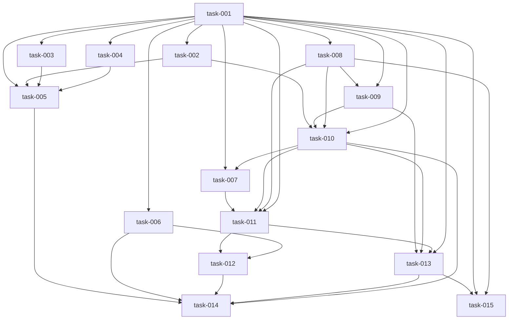

# Implementation Plan (TASKS.md)

## Dependency Graph

## task-001: Single-source lane id pattern accepting task-N, task-INT-N and DAT-142
- **Slug**: shared-lane-id-pattern
Create datum/id_pattern.py as the one canonical definition of a valid lane/task id and make the first two real consumers (the tasks JSON Schema used by `datum lane-plan --validate` and the DatumTask pydantic model) reference it, so a tasks.json whose ids are `DAT-142` validates end to end where today it is rejected.

- **Acceptance Criteria**:
  - datum.id_pattern.LANE_ID_PATTERN is a string regex anchored with ^...$ and re.fullmatch(LANE_ID_PATTERN, x) is truthy for 'task-1', 'task-001', 'task-INT-1', 'DAT-142', 'AB-1', 'ABCDEF-9'
  - re.fullmatch(LANE_ID_PATTERN, x) is None for 'DAT142', 'dat-142', 'DATUM-142', 'task-', 'task-INT-', 'DAT-', 'DAT-1x'
  - datum.id_pattern.is_lane_id('DAT-142') returns True and is_lane_id('dat-142') returns False
  - assets/schemas/task.schema.json's `id` pattern and `depends_on` item pattern both equal datum.id_pattern.LANE_ID_PATTERN (a test asserts equality by reading the JSON file, not by re-typing the literal)
  - datum.models.task_schema.DatumTask(id='DAT-142', slug='x-y-z', title='t', acceptance_criteria=['a'], files=['a'], depends_on=['DAT-141'], red_note='n') constructs without raising
  - DatumTask(id='dat-142', ...) raises pydantic.ValidationError
  - DatumTask(id='task-001', depends_on=['task-002'], ...) still constructs (widening, not tightening)
  - datum.lane_plan.main() run with --validate over a tasks.json whose ids are 'DAT-142'/'DAT-143' exits 0 and prints {"valid": true, "task_count": 2}
- **Files**: datum/id_pattern.py, assets/schemas/task.schema.json, datum/models/task_schema.py, tests/test_id_pattern_shared.py
- **RED Note**: pytest. The failing test must (a) import datum.id_pattern.LANE_ID_PATTERN — the module does not exist yet, so the import itself is the first RED — and table-drive re.fullmatch over the accept list ['task-1','task-001','task-INT-1','DAT-142','AB-1','ABCDEF-9'] and reject list ['DAT142','dat-142','DATUM-142','task-','task-INT-','DAT-','DAT-1x']; (b) json.load assets/schemas/task.schema.json and assert its id/depends_on patterns == LANE_ID_PATTERN; (c) construct DatumTask with id 'DAT-142' and assert pydantic.ValidationError for 'dat-142'; (d) write a tasks.json with DAT- ids into tmp_path and drive datum.lane_plan.main() with --validate, asserting exit code 0. Do NOT edit tests/test_task_slug.py — it must keep passing unmodified.
- **Estimated LOC**: 90

## task-002: Lane-plan output schemas accept prefixed ids
- **Slug**: widen-lane-plan-output-schemas
Widen the lane-plan.json models (lane id, topological_order entries, file_ownership values, and the lane record) to the shared pattern so a built lane-plan.json carrying DAT-<n> ids validates through datum.contracts.validate_payload.

- **Acceptance Criteria**:
  - datum.models.lane_plan_schema.DatumLanePlan validates a plan whose lane id, topological_order entry and file_ownership value are all 'DAT-142'
  - The same plan with 'task-001' and with 'task-INT-1' still validates (widening)
  - DatumLanePlan raises pydantic.ValidationError for lane id 'dat-142', 'DAT142' and 'DATUM-142'
  - datum.models.lane_schema's lane `id` accepts 'DAT-142' and rejects 'dat-142'
  - No literal r'^task-\d+$' or r'^task-(\d+|INT-\d+)$' string remains in datum/models/lane_plan_schema.py or datum/models/lane_schema.py — both reference datum.id_pattern.LANE_ID_PATTERN
  - datum.contracts.validate_payload accepts the DAT-142 plan written to a tmp_path file, matching the call style used by the existing int-ids test
- **Files**: datum/models/lane_plan_schema.py, datum/models/lane_schema.py, tests/test_lane_plan_schema_prefixed_ids.py
- **Depends on**: task-001
- **RED Note**: pytest, modelled on tests/test_lane_plan_schema_int_ids.py's _base_plan helper but with its own fixture in its own file. Drive validation through datum.contracts.validate_payload (not bare model construction) so the lane exercises the real caller. tests/test_lane_plan_schema_int_ids.py must NOT be modified or listed — it is the Req 4 AC3 backward-compat witness and must keep passing byte-identical. Also assert with a source-text read that no inline task-\d literal survives in the two edited files.
- **Estimated LOC**: 70

## task-003: Brief packet schemas accept prefixed task ids
- **Slug**: widen-brief-schemas
Point the four brief_* pydantic packet schemas at the shared id pattern so a RED/GREEN/REFACTOR brief for lane DAT-142 validates.

- **Acceptance Criteria**:
  - BriefRed, BriefGreen, BriefGreenContinuation and BriefRefactor payloads with task_id='DAT-142' validate through datum.contracts.validate_payload
  - The same four payloads with task_id='task-001' still validate
  - Each of the four raises pydantic.ValidationError for task_id='dat-142' and task_id='DAT142'
  - No literal r'^task-\d+$' remains in datum/models/brief_red_schema.py, brief_green_schema.py, brief_green_continuation_schema.py or brief_refactor_schema.py — each references datum.id_pattern.LANE_ID_PATTERN
- **Files**: datum/models/brief_red_schema.py, datum/models/brief_green_schema.py, datum/models/brief_green_continuation_schema.py, datum/models/brief_refactor_schema.py, tests/test_brief_schemas_prefixed_ids.py
- **Depends on**: task-001
- **RED Note**: pytest. Build one minimal valid payload per brief model (read each model for its required fields), parametrise over the four models x ['DAT-142','task-001'] asserting acceptance and x ['dat-142','DAT142'] asserting pydantic.ValidationError, routing through datum.contracts.validate_payload. Add a source-text assertion that no inline task-\d regex literal survives in the four edited files.
- **Estimated LOC**: 80

## task-004: Result packet schemas accept prefixed task ids
- **Slug**: widen-result-schemas
Point the four result_* pydantic packet schemas at the shared id pattern so a stage result reported for lane DAT-142 validates.

- **Acceptance Criteria**:
  - ResultRed, ResultGreen, ResultRefactor and ResultAdversarial payloads with task_id='DAT-142' validate through datum.contracts.validate_payload
  - The same four payloads with task_id='task-001' still validate
  - Each of the four raises pydantic.ValidationError for task_id='dat-142' and task_id='DATUM-142'
  - No literal r'^task-\d+$' remains in datum/models/result_red_schema.py, result_green_schema.py, result_refactor_schema.py or result_adversarial_schema.py — each references datum.id_pattern.LANE_ID_PATTERN
- **Files**: datum/models/result_red_schema.py, datum/models/result_green_schema.py, datum/models/result_refactor_schema.py, datum/models/result_adversarial_schema.py, tests/test_result_schemas_prefixed_ids.py
- **Depends on**: task-001
- **RED Note**: pytest, same table-driven shape as the brief lane but in its own test file with its own fixtures — never reuse or import the brief lane's helpers. Route every assertion through datum.contracts.validate_payload so the lane exercises the real consumer, and add the source-text no-inline-literal assertion.
- **Estimated LOC**: 80

## task-005: Executor, preflight and edge-case schemas accept prefixed task ids
- **Slug**: widen-executor-preflight-schemas
Point the remaining three pattern-bearing pydantic schemas (executor_result, preflight_result, candidate_edge_cases) at the shared id pattern, completing the Req 5 NFR that zero duplicated task-only literals remain under datum/models/.

- **Acceptance Criteria**:
  - ExecutorResult, PreflightResult and CandidateEdgeCases payloads with task_id='DAT-142' validate through datum.contracts.validate_payload
  - The same three payloads with task_id='task-001' still validate, and each raises pydantic.ValidationError for 'dat-142'
  - executor_result_schema's commit-message field description no longer hardcodes only 'feat(task-001)' as the example — it names the prefixed shape too, and the field itself imposes no task-\d-only constraint
  - A repo-wide test asserts that no file under datum/models/ contains the literal substring 'task-\\d' — the last three offenders are removed by this task
- **Files**: datum/models/executor_result_schema.py, datum/models/preflight_result_schema.py, datum/models/candidate_edge_cases_schema.py, tests/test_models_no_inline_task_id_regex.py
- **Depends on**: task-001, task-002, task-003, task-004
- **RED Note**: pytest. This lane owns the repo-wide sweep assertion, so it must land after the other widening lanes: glob datum/models/*.py, read each as text, assert none contains 'task-\\d'. That assertion is RED today for all 14 files and stays RED until this lane's three files are converted — depends_on the other widening lanes so it is scheduled last. Also add the per-model DAT-142/task-001/dat-142 validate_payload cases for the three files this lane edits.
- **Estimated LOC**: 80

## task-006: TypeScript consumes the same lane id pattern, with a Python parity test
- **Slug**: ts-shared-lane-id-pattern
Add skills/src/shared/lane-id-pattern.ts exporting the canonical regex as a hand-written module (checked into the repo, not generated), make lane-steps.ts's id validation use it instead of its own character-class check, and add a Python test asserting the TS literal is character-for-character the Python LANE_ID_PATTERN so the two can never drift.

- **Acceptance Criteria**:
  - skills/src/shared/lane-id-pattern.ts exports LANE_ID_PATTERN (string) and isLaneId(s: string): boolean
  - isLaneId returns true for 'task-1', 'task-INT-1' and 'DAT-142'; false for 'DAT142', 'dat-142' and 'DATUM-142'
  - lane-steps.ts's completionMarkerCommand and laneSpecExportCommand reject a task id that isLaneId rejects (e.g. a shell-metacharacter id) and accept 'DAT-142' without throwing
  - A Python test reads skills/src/shared/lane-id-pattern.ts, extracts the LANE_ID_PATTERN string literal, and asserts it equals datum.id_pattern.LANE_ID_PATTERN exactly — failing loudly if either side is edited alone
- **Files**: skills/src/shared/lane-id-pattern.ts, skills/src/shared/lane-steps.ts, skills/src/shared/lane-id-pattern.test.ts, tests/test_id_pattern_ts_parity.py
- **Depends on**: task-001
- **RED Note**: Two RED tests. (1) skills/src/shared/lane-id-pattern.test.ts (the project's existing TS test runner, same style as the other skills/src/shared/*.test.ts files) importing lane-id-pattern.ts — the import fails first — plus cases driving completionMarkerCommand/laneSpecExportCommand with 'DAT-142' (must not throw) and with an id containing a shell metacharacter (must throw). (2) tests/test_id_pattern_ts_parity.py reading the .ts source and asserting literal equality with datum.id_pattern.LANE_ID_PATTERN. Deliberate deviation from the chosen approach, agreed at plan time: the file is a hand-written .ts, NOT a '.generated.ts' emitted by scripts/build-workflows.sh — a generated file may not appear in any lane's files[], which would make the lane unplannable, and esbuild already bundles shared/*.ts transitively from the datum-*.ts entry points, so build-workflows.sh needs no change. Do not edit skills/src/shared/lane-steps.test.ts (owned elsewhere); put every new TS assertion in lane-id-pattern.test.ts.
- **Estimated LOC**: 110

## task-008: Resolve task_id_prefix from .datum/config.json or derive and persist it
- **Slug**: task-id-prefix-resolution
New module datum/task_ids.py providing prefix resolution: read .datum/config.json's task_id_prefix verbatim when present, otherwise derive it from the repo directory basename (letters only, uppercased, first 3 chars), persist the derived value back to config, and fail with a structured error when the derivation is too short.

- **Acceptance Criteria**:
  - resolve_task_id_prefix(repo_root) returns 'XYZ' verbatim when .datum/config.json contains {"task_id_prefix": "XYZ"}, and does not rewrite the config file in that case
  - For a repo directory named 'datum' with no task_id_prefix field, resolve_task_id_prefix returns 'DAT'
  - For a repo directory named 'my-project_2', derivation strips non-letters and uppercases before truncating, returning 'MYP'
  - After a derive, .datum/config.json on disk contains task_id_prefix set to the derived value, every pre-existing key is preserved unchanged, and a second call returns the same value without re-deriving
  - For a repo directory named '9' or '_x', resolve_task_id_prefix raises TaskIdPrefixError whose payload is {'code': 'task_id_prefix_invalid', 'message': <str>, 'correlationId': <str>} and .datum/config.json is left without a task_id_prefix key
  - Resolution is idempotent: calling it twice on a fresh repo writes config once and leaves identical content the second time
- **Files**: datum/task_ids.py, tests/test_task_id_prefix.py
- **Depends on**: task-001
- **RED Note**: pytest with tmp_path fixtures — the import of datum.task_ids is the first RED (the module does not exist). Create tmp_path/<name>/.datum/config.json with a couple of unrelated keys and assert they survive the rewrite. Follow the read/derive/persist-once pattern already used for hooks_installed/agent_types in datum/cli.py around line 659. Test the structured-error negative path with pytest.raises and assert all three keys of the payload, not just the code.
- **Estimated LOC**: 120

## task-009: Repo-wide counter computes max(existing)+1 from committed ids only
- **Slug**: task-id-counter-from-committed-ids
Extend datum/task_ids.py with a counter that enumerates committed docs/epics/*/tasks.json and lane-plan.json files on the current branch via git plumbing, extracts every ^<PREFIX>-\d+$ id from `id` and `depends_on` fields, and returns the next free number.

- **Acceptance Criteria**:
  - next_task_number(repo_root, prefix) returns 1 when no committed file contains a <PREFIX>-\d+ id
  - Given a committed docs/epics/e1/tasks.json containing ids 'DAT-3' and 'DAT-7' and a depends_on entry 'DAT-9', next_task_number(root, 'DAT') returns 10
  - Committed ids of the old shapes 'task-001' and 'task-INT-4' contribute nothing to the maximum — a repo containing only those returns 1
  - An id with a different prefix ('ABC-99') does not raise the DAT counter
  - A DAT-<n> id present only in the working tree (written but not committed) is ignored — the counter reads committed content via `git show HEAD:<path>` over paths enumerated by `git ls-tree -r HEAD --name-only`, never a filesystem glob
  - A DAT-<n> id committed only on another local branch is ignored — the scan is scoped to HEAD of the current branch
  - A committed tasks.json that is malformed JSON is skipped without raising, and the counter still returns the max over the parseable files
- **Files**: datum/task_ids.py, tests/test_task_id_counter.py
- **Depends on**: task-008, task-001
- **RED Note**: pytest. Fixtures must build a HERMETIC temp git repo: pass an explicit env with GIT_CONFIG_GLOBAL/GIT_CONFIG_SYSTEM pointed at /dev/null (or a tmp file), core.hooksPath unset, and an explicit user.name/user.email, because this repo has previously had global git hooks (~/.config/git/hooks) and ~/.ignore change fixture outcomes. Commit files, then also write an uncommitted DAT- id and assert it is NOT counted; create a second branch with a higher DAT- id and assert it is NOT counted. This lane shares datum/task_ids.py with the prefix lane, hence the depends_on edge.
- **Estimated LOC**: 130

## task-010: Deterministic post-decompose renumber of task-NNN ids to PREFIX-n
- **Slug**: renumber-tasks-after-decompose
New module datum/task_renumber.py that rewrites decomposer-emitted task-NNN ids to <PREFIX>-<n> in topological order (rewriting every depends_on reference in the same pass), wired into datum.lane_plan.main()'s build path so a plain `datum lane-plan` renumbers tasks.json on disk before the plan is built — and explicitly NOT wired into the --validate path.

- **Acceptance Criteria**:
  - renumber_tasks(tasks, prefix, start) on [{id:'task-001',depends_on:[]},{id:'task-002',depends_on:['task-001']}] with prefix 'DAT', start 142 returns ids 'DAT-142','DAT-143' with depends_on ['DAT-142'] on the second
  - Assignment follows dependency order: for tasks where task-001 depends_on task-002, task-002 receives the lower number, so no lane's number is greater than a lane that depends on it
  - After renumbering, no value anywhere in the returned structure matches ^task-\d+$ — every depends_on reference is rewritten alongside the id it targets
  - A task whose id is already 'DAT-142' is left untouched and its number is not reissued to another lane
  - `datum lane-plan --input tasks.json --output ...` (no extra flag, no interactive input) rewrites tasks.json ON DISK so the file itself holds <PREFIX>-<n> ids, and does so before schema validation and lane-plan construction run
  - `datum lane-plan --validate --input tasks.json` on a tasks.json containing 'task-001'/'task-002' leaves that file byte-identical — the renumber step never runs on the validate path (Req 7 AC2)
- **Files**: datum/task_renumber.py, datum/lane_plan.py, tests/test_task_renumber.py, tests/test_lane_plan_renumber_wiring.py
- **Depends on**: task-002, task-009, task-008, task-001
- **RED Note**: pytest, two new test files: a pure-function file for renumber_tasks (topological ordering, depends_on rewrite, already-prefixed passthrough) and a wiring file that drives datum.lane_plan.main() with patched sys.argv in a tmp_path repo. The byte-identical --validate assertion is load-bearing and must be written as a RED case, not left to review: read tasks.json bytes before and after and assert equality. Note for the implementer: renumbering must mutate the file on disk, not only the in-memory list normalize_input() returns.
- **Estimated LOC**: 180

## task-007: Plan gate identifies integration lanes by kind, not by task-INT- prefix
- **Slug**: gate-integration-lane-by-kind
Replace gate.py's _INT_LANE_PREFIX string-prefix checks with a kind == 'integration' test (the field derive_integration_lanes already emits and lane_plan.py already propagates), so integration lanes keep being recognised once their ids become DAT-<n>.

- **Acceptance Criteria**:
  - For a lane plan whose integration lane has id 'DAT-150' and kind 'integration', the gate classifies it as an integration lane and applies the same frontier/dependency rules it applies to a 'task-INT-1' lane
  - For a lane plan still using 'task-INT-1' with kind 'integration', gate behaviour is byte-identical to today (same verdict, same error list)
  - A task lane whose id happens to start with 'task-INT' is NOT treated as an integration lane when its kind is 'behavioral' — kind is the sole discriminator
  - No `startswith(_INT_LANE_PREFIX)` call remains in datum/gate.py; any surviving id-shape validation in gate.py references datum.id_pattern.LANE_ID_PATTERN
- **Files**: datum/gate.py, tests/test_gate_integration_lane_kind.py
- **Depends on**: task-001, task-010
- **RED Note**: pytest, in a new test file only. gate.py is the highest-risk file in scope (1780 LOC, 19 existing test files) — do not touch any existing tests/test_gate_*.py; they are the regression net and must all still pass. The RED test builds a lane-plan dict with one behavioural lane 'DAT-149' and one integration lane 'DAT-150' (kind 'integration', depends_on the first) and asserts the gate's plan verdict recognises the integration lane; today it does not, because the check is `lid.startswith('task-INT-')`. Add the paired legacy case with 'task-INT-1' asserting unchanged behaviour, and a negative case where kind is 'behavioral' but the id starts with 'task-INT'.
- **Estimated LOC**: 90

## task-011: Synthesised integration lanes draw ids from the same counter
- **Slug**: integration-lanes-take-counter-ids
Stop derive_integration_lanes from minting `task-INT-<n>` ids for new epics: integration lanes take the next sequential <PREFIX>-<n> values from the same counter as task lanes, identified downstream solely by kind == 'integration'.

- **Acceptance Criteria**:
  - derive_integration_lanes, given a prefix and a starting number, emits lane ids matching ^DAT-\d+$ and no id containing 'INT'
  - Integration lane numbers continue from the highest number the task lanes consumed in the same build — if task lanes end at DAT-145, the first integration lane is DAT-146
  - Every emitted integration lane still carries kind == 'integration' and that field survives into the built lane-plan.json
  - build_lane_plan's output for an epic with two invariant groups contains exactly two integration lanes, both with <PREFIX>-\d+ ids, both present in topological_order after the task lanes they cover
  - Integration-lane dependency edges point at the renumbered task-lane ids, not stale task-NNN strings
- **Files**: datum/integration_invariants.py, datum/lane_plan.py, tests/test_integration_lane_prefixed_ids.py
- **Depends on**: task-007, task-010, task-008, task-001
- **RED Note**: pytest in a new test file only. tests/test_integration_invariants_frontier.py, tests/test_lane_plan_integration_lanes.py and tests/test_gate_plan_integration_lanes.py must NOT be edited or listed — Req 4 AC3 makes them the witness that already-planned task-INT-<n> epics stay valid, so they have to keep passing untouched. The RED test calls derive_integration_lanes with an explicit prefix/start and asserts on the id shape and the kind field, then drives build_lane_plan end to end and asserts the integration lanes' ids and their depends_on all match ^DAT-\d+$. Shares datum/lane_plan.py with the renumber lane, hence the edge.
- **Estimated LOC**: 130

## task-012: datum-properties counts integration lanes by kind instead of grepping task-INT-
- **Slug**: properties-count-int-lanes-by-kind
skills/src/datum-properties.ts currently counts scheduled integration lanes with `grep -c '"task-INT-' lane-plan.json`, which silently reports zero once integration lanes carry <PREFIX>-<n> ids. Count lanes whose kind is 'integration' instead.

- **Acceptance Criteria**:
  - For a lane-plan.json whose two integration lanes have ids 'DAT-146'/'DAT-147' and kind 'integration', the step reports integration_lanes_scheduled with a count of 2 (today it reports integration_lanes_none)
  - For a legacy lane-plan.json with 'task-INT-1'/'task-INT-2' lanes carrying kind 'integration', the count is still 2 — behaviour unchanged for existing epics
  - For a lane-plan.json with no integration lanes the step still logs integration_lanes_none
  - No `'\"task-INT-'` literal remains in skills/src/datum-properties.ts
- **Files**: skills/src/datum-properties.ts, skills/src/datum-properties-int-lane-count.test.ts
- **Depends on**: task-011, task-006
- **RED Note**: TypeScript test in a NEW file (skills/src/datum-properties.test.ts already exists and is owned elsewhere — do not edit it). Assert on the command/counting logic with three lane-plan fixtures: DAT-prefixed integration lanes, legacy task-INT- integration lanes, and none. This consumer was missed by the codebase scan's 'the id is an opaque string' claim; it is a real cross-layer break, which is why it is its own lane. Do not hand-edit any skills/*.js bundle — those are @generated from these sources.
- **Estimated LOC**: 70

## task-013: lane-plan --validate reports task_id_collision across merged epics
- **Slug**: task-id-collision-gate-check
Detect two epics independently claiming the same <PREFIX>-<n> id — surfaced when one branch rebases or merges onto the other's base — and report it from `datum lane-plan --validate` as a structured, distinguishable failure.

- **Acceptance Criteria**:
  - find_task_id_collisions(repo_root, prefix, tasks) returns one record per duplicated id containing the colliding id and both conflicting epic/lane paths
  - `datum lane-plan --validate` exits non-zero when the tasks.json under validation reuses an id already committed to a different lane in another docs/epics/*/tasks.json, and its JSON output contains code 'task_id_collision', the colliding id, and both conflicting paths
  - The same id appearing for the SAME lane (the epic's own committed copy of itself) is not reported as a collision
  - When no collision exists, `datum lane-plan --validate` output contains no task_id_collision entry and exits 0
  - A schema-shape failure and a topology (cycle) failure each produce their own distinct error code — task_id_collision is never emitted for them, and a collision is never downgraded to a generic validation error
  - Old-shape ids (task-001, task-INT-1) shared across epics are not reported as collisions — only <PREFIX>-\d+ ids participate
- **Files**: datum/task_ids.py, datum/lane_plan.py, tests/test_lane_plan_task_id_collision.py
- **Depends on**: task-009, task-010, task-011, task-001
- **RED Note**: pytest against a hermetic temp git repo (same GIT_CONFIG_GLOBAL/GIT_CONFIG_SYSTEM/hooksPath isolation as the counter lane) with two committed docs/epics/*/tasks.json files sharing a DAT- id. Assert the exit code and parse the printed JSON for the exact 'task_id_collision' code plus both paths — assert the code string specifically, not merely that validation failed. Deliberate placement: the check lives in lane_plan.main()'s validate path, NOT gate.py, because the AC names `datum lane-plan --validate` (which routes to lane_plan.main) and gate.py is a 1780-LOC high-risk file kept to its own lane. Shares lane_plan.py and task_ids.py with earlier lanes, hence the edges.
- **Estimated LOC**: 160

## task-014: Existing epics still validate and DAT ids propagate to branch, commit, marker, issue
- **Slug**: existing-epics-and-id-propagation-regression
Two regression witnesses: every epic already in docs/epics/ validates unchanged after the whole change lands, and a DAT-142 lane id flows verbatim into the branch name, worktree path, marker file, commit subjects, Datum-Lane trailer and issue title.

- **Acceptance Criteria**:
  - For every directory under docs/epics/ containing a tasks.json, `datum lane-plan --validate` exits 0 and the file's bytes are unchanged before and after the run
  - No existing committed tasks.json under docs/epics/ contains a <PREFIX>-\d+ id after the suite runs — nothing migrated old ids
  - The lane branch derived for id 'DAT-142' in epic 'my-epic' is 'my-epic--DAT-142' and the worktree path contains 'DAT-142'
  - The lane-state marker path for run R and id 'DAT-142' ends in 'DAT-142.json' (or the repo's existing marker naming with DAT-142 substituted)
  - Commit subjects built for id 'DAT-142' are exactly 'red(DAT-142): RED complete', 'green(DAT-142): GREEN complete', 'refactor(DAT-142): REFACTOR complete', and datum.render's green/red commit regexes extract 'DAT-142' from them
  - The issue title built for lane 'DAT-142' titled 'Widen the thing' is '[DAT-142] Widen the thing'
- **Files**: tests/test_existing_epics_still_validate.py, tests/test_task_id_propagation_end_to_end.py
- **Depends on**: task-005, task-006, task-012, task-013, task-010
- **RED Note**: pytest, two new files. The first walks the real docs/epics/ tree, snapshots each tasks.json's bytes, runs the validate path, and asserts exit 0 plus byte equality — it is the Req 7 guard and must fail loudly if any earlier lane renumbers a committed epic. The second asserts id propagation by calling the real Python derivation helpers (branch/worktree/marker/issue-title/commit-subject) with 'DAT-142'; where the derivation lives only in TypeScript (laneCommitCommand), assert the equivalent through datum.render's _RED_COMMIT_RE/_GREEN_COMMIT_RE extracting 'DAT-142' from the literal subject string rather than shelling out to node. This lane must run last, so it depends on every implementation lane.
- **Estimated LOC**: 140

## task-015: ADR: repo-wide sequential task ids
- **Slug**: adr-repo-wide-task-ids
Record the decision, the derivation and persistence rule for task_id_prefix, why old shapes are accepted forever, why collisions are detected rather than prevented, and why the TS pattern module is hand-written with a parity test rather than generated.

- **Acceptance Criteria**:
  - docs/adr/001-repo-wide-task-ids.md exists and follows docs/adr/000-template.md's section structure
  - It documents the prefix derivation rule (basename, letters only, uppercased, first 3 chars), the persist-once behaviour, and the task_id_prefix_invalid failure
  - It states that task-\d+ and task-INT-\d+ remain permanently accepted with no sunset, and that no existing epic is migrated
  - It records that cross-branch collisions are detected after the fact by task_id_collision rather than prevented by a counter service
  - It records that skills/src/shared/lane-id-pattern.ts is hand-written and kept in sync by a Python parity test, and why (a @generated file cannot be owned by a lane)
- **Files**: docs/adr/001-repo-wide-task-ids.md
- **Depends on**: task-013, task-001, task-008
- **RED Note**: Documentation only, no test stage. ADR number 001 is the next free sequence — docs/adr/ currently contains only 000-template.md — and no other lane in this plan writes an ADR, so there is no sequence collision.
- **Estimated LOC**: 60

## Research Findings

### task-001: Single-source lane id pattern
- **Pattern**: `datum/models/task_schema.py:18` and `:26` are today's narrowest definitions (`constr(pattern=r"^task-\d+$")`) — the new `datum.id_pattern.LANE_ID_PATTERN` supersedes both.
- **Convention**: pydantic schemas in `datum/models/` uniformly use `constr(pattern=...)` inline, never a shared import — this task is what introduces the first shared-constant convention for that directory.
- **Pitfall**: `assets/schemas/task.schema.json` is a separately-maintained JSON Schema mirror of the pydantic model; the two currently agree only by hand-editing both, so the AC's "test asserts equality by reading the JSON file" is the only thing currently preventing silent drift.

### task-002: Lane-plan output schemas
- **Pattern**: `datum/models/lane_plan_schema.py:12-13,20,36` all repeat the same literal `r"^task-(\d+|INT-\d+)$"` four times in one file (`TopologicalOrderItem`, lane `id`, `file_ownership` dict values) — confirmed via grep, matches the task's "no literal ... remains" AC exactly.
- **Convention**: `tests/test_lane_plan_schema_int_ids.py` already exists as the widening precedent for `task-INT-\d+` and is named as the byte-identical regression witness — follow its `_base_plan` fixture shape but do not import from it (task-003/004 RED notes repeat this isolation rule).
- **Pitfall**: `datum/models/lane_schema.py:23` has its own independent `id: constr(pattern=r'^task-\d+$')` — easy to miss since it's a separate file from `lane_plan_schema.py` but is explicitly named in the AC.

### task-003 / task-004: Brief and result packet schemas
- **Pattern**: Confirmed by grep — all eight files (`brief_red_schema.py:43`, `brief_green_schema.py:43`, `brief_green_continuation_schema.py:33`, `brief_refactor_schema.py:42`, `result_red_schema.py:36`, `result_green_schema.py:36`, `result_refactor_schema.py:38`, `result_adversarial_schema.py:25`) use the identical `task_id: constr(pattern=r'^task-\d+$')` line — a pure find/replace-shaped change once `id_pattern.py` exists.
- **Convention**: All packet validation is routed through `datum.contracts.validate_payload(schema_path, payload_path)` (`datum/contracts.py:104`), which the RED notes correctly identify as the real call site rather than bare pydantic construction.

### task-005: Executor/preflight/edge-case schemas + repo-wide sweep
- **Pattern**: `executor_result_schema.py:92`, `preflight_result_schema.py:35`, `candidate_edge_cases_schema.py:48` — same literal, confirmed.
- **Pitfall**: This is the only lane with a repo-wide glob assertion (`tests/test_models_no_inline_task_id_regex.py`); it must land last among the widening lanes since it will fail against every unconverted file — the depends_on edges already enforce this ordering.

### task-006: TypeScript parity
- **Pattern**: `skills/src/shared/lane-steps.ts` has its own hand-rolled `ereEscape` helper (`skills/src/shared/lane-steps.ts:19`) for shell-safety in commands like `completionMarkerCommand`/`laneSpecExportCommand` — the id validation to be replaced sits alongside this existing escaping logic, not duplicated.
- **Convention**: `skills/src/shared/*.test.ts` files are the project's TS test convention (co-located `.test.ts` next to source, not a separate `tests/` tree) — `lane-id-pattern.test.ts` should follow this.
- **Pitfall**: `CLAUDE.md` and `AGENTS.md` both call out that `skills/datum-tdd-act*.js` are `// @generated` from `skills/src/` via `scripts/build-workflows.sh` — the RED note's warning that `lane-id-pattern.ts` must NOT be a generated file (so it can appear in a lane's `files[]`) matches this project-wide generated/source split.

### task-007: Gate integration-lane-by-kind
- **Pattern**: Confirmed via grep: `datum/gate.py:957` defines `_INT_LANE_PREFIX = "task-INT-"`, used at lines 1107, 1147, 1164 (`lid.startswith(_INT_LANE_PREFIX)` in three places: membership check, dependency check, and task-lane exclusion).
- **Pitfall**: `gate.py` is confirmed as the largest file in scope; `tests/test_gate_*.py` is an existing 19-file regression suite per the RED note — the safe move is a new file only, never touching existing gate tests.

### task-008: Prefix resolution
- **Pattern**: `datum/cli.py`'s `datum init --refresh` path (~line 659-666) is the established "read config, update in place, write back preserving other keys" idiom: `existing = json.loads(config_path.read_text()) if config_path.exists() else {}`, mutate/update, then `config_path.write_text(json.dumps(existing, indent=2) + "\n")`. `datum/task_ids.py`'s persist-once logic should mirror this exactly rather than inventing a new read/write shape.
- **Pitfall**: No existing structured-error type in `datum/` currently uses a `{'code', 'message', 'correlationId'}` payload shape by that literal spelling (searched, no direct precedent) — `TaskIdPrefixError` will be a new pattern; base it on whatever exception-with-`.payload`-dict convention is closest (check `datum/contracts.py` and `datum/local_llm` error paths before inventing shape details).

### task-009 / task-013: Git-plumbing counter and collision detection
- **Pattern**: `tests/test_datum_hardening.py:66` (`_init_temp_repo`) is the closest existing hermetic-temp-git-repo helper: `git init -b main`, explicit `git config user.email`/`user.name`, `git commit --allow-empty`, all via `run_cmd(..., cwd=path)` — reuse this shape and additionally set `GIT_CONFIG_GLOBAL`/`GIT_CONFIG_SYSTEM` env per the RED note's hermeticity requirement (no existing Python test does this yet; `skills/src/shared/routing-steps.test.ts`'s `hermeticGitRepo()` and `main-sync-steps.test.ts`'s `hermeticEnv()` are the TS-side analogs worth mirroring for the env-var isolation approach).
- **Pitfall**: Global git hooks (`~/.config/git/hooks`) and `~/.ignore` are a documented prior source of flaky fixture outcomes in this repo (per project memory / #524 dogfooding) — this is exactly why the RED note insists on `GIT_CONFIG_GLOBAL=/dev/null`-style isolation rather than relying on a plain `tempfile.TemporaryDirectory()`.

### task-010: Renumbering wired into lane_plan.py
- **Pattern**: `datum/lane_plan.py:47` `normalize_input(raw: list | dict) -> tuple[list[dict], dict]` is the existing tasks.json ingestion point; `main()` (`datum/lane_plan.py:700`) parses `--validate`/`--input`/`--output` via argparse (`:704`) and calls `normalize_input` at `:722`. The renumber step must run in `main()` before this normalize call on the non-validate path only, and the wiring test should patch `sys.argv` as the RED note specifies.
- **Pitfall**: The AC explicitly requires renumbering to mutate the file **on disk**, not just the in-memory list `normalize_input()` returns — a naive implementation that only renumbers the returned tuple would pass casual testing but fail the byte-identical-on-disk AC.

### task-011: Integration lane ids from counter
- **Pattern**: `datum/integration_invariants.py:196` is the exact synthesis site: `"id": f"task-INT-{n}"` inside `derive_integration_lanes` (defined at `:143`) — this f-string is the single line to change to prefix+counter based ids.
- **Pitfall**: `tests/test_integration_invariants_frontier.py`, `tests/test_lane_plan_integration_lanes.py`, `tests/test_gate_plan_integration_lanes.py` are named as must-not-touch backward-compat witnesses (confirmed these files exist) — any change to `derive_integration_lanes`'s signature must keep old-style call sites/fixtures passing untouched.

### task-012: datum-properties.ts kind-based counting
- **Pattern**: Confirmed exact line: `skills/src/datum-properties.ts:161` — `` { name: 'int-count', command: `grep -c '"task-INT-' ${JSON.stringify(...)} || true`, tolerant: true } ``, consumed at `:172` to decide `integration_lanes_scheduled` vs `integration_lanes_none`.
- **Convention**: This file already uses a `{name, command, tolerant}` step-list convention consumed by a shared runner — the fix should replace the grep-based step with one that parses lane-plan.json's `kind` field (e.g. via `jq` or a small inline JSON count) rather than string-matching ids.
- **Pitfall**: `skills/src/datum-properties.test.ts` already exists and is owned elsewhere per the RED note — the new test must be a separate file (`datum-properties-int-lane-count.test.ts`) to avoid a merge collision with whoever owns the existing suite.

### task-014: Regression + propagation witnesses
- **Pattern**: `datum/github_issues.py:431` — `publish_lane_plan`'s `create_task(title=f"[{lid}] {lane['title']}", ...)` already builds issue titles directly from the lane id string with no `task-\d` assumption baked in, so the `[DAT-142] Widen the thing` AC is satisfied by existing code; this lane only needs a regression test proving it, not a source change to `github_issues.py`.
- **Pattern**: `datum/render.py:30-31` — `_GREEN_COMMIT_RE = re.compile(r"\bgreen\(([^)]+)\)")` and `_RED_COMMIT_RE = re.compile(r"\bred\(([^)]+)\)")` are capture-group regexes with no id-shape constraint, confirming the AC that they already "extract 'DAT-142'" from a commit subject without modification — again a regression-only lane for this half of the AC.
- **Pitfall**: The RED note is explicit that this lane must snapshot every real `docs/epics/*/tasks.json` byte-for-byte before/after the validate run — if any earlier lane's renumber step accidentally fires on the validate path (task-010's core risk) this is the test that catches it, so it must genuinely run last (depends_on already encodes this).

### task-015: ADR
- **Pattern**: `docs/adr/000-template.md` is confirmed as the only existing file under `docs/adr/`, so `001-repo-wide-task-ids.md` is free to take the next sequence number with no collision, consistent with the RED note's claim.

