# Diagram Legibility & Layout Guide

Mermaid renders in a fixed viewport. A diagram that looks clean at 8 nodes becomes illegible at 20 — nodes compress, labels truncate, edges cross. The fix is structural: break large diagrams into a hierarchy of smaller, focused ones, and choose layout direction intentionally.

## When to Split

Split when ANY of these apply:

| Signal | Threshold | Action |
|--------|-----------|--------|
| Node count | > 12 | Split into Overview + Detail layers |
| Edge crossings | > 3 visible | Flip layout direction first, then split |
| Subgraph nesting | > 2 levels | Extract deepest subgraph as its own diagram |
| Hub node connections | > 4 edges from one node | Give that node its own detail diagram |
| Label truncation | Any label gets cut | Diagram is too compressed — split or flip direction |

## The Overview → Detail Pattern

Every complex system gets two layers:

1. **Overview** (max 8 nodes) — the 30,000-foot view. Shows main components and primary relationships only. No internal details.
2. **Detail diagrams** — one per major component or concern. Shows the internals.

Label each overview node with its detail diagram filename so readers can navigate.

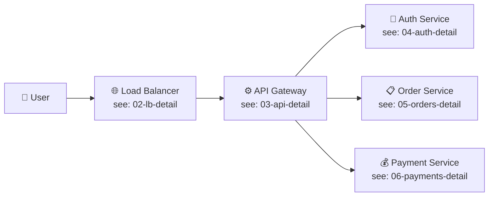

## Layout Direction Selection

The content should drive the direction, not the other way around. When edges are crossing frequently, changing direction often resolves 80% of the visual noise before any restructuring is needed.

| Content type | Direction | Why |
|---|---|---|
| Process flows, state machines | `TD` | Time flows downward; mirrors natural reading of sequences |
| Pipelines, data flows | `LR` | Matches the input → transform → output mental model |
| Organizational hierarchies | `TB` | Root at top; matches org chart conventions |
| Side-by-side comparisons | `LR` | Items align horizontally for easy scanning |
| API call sequences | Use sequence diagram | Mermaid sequence diagrams handle back-and-forth better than flowcharts |

You can also set direction per subgraph — `direction LR` inside a `TD` parent is useful for horizontal steps within a vertical flow:

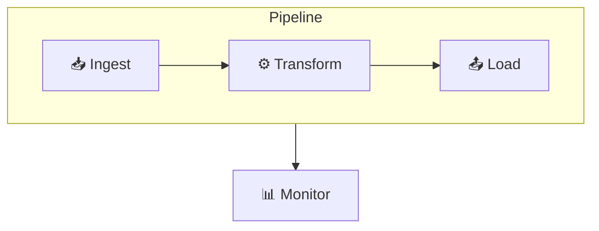

## Subgraph Rules

- **Group by boundary**: deploy boundary, trust boundary, team ownership, or lifecycle phase
- **Max 6–7 nodes per subgraph** — beyond this, either nest a subgraph or split into a separate diagram
- **Max 2 nesting levels** — a third level of nesting is always harder to read than a separate diagram
- **Name subgraphs clearly** — the subgraph label is the first thing the reader sees; make it unambiguous

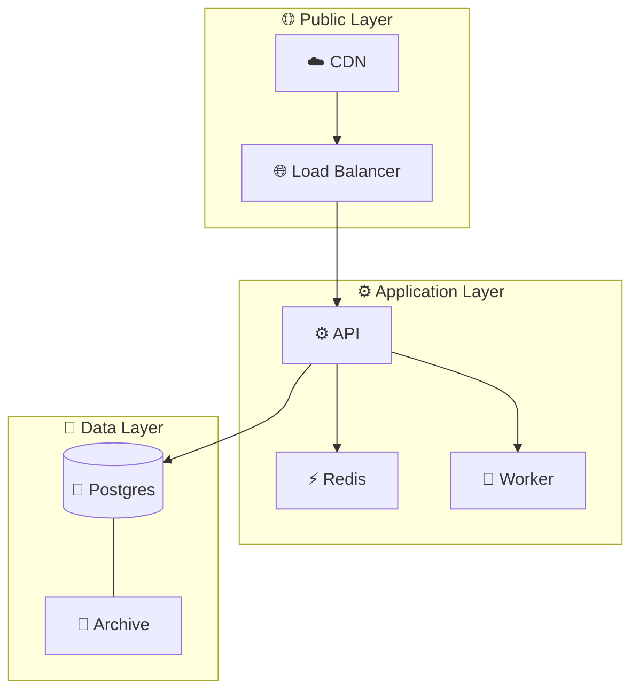

## Node Design for Readability

- **Label length**: 3–4 words max. Break longer labels with `<br/>`
- **Shapes carry meaning** — use them consistently:

| Shape | Syntax | Use for |
|-------|--------|---------|
| Rectangle | `[Label]` | Process, service, action |
| Round rect | `(Label)` | Start/end terminal |
| Diamond | `{Label}` | Decision, condition |
| Cylinder | `[(Label)]` | Database, storage |
| Circle | `((Label))` | Event, trigger |
| Stadium | `([Label])` | Subprocess, named flow |

- **Avoid abbreviations** unless universal in the domain — `Auth Svc` saves 3 characters but loses clarity for anyone outside the team

## Edge Reduction Techniques

Before restructuring, ask whether an edge can be implied by position:

1. **Sequential nodes** — if A always flows to B, layout adjacency makes the arrow obvious; the edge is noise
2. **Bidirectional flows** (A ↔ B) in a flowchart — this is usually a sequence diagram in disguise; switch diagram types
3. **Hub nodes** (6+ connections from one node) — the hub needs its own detail diagram; the overview just shows it as a single box

## Splitting a Large Diagram: Before and After

**Before** — 18-node monolith, unreadable:

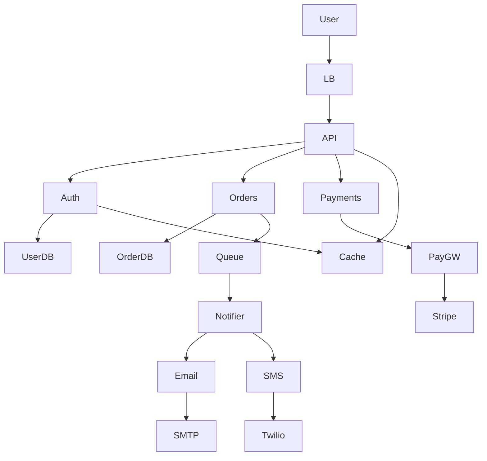

**After** — 3 diagrams, each readable:

**Diagram 1 — System Overview (6 nodes):**
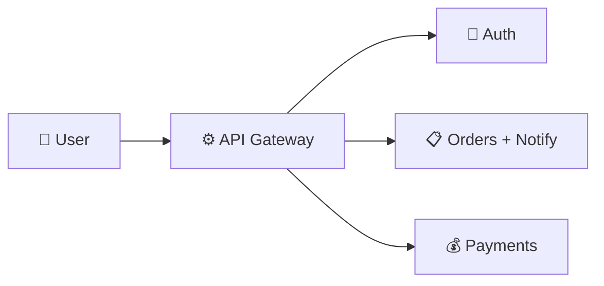

**Diagram 2 — Orders & Notifications:**
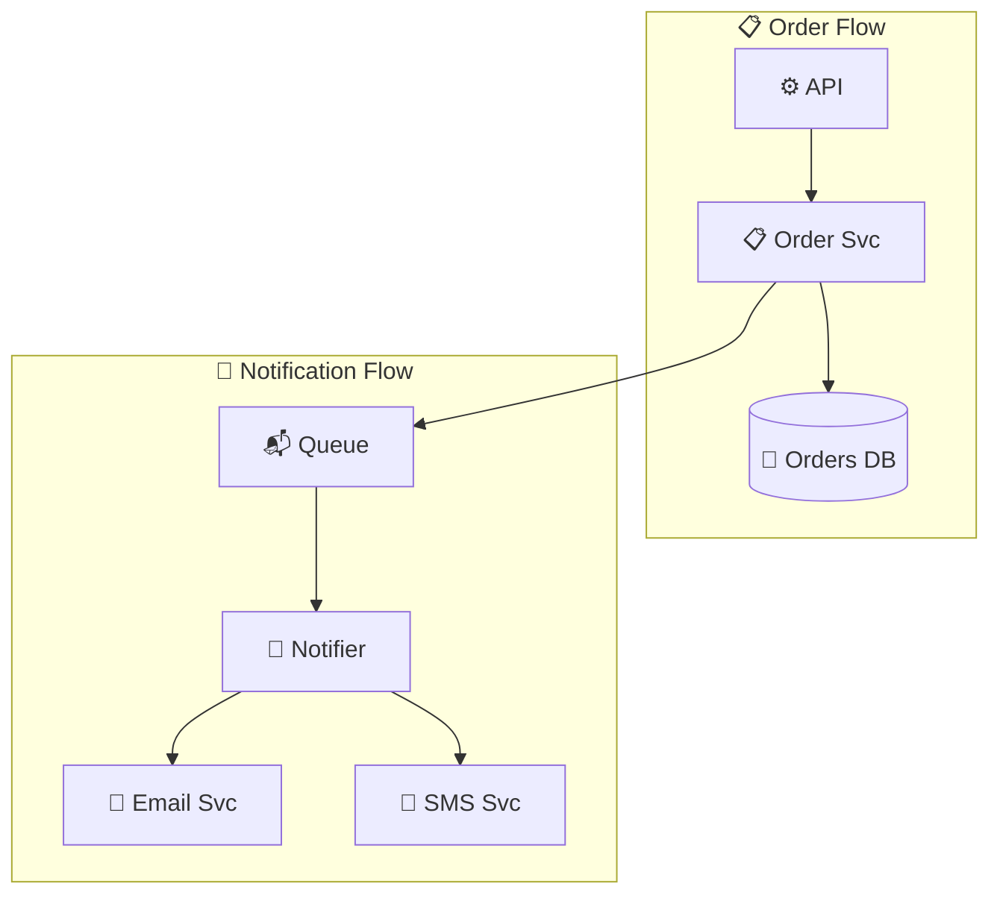

**Diagram 3 — Payments & Auth:**
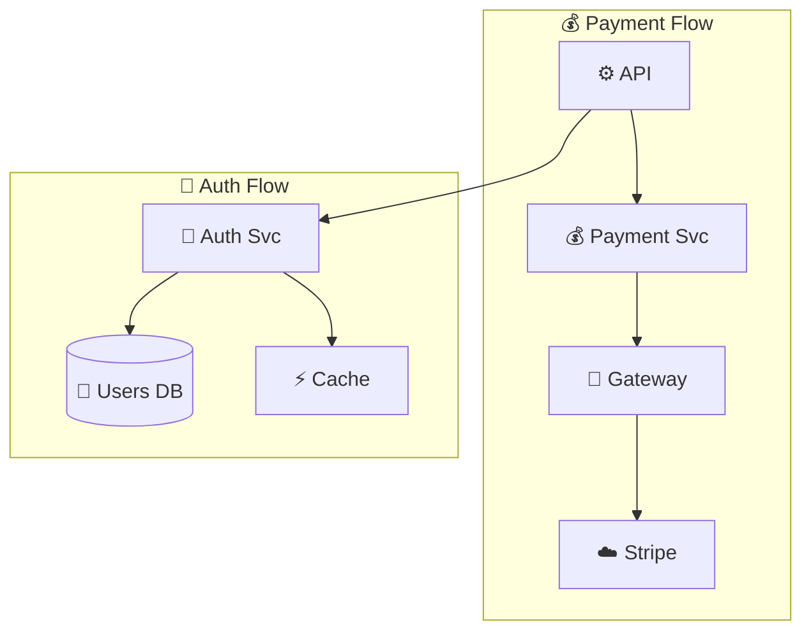

## Linking Diagrams Together (The Puzzle-Piece Pattern)

Mermaid has no native `include` or embed, but two features combine to give you navigable, drill-down diagrams.

### Option A: `click href` — any node, any diagram type

Turn any node into a link to its detail diagram. Works in GitHub wikis, GitLab, Obsidian, MkDocs, Notion, and any renderer that enables Mermaid interactions.

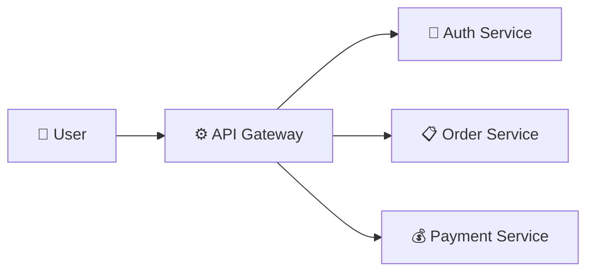

Each overview box is a clickable entry point. The detail diagram can itself have `click href` links going deeper. This is the literal puzzle-piece pattern — overview → detail → sub-detail.

**Tooltip syntax variants:**
```
click NodeId "url"                          # basic link
click NodeId "url" "tooltip text"           # with hover tooltip
click NodeId "url" "tooltip text" _blank    # opens in new tab
click NodeId href "url" "tooltip"           # class diagram syntax
```

### Option B: C4 Diagrams — Mermaid's built-in drill-down model

C4 is a first-class Mermaid diagram type designed specifically for hierarchical decomposition. The three levels map directly to "puzzle pieces":

| Level | Syntax | Shows |
|-------|--------|-------|
| Context | `C4Context` | System and its users/external dependencies |
| Container | `C4Container` | Internal apps, databases, services |
| Component | `C4Component` | Code-level components inside one container |

**C4Context (overview — the outer puzzle):**
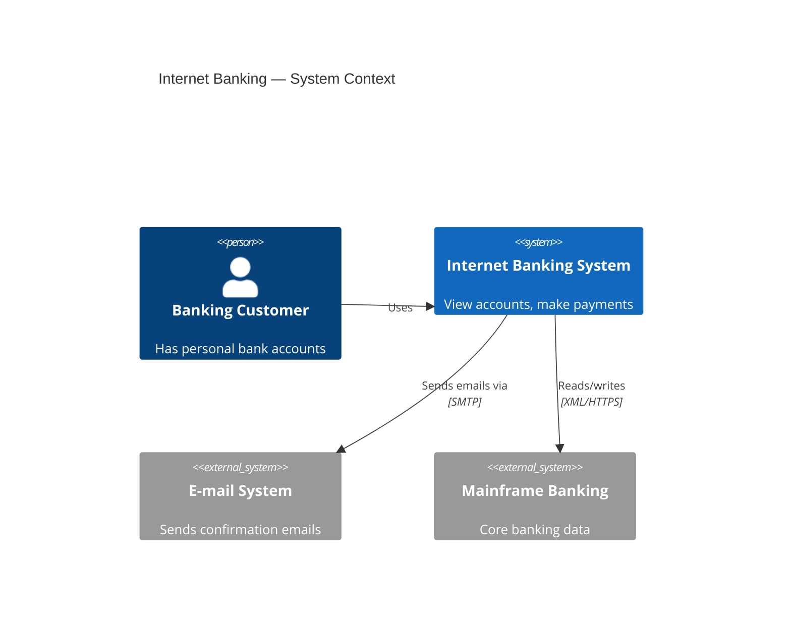

**C4Container (drill into the system — inner puzzle pieces):**
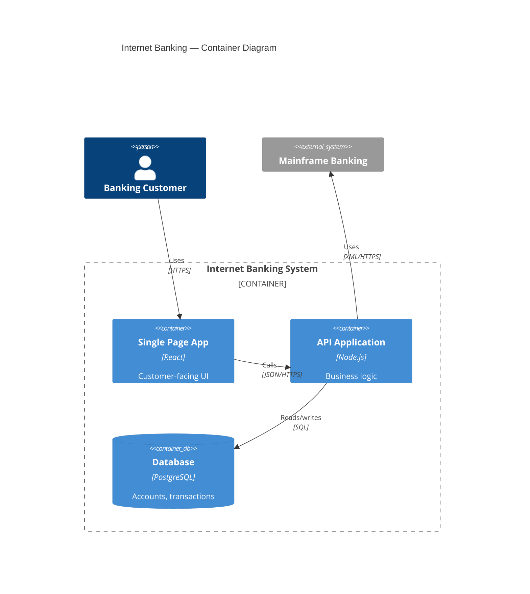

**Use C4 when:** the system has clear architectural layers (user-facing → services → data). Use `click href` when you're decomposing a single large flowchart or deployment diagram into focused sub-diagrams.

## Per-Diagram Config with `%%{init}%%`

Add an `%%{init}%%` directive as the first line of any diagram to control rendering without needing external CSS or Typora settings. This is standard Mermaid — works in GitHub, Obsidian, MkDocs, VS Code, and Typora alike.

### Flowchart curve (biggest legibility win)

`basis` curves smooth out edges so they naturally separate from each other. In a dense diagram, switching from the default `linear` to `basis` can eliminate most of the visual crossing noise without changing any node layout.

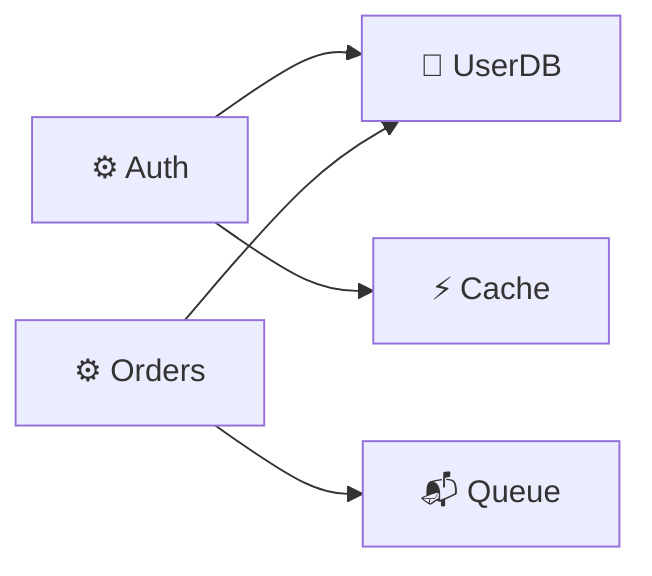

| Curve | Shape | Best for |
|-------|-------|----------|
| `linear` | Straight lines | Simple, small diagrams |
| `basis` | Smooth splines | Dense diagrams with many edges — **default recommendation** |
| `natural` | Natural splines | Medium complexity |
| `step` | Right-angle steps | Hierarchies, org charts, decision trees |

### Theme (per diagram)

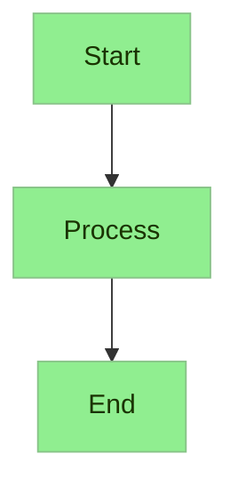

Available themes: `base`, `default`, `dark`, `forest`, `neutral`, `night`

Use `base` + `themeVariables` when you need precise color control without `classDef` on every node.

### Sequence auto-numbering

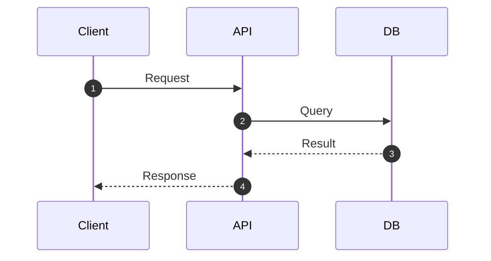

## Mindmap — Use Instead of Deep Flowcharts

When information is hierarchical (concepts branching into sub-concepts, feature trees, knowledge maps), a mindmap is almost always more readable than a flowchart. It uses a radial tree layout designed for exactly this shape of data.

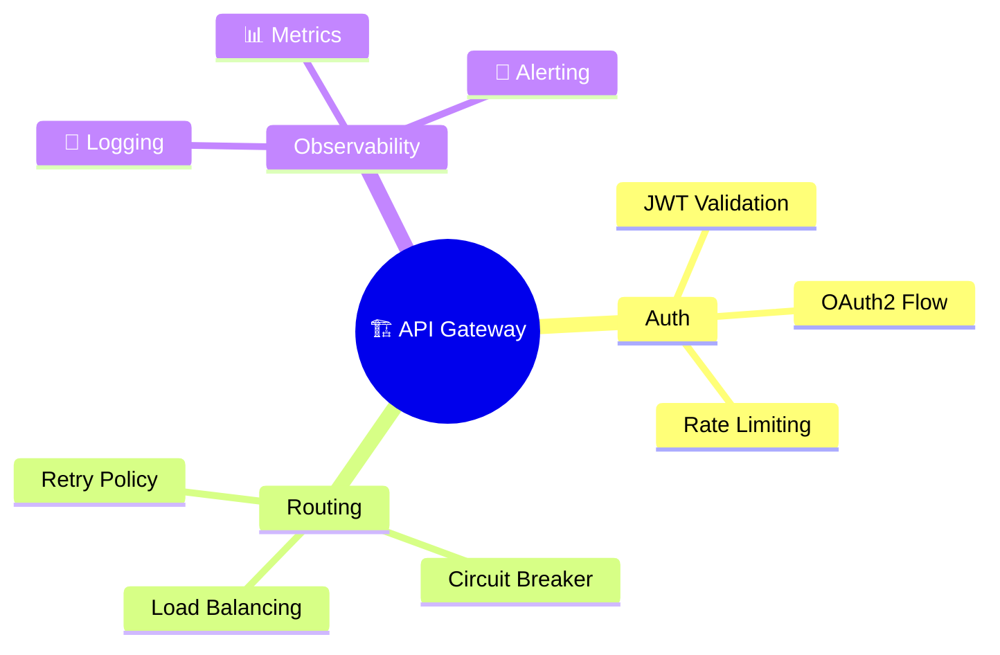

**Use mindmap instead of flowchart when:**
- The diagram would have more than 3 levels of nesting
- Information is purely hierarchical (no cross-connections needed)
- You're mapping concepts, features, or a knowledge domain
- The flowchart version would require more than 15 nodes

**Mindmap syntax rules:**
- Indentation = hierarchy level
- `root((text))` for the center node (circle)
- `[text]` for rectangular nodes, `(text)` for rounded, `((text))` for circle
- No arrows — structure is implied by indentation

## Invisible Spacer Nodes (Last Resort)

When Mermaid compresses nodes and labels overlap, invisible spacers can force breathing room — but this is a workaround, not a design choice. If spacers are needed, the diagram should be split instead.

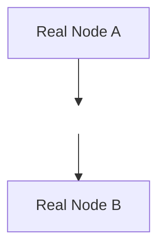

## Quick Decision Checklist

Before finalizing any diagram:

- [ ] Node count ≤ 12?
- [ ] Edge crossings ≤ 3?
- [ ] Subgraph nesting ≤ 2 levels?
- [ ] No hub node with > 4 connections?
- [ ] Labels visible without truncation?
- [ ] Layout direction matches data flow direction?
- [ ] Each subgraph has a clear, unambiguous name?

If any box is unchecked, apply the relevant technique from this guide before saving.
